# Active Directory Certificate Services (ESC1)

**Lab:** `condef.local`
**Platform:** Windows (Active Directory Certificate Services)
**Log sources:** Windows Security (CA auditing, Kerberos)
**SIEM:** Splunk
**ATT&CK:** T1649 Steal or Forge Authentication Certificates · Tactic: Credential Access

---

## TL;DR

ESC1 is a certificate-template misconfiguration that can let a low-privilege domain user request an authentication certificate for a more privileged identity. In this lab I configured and published an ESC1-vulnerable template, then requested a certificate and generated certificate-based Kerberos authentication activity using the domain Administrator account.

One distinction matters in my results: my Metasploit request never set `CERT_TEMPLATE`, and my later 4887 event shows that the issued certificate came from the built-in `User` template. I therefore do **not** treat this run as a completed ESC1 privilege-escalation exploit. What I did validate was the ESC1-vulnerable configuration itself, the CA and Kerberos auditing needed to see certificate activity, certificate issuance telemetry, PKINIT-based TGT issuance, and serial-number correlation between the CA and KDC events.

The useful telemetry landed in three places: 4898 for template-load/configuration context, 4887 for certificate issuance, and 4768 for a Kerberos TGT requested with a certificate.

## What ESC1 is

Active Directory Certificate Services issues certificates based on templates. A template controls who is allowed to enroll and what the resulting certificate can be used for. The core ESC1 conditions are low-privilege enrollment rights, enrollee-supplied subject information, an authentication-capable certificate, and no approval or signature requirement that blocks issuance. Put those together and a normal domain user can potentially request a certificate in someone else's name, including a domain admin, and use that certificate for authentication as the privileged identity.

The reason this matters is that it turns a low-privilege foothold into domain admin. The certificate is a valid credential on its own, and once it exists it can be exchanged for a Kerberos ticket. In ATT&CK terms this is T1649, Steal or Forge Authentication Certificates, and the ticket it produces is valid-account access to the domain. It is not theoretical either: MITRE credits APT29 with abusing misconfigured AD CS templates to impersonate admin users and mint their own authentication certificates.

I built and published the vulnerable template myself, generated certificate enrollment and PKINIT activity as the domain Administrator, and then investigated what each stage left behind in the logs.

## Building the CA

Most prebuilt lab environments ship with the certificate authority already configured, so a walkthrough can open straight into an existing CA. I built my environment from scratch, so that CA never existed and standing it up was on me. That turned into its own troubleshooting run before I could attack anything.

### Problem: CA snap-in failed to open

Opening Certificate Authority on CERTER threw:

`Cannot manage Active Directory Certificate Services. The system cannot find the file specified. 0x80070002 (WIN32: 2 ERROR_FILE_NOT_FOUND)`

Root cause: the AD CS **role binaries** were installed but no CA was ever **configured**. Server Manager shows the AD CS tile as soon as the role is present, but `certsrv.msc` needs an actual CA in the registry. With none, the snap-in has nothing to open.

### Diagnosis

```powershell
certutil -cainfo            # "No local Certification Authority" = nothing configured
Get-WindowsFeature ADCS-*   # Cert-Authority = Installed (binaries present)
Get-Service CertSvc         # Stopped (nothing to run)
```

Confirmed: role installed, service registered but stopped, no CA object.

### The uninstall / reinstall cascade

My first install attempt failed with "already installed" even though nothing worked. There was a phantom config marker with no functional CA behind it. Clearing it and rebuilding surfaced a chain of leftover-state errors, each needing its own overwrite flag:

1. `The Certification Authority is already installed` -> uninstall first
2. `The private key "condef-CERTER-CA" already exists` -> `-OverwriteExistingKey`
3. `A certification authority with the same name was found in the Active Directory` -> `-OverwriteExistingCAinDS`

The uninstall deliberately leaves the key material and the AD object behind so nothing gets destroyed by accident. Reusing the same CA name means the reinstall trips over both.

**Uninstall:**

```powershell
Uninstall-AdcsCertificationAuthority -Force
```

**Working install (all flags):**

```powershell
Install-AdcsCertificationAuthority `
  -CAType EnterpriseRootCA `
  -CACommonName "condef-CERTER-CA" `
  -CryptoProviderName "RSA#Microsoft Software Key Storage Provider" `
  -KeyLength 2048 `
  -HashAlgorithmName SHA256 `
  -ValidityPeriod Years -ValidityPeriodUnits 5 `
  -OverwriteExistingKey `
  -OverwriteExistingCAinDS `
  -Force
```

Notes on the install:

- An Enterprise CA is required because the attack depends on certificate templates, and only Enterprise CAs use templates.
- Configuring an Enterprise CA needs Enterprise Admin (Administrator.CONDEF has it) and the DC reachable, since the process reads and writes AD PKI objects. DC off means failures that look like CA problems but are really AD being unreachable.
- The CA name has to match the Metasploit `set CA` value later. I used `condef-CERTER-CA`.

**Confirmed working:**

```powershell
Get-Service CertSvc             # Running
certutil -cainfo                # Valid Enterprise Root CA, name condef-CERTER-CA, live cert + CRL
certutil -getreg CA\CommonName  # condef-CERTER-CA
```

## Turning on the auditing

This is two independent settings, and both are required or the telemetry silently never appears.

**CA-side audit filter**, which controls what the CA emits:

```powershell
certutil -setreg CA\AuditFilter 127
Restart-Service CertSvc
```

127 is all seven audit flags. Same as CA Properties, Auditing tab, tick everything.

**Audit subcategory**, which controls whether Windows records it:

```powershell
auditpol /set /subcategory:"Certification Services" /success:enable /failure:enable
auditpol /get /subcategory:"Certification Services"   # confirm Success + Failure
```

The filter controls what the CA writes, the subcategory controls whether it lands in the Security log. Miss the subcategory and 4898 never shows up, with no error to tell you why. The same silent-auditing problem appeared again later in this run with Kerberos.

## Building the vulnerable template

With the CA live and auditing on, I built a template I could attack. I named it `ECS1-VulnerableTemplate` (the vulnerability class is ESC1, the name is just the label I gave the template).

In the CA window I went to Certificate Templates, right clicked, and chose Manage.

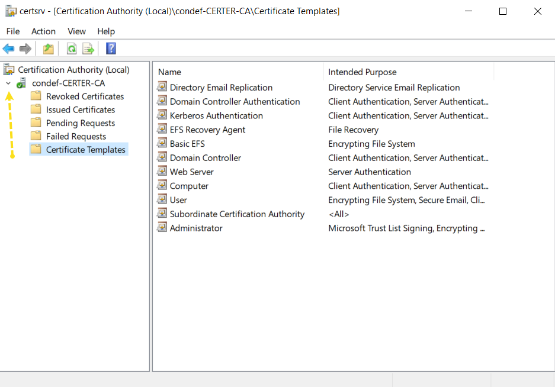
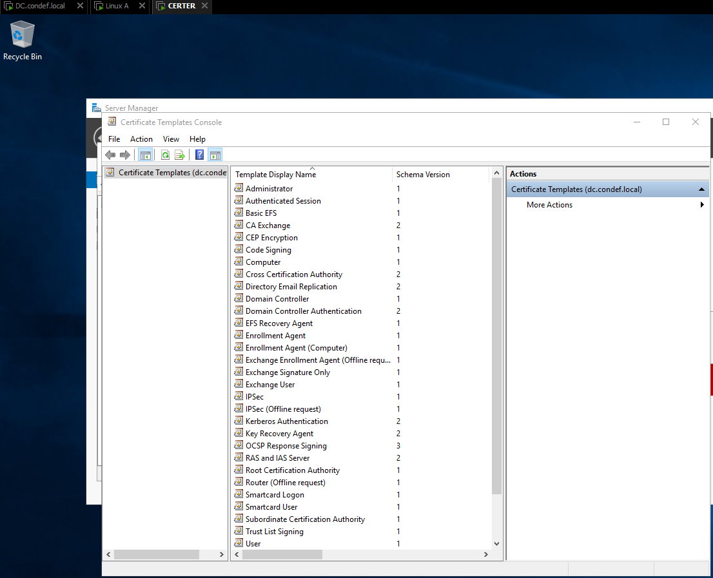

I clicked on the "User" certificate and chose Duplicate Template.

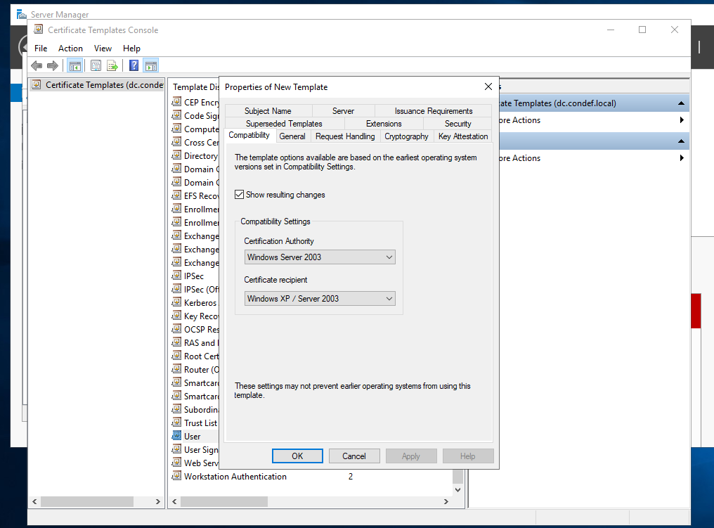

On the General tab I named it `ECS1-VulnerableTemplate`.

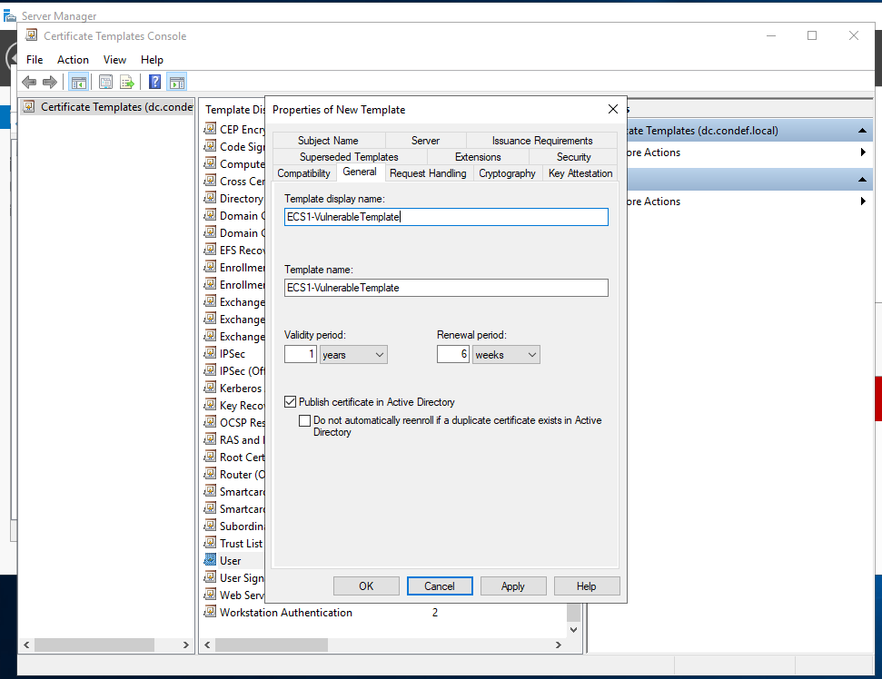

On the Subject Name tab I ticked "Supply in the request" and accepted the warning dialog. This is the setting that makes the template dangerous, because it lets the requester decide whose name goes on the certificate.

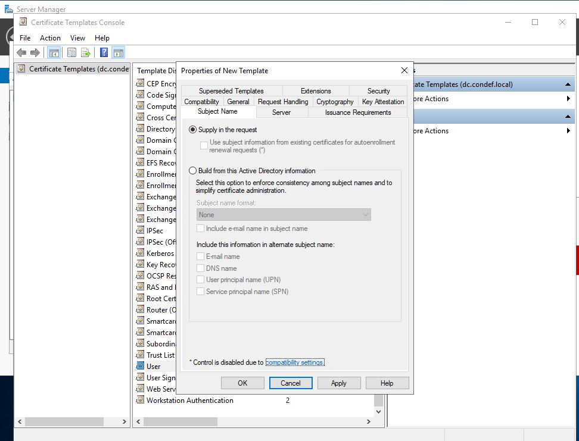

On the Extensions tab I edited Application Policies and added Server Authentication, then KDC Authentication, then Smart Card Login. These give the certificate an authentication use, which is what lets it be traded for a Kerberos ticket.

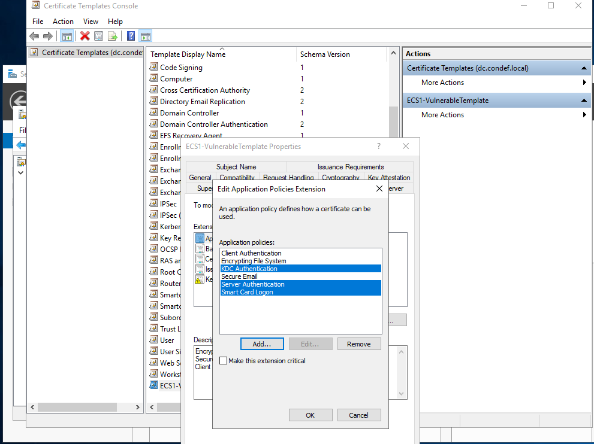

I applied, closed the Certificate Templates Console, then in the CA window went to Certificate Templates, New, Certificate Template to Issue, and selected the template I just built.

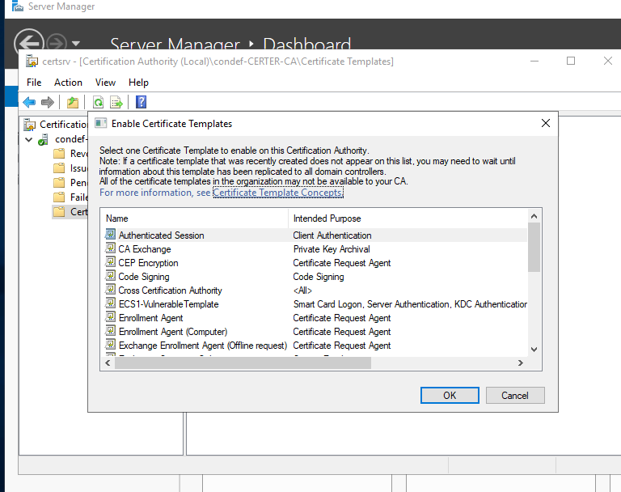

## Requesting the certificate

I ran the request from LinuxA with Metasploit's `icpr_cert` module against CERTER.

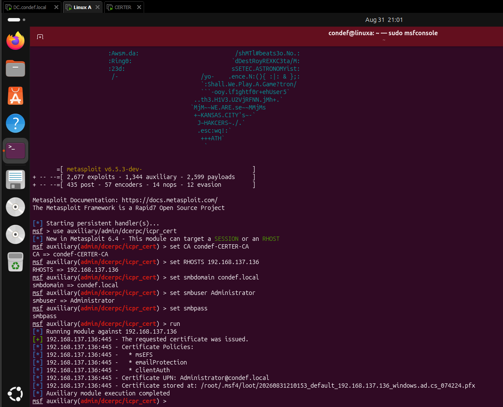

*Password redacted from this screenshot.*

I ran this request as the Administrator account to generate the issuance telemetry, not to prove the low-privilege escalation path. The ESC1 risk I configured earlier is that Domain Users can enroll while the requester can supply the subject identity, which can allow an unprivileged user to request an authentication certificate for a privileged account.

There is an important difference between that vulnerable configuration and what this specific request did. My Metasploit request did not set `CERT_TEMPLATE`. In my later 4887 telemetry, `CertificateTemplate` is `User`, which confirms this certificate was issued from the built-in User template rather than `ECS1-VulnerableTemplate`. The `icpr_cert` module uses the User template unless another template is selected.

The module came back with a certificate issued for `Administrator@condef.local` and a PFX written to loot. That generated the certificate-enrollment telemetry I needed, but I do not count it as exploitation of the ESC1 template.

## Getting the certificate to authenticate

The next step is to trade the certificate for a Kerberos ticket with the `get_ticket` module. My first attempt failed:

```
[*] 192.168.137.135:88 - Getting TGT for Administrator@condef.local
[-] Auxiliary aborted due to failure: unknown: Kerberos Error -
    KDC_ERR_CLIENT_NOT_TRUSTED (62) - PKINIT - KDC_ERR_CLIENT_NOT_TRUSTED
```

Because certificate issuance had succeeded, I focused the troubleshooting on certificate trust and PKINIT rather than the enrollment step. In my lab, the domain controller was refusing to accept the certificate for logon because it had not yet enrolled for the certificate it needed to support certificate-based Kerberos authentication.

The fix was on the DC, in Group Policy. Under the Default Domain Policy, in Computer Configuration, Policies, Windows Settings, Security Settings, Public Key Policies, I enabled two things:

- Certificate Services Client - Certificate Enrollment Policy, set to Enabled
- Certificate Services Client - Auto-Enrollment, set to Enabled with both renewal checkboxes ticked

Then `gpupdate /force`, and a reboot of CERTER to get everything settled. Turning on auto-enrollment is what makes the DC go and enroll for its own Kerberos Authentication certificate, which is the piece PKINIT was missing. A nice confirmation of this shows up later in the logs, where one of the certificate issuance records is the DC (`CONDEF\DC$`) picking up that certificate.

After the reboot I reran the ticket request against the DC:

```
use admin/kerberos/get_ticket
set RHOSTS 192.168.137.135
set CERT_FILE /root/.msf4/loot/20260831210153_default_192.168.137.136_windows.ad.cs_074224.pfx
run
```

This time it returned a valid TGT-Response and saved the ticket to loot.

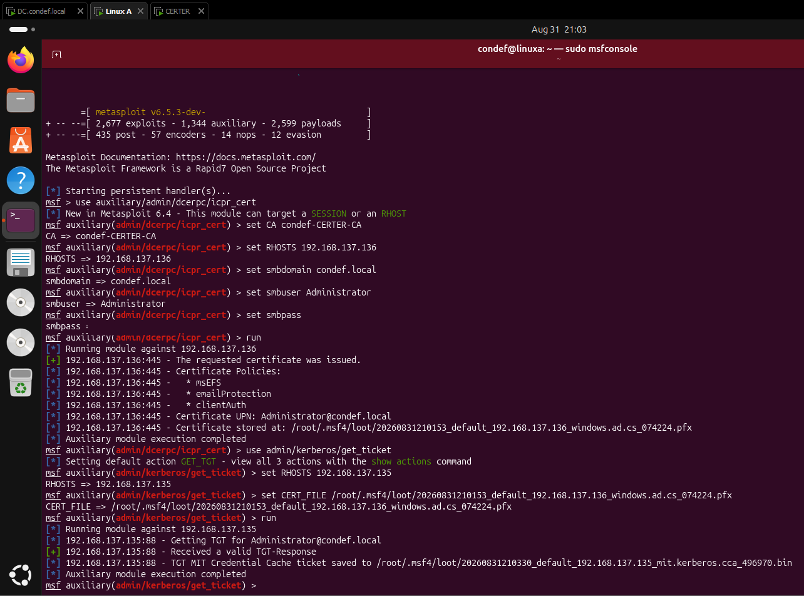

*Password redacted from this screenshot.*

At that point I had certificate issuance to Administrator and a real Kerberos TGT for Administrator through PKINIT. Combined with the earlier ESC1 template build, this gave me both the vulnerable configuration and the relevant certificate and Kerberos telemetry to investigate, but it did not demonstrate a low-privilege ESC1 escalation.

## Detection

I investigated three telemetry sources that cover different parts of the workflow: template configuration, certificate issuance, and certificate-based Kerberos authentication. They are useful together, but my own results also showed why none of them should be treated as proof of ESC1 by itself.

### Template configuration context (4898)

Event 4898 records that Certificate Services loaded a template. The event contains template configuration data, so I used it to look for two characteristics relevant to ESC1: Domain Users with enrollment rights and an authentication-capable EKU.

```spl
index=winlogs EventCode=4898
| regex SecurityDescriptor="Allow.*?\\Domain Users\D.*?Enroll"
| regex TemplateContent="1.3.6.1.5.5.7.3.2"
| table signature,SecurityDescriptor,TemplateContent
```

The first regex matches a security descriptor that allows Domain Users to enroll. The second matches the Client Authentication EKU (`1.3.6.1.5.5.7.3.2`). Those are both relevant to ESC1, but they are not sufficient to identify it because the query does not test whether the enrollee can supply the subject.

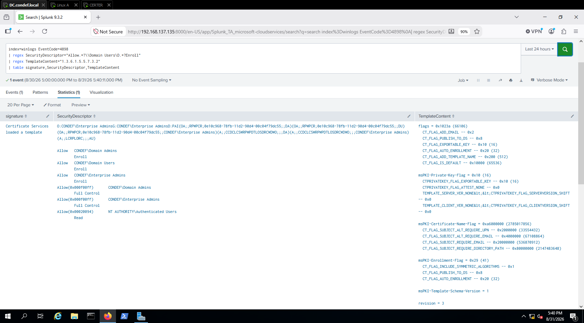
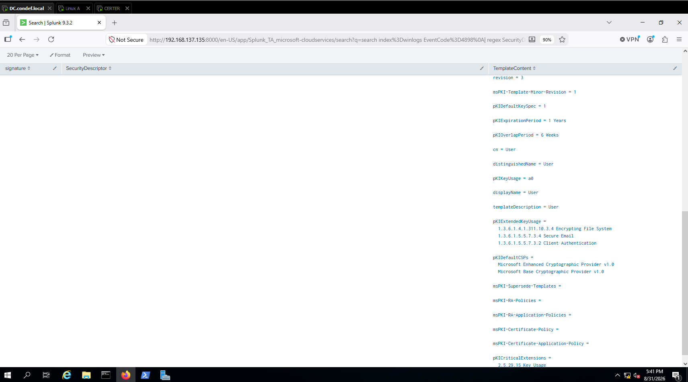

That limitation showed up directly in my result: the returned template is the built-in `User` template. The search was useful as a broad configuration hunt, but my own data showed that it was **not** a validated ESC1 detection.

### The issued certificate (4887)

Certificate Services logs 4887 when it approves a certificate request and issues the certificate. I searched the issuance events directly:

```spl
index=winlogs EventCode=4887
```

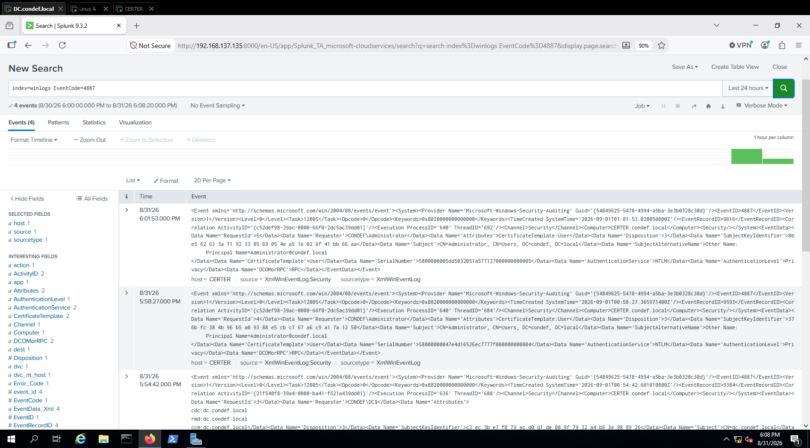

The raw event gave me three fields that mattered for this investigation: `Requester`, `SubjectAlternativeName`, and `CertificateTemplate`. My event shows `CONDEF\Administrator` as the requester, `Administrator@condef.local` in the SAN, and `User` as the certificate template. The third event visible in the screenshot is `CONDEF\DC$` obtaining a Domain Controller certificate after I enabled auto-enrollment during the PKINIT troubleshooting.

The `CertificateTemplate: User` field was the important one, because it corrected the story the template name alone might have suggested. I had configured an ESC1-vulnerable template, but the certificate used for the TGT in this run was not issued from it.

In a true ESC1 impersonation, a low-privilege requester obtains a certificate whose SAN names a privileged user. My run used Administrator for the request, so the requester and the SAN are the same identity and I never produced that mismatch. To actually exploit the template I built, the request would need to come from a low-privilege domain account with `CERT_TEMPLATE` set to `ECS1-VulnerableTemplate` and the privileged identity supplied through `ALT_UPN` and `ALT_SID`. That is the kind of request that would produce a low-privilege requester and a privileged certificate identity.

### The certificate in use (4768)

When the certificate is used to get a Kerberos ticket, the KDC logs a 4768 that carries the certificate's thumbprint and serial number. That is the fingerprint of certificate-based authentication.

```
index=winlogs EventCode=4768 CertThumbprint=*
| table _time,IpAddress,ServiceName,CertThumbprint,CertSerialNumber
```

This is where the silent audit gap bit me a second time. My first run of this query returned zero events, even though I was holding the ticket I had just pulled. The activity happened, there was just no log for it, because "Audit Kerberos Authentication Service" was never enabled on the DC. The certificate flags decide what the CA writes, but Kerberos ticket events are gated by their own separate subcategory.

I enabled it on the DC and confirmed it took:

```
auditpol /set /subcategory:"Kerberos Authentication Service" /success:enable /failure:enable
auditpol /get /subcategory:"Kerberos Authentication Service"
```

The catch is that the ticket I already had would not backfill a log event, so I reran the `get_ticket` step to generate a fresh 4768 under the new setting. Then the query populated.

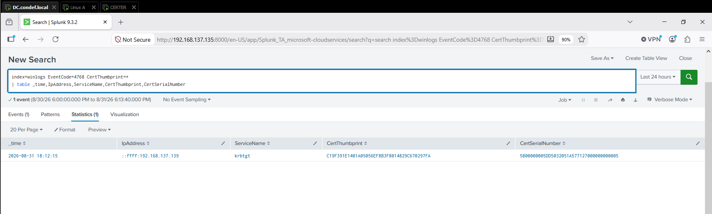

The source also stood out. The `IpAddress` is `192.168.137.139`, my LinuxA attacker box, pulling a certificate-based TGT for the Administrator account. On a real network I would weigh that against what normally does certificate authentication, because a Linux host requesting a domain admin's ticket this way is not a pattern I would expect to see.

### Correlating issuance to use

The 4768 carries a serial number, and so does the certificate that was issued. Matching those two links "this certificate was issued" to "this certificate was used to get a ticket." I took the serial from the 4768 event and matched it against the Issued Certificates view on the CA to pull the full certificate details.

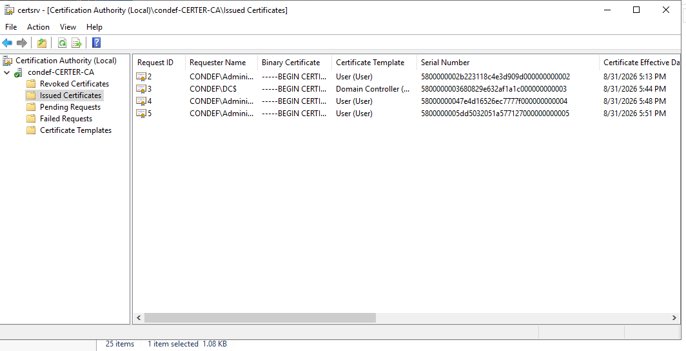

Serial from the log:

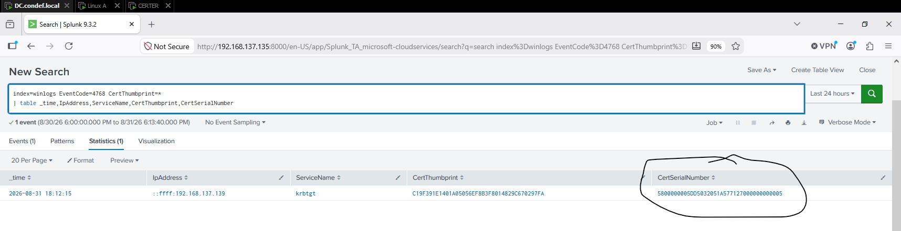

Same serial in the CA's Issued Certificates:

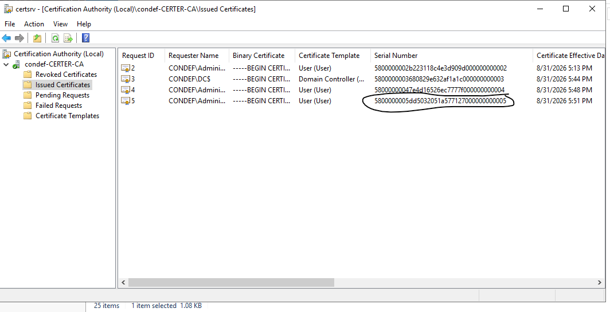

### False positives and tuning

My results made the limits of the individual signals clear. Certificate-based logon and smart-card authentication can legitimately produce 4768 events with certificate fields. My 4898 search was broad enough to match the normal `User` template. My 4887 event showed the same account as requester and SAN, and it named the template as `User`.

So I would not call any one of these searches a tested ESC1 alert. What I validated is how to pull and read the template, issuance, and Kerberos telemetry, and how to tie a certificate's issuance to its later use through the serial number. Whether real activity like this is an attack comes down to the account, the template, the SAN, the source host, and whether certificate authentication is normal in that environment at all.

## Key takeaways

- The evidence matters more than the label. I configured an ESC1-vulnerable template, but the 4887 event showed the certificate used in my PKINIT test came from the built-in `User` template, so I did not claim an ESC1 privilege escalation that my telemetry did not prove.
- Event 4898 is useful configuration context: it records Certificate Services loading a template and exposes template properties. My query found enrollment rights plus Client Authentication, but the result showed why those two conditions alone are too broad to identify ESC1.
- Event 4887 was the most useful issuance record in this run because it exposed the requester, SAN, and actual certificate template.
- The audit-gate problem appeared twice: CA events required both the CA audit filter and the Certification Services audit subcategory, while 4768 required Kerberos Authentication Service auditing on the DC. An empty SIEM result was not enough to conclude that the activity did not happen.
- The certificate serial number connected the CA's issuance record to the certificate-backed 4768 on the KDC, giving me a concrete way to correlate certificate creation with later authentication.

## References

- [MITRE ATT&CK T1649 - Steal or Forge Authentication Certificates](https://attack.mitre.org/techniques/T1649/)
- [Microsoft - Advanced Audit Policy Configuration settings](https://learn.microsoft.com/en-us/windows-server/identity/ad-ds/plan/security-best-practices/advanced-audit-policy-configuration)
- [Microsoft - Monitoring Public Key Infrastructure](https://learn.microsoft.com/en-us/previous-versions/windows/it-pro/windows-server-2012-r2-and-2012/dn786432%28v%3Dws.11%29)
- [Metasploit - Attacking AD CS ESC Vulnerabilities](https://docs.metasploit.com/docs/pentesting/active-directory/ad-certificates/attacking-ad-cs-esc-vulnerabilities.html)
- [Metasploit AD Certificates overview](https://docs.metasploit.com/docs/pentesting/active-directory/ad-certificates/overview.html)
- [Lares - ADCS Exploits Investigations Part 2](https://labs.lares.com/adcs-exploits-investigations-pt2/)
- [SpecterOps - Certified Pre-Owned](https://posts.specterops.io/certified-pre-owned-d95910965cd2)
- [Wavestone - Abusing PKI in Active Directory](https://www.riskinsight-wavestone.com/en/2021/06/microsoft-adcs-abusing-pki-in-active-directory-environment/)
- [HackTricks - AD Certificates domain escalation](https://book.hacktricks.xyz/windows-hardening/active-directory-methodology/ad-certificates/domain-escalation)
- [Black Hills - Abusing ADCS Part One](https://www.blackhillsinfosec.com/abusing-active-directory-certificate-services-part-one/)
- [Certipy](https://github.com/ly4k/Certipy)
