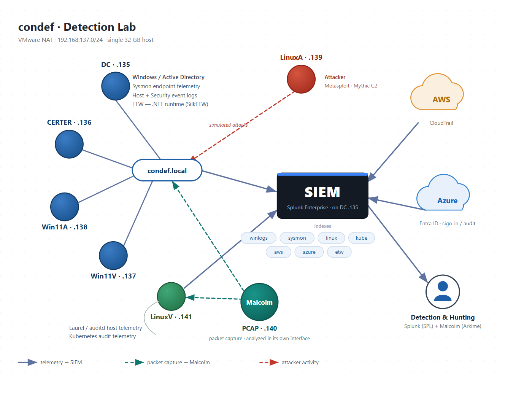

# Detection Engineering Portfolio

This repository documents my hands-on detection engineering work in a lab I built and operate on my own hardware.

I execute attack techniques, examine the telemetry they produce, develop and test Splunk detection logic, troubleshoot missing or incomplete logging, and correlate activity across endpoint, Windows Security, and network data sources.

The SPL queries are only one part of the work. The primary focus of this portfolio is the reasoning required to move from attacker behavior to an observable and testable detection hypothesis.

> **Detection status:** The detections in this repository are validated in my isolated lab. They have not been tested in a production environment and may require additional baselining and tuning before operational use.
>
> **Safety:** The environment runs on an isolated VMware NAT network. All credentials are throwaway values, and all cloud resources use disposable lab accounts.

---

## What This Portfolio Demonstrates

* Investigating failed detections by tracing missing results to audit-policy, telemetry, and ingestion dependencies
* Building and operating a multi-source detection lab
* Translating attacker behavior into observable telemetry
* Developing and iteratively refining SPL detections
* Validating detection output against known ground truth and testing assumptions about field formatting, time windows, and ingestion encoding
* Baselining normal behavior and investigating false positives
* Testing multiple attack procedures against the same telemetry
* Testing whether detections survive basic evasion such as executable and service renaming
* Correlating Windows host telemetry with network evidence
* Distinguishing core detection logic from enrichment and attribution
* Documenting limitations, blind spots, and investigation considerations
* Mapping detection coverage to MITRE ATT&CK

---

## Writeups

### [Building a Detection Lab on One Machine](building-a-detection-lab-on-one-machine.md)

How I built the environment and why each component is present. This writeup covers the network, Active Directory domain, endpoint telemetry, Splunk collection tier, Malcolm network monitoring, Linux and Kubernetes logging, cloud pipelines, resource constraints, and the failures that taught me the most during the build.

### [Catching DCSync: Detecting Domain Replication Abuse](catching-dcsync.md)

I used Mimikatz from a Windows workstation to request credential material from a domain controller through Active Directory replication.

My initial Event 4662 detection returned no results even though the attack succeeded. I verified that Windows Security events were reaching Splunk, traced the missing telemetry to disabled Directory Service Access auditing and a missing SACL on the domain object, configured both requirements, and successfully detected the replication-right operation after repeating the attack.

The Event 4662 result identified the account performing the directory operation but did not provide usable source-host information through my Event 4624 enrichment. I recovered the client IP through Event 4769 and independently confirmed the `DRSGetNCChanges` request from the workstation to the domain controller using Malcolm, Zeek, and Arkime.

### [Detecting Lateral Movement in a Windows Domain: WMIExec and PsExec](detecting-lateral-movement-wmiexec-psexec.md)

I used Impacket's WMIExec from a Linux attacker system and Microsoft Sysinternals PsExec from a Windows workstation to execute commands remotely on a domain-joined target. I traced the resulting activity through Sysmon, Windows Security and System events, Splunk, and Malcolm network telemetry.

For WMIExec, I developed a Sysmon process-creation detection combining `WmiPrvSE.exe` ancestry with the timestamp-named output file used by the tested output-enabled mode. For PsExec, I tested how name-based detections held up after renaming both the executable and remote service. The original process-name query failed, but the renamed run remained visible through `PSEXEC-*.key` access on `ADMIN$`, Malcolm file extraction, and RPC operations against the Service Control Manager.

### [Catching Discovery Commands on Windows Hosts](catching-discovery-commands.md)

I ran Windows discovery and credential-enumeration commands from cmd.exe and PowerShell, then compared a command-line regex against known Sysmon ground truth. The query returned results while missing 12 of 23 selected process-creation events because the two shells recorded `net user` in forms the literal pattern did not match.

I rebuilt the detection around resolved process images and distinct utility density within one execution context. A six-command validation burst exposed a second failure when fixed ten-minute buckets split the sweep and discarded two commands, so I replaced them with a rolling `streamstats` window and tested the result across seven days of lab activity. I also developed a separate WMI remote-execution ancestry rule, traced its initial zero-result failure to XML-escaped redirection text, and grouped the commands into one analyst-readable session using WMIExec's shared output filename.

### [Catching LSASS Credential Dumping Three Ways](catching-lsass-credential-dumping.md)

I dumped LSASS using three procedures: Mimikatz through Meterpreter, Task Manager, and Procdump. I then developed complementary Sysmon detections for suspicious access to `lsass.exe` and the creation of LSASS dump files.

The writeup examines the `GrantedAccess` bitmask and why the `PROCESS_VM_READ` right is an important signal, how legitimate processes can request similar access, and how environmental baselining reduces noise. It also explains why covering all three tested procedures requires both ProcessAccess and FileCreate telemetry, along with the false positives and blind spots introduced by each approach.

### [Catching Kerberoasting](catching-kerberoasting.md)

I created Active Directory service accounts with Service Principal Names and used Impacket's `GetUserSPNs` to request crackable Kerberos service tickets. I investigated the resulting Windows Security Event 4769 telemetry and developed a Splunk detection based on one account requesting multiple service tickets within a short period.

The writeup compares encryption-type and request-volume signals, examines the same Kerberoasting activity through Malcolm network telemetry, and completes the exercise by cracking a captured service ticket in the lab.

### [Catching Credential Access Through File Shares](catching-credential-access-through-file-shares.md)

I created Windows file shares, planted a simulated sensitive file named `passwords.txt`, and used Snaffler to crawl the environment. I then developed two Splunk detections using Windows Security Event 5145: one for access to potentially sensitive filenames and another for unusually high failure volume associated with share discovery activity.

The writeup covers the fields used to develop the detections, the audit policy required to generate the telemetry, threshold-related false positives, and how Malcolm network telemetry independently corroborated the same SMB activity.

### [Catching My First Reverse Shell](catching-my-first-reverse-shell.md)

I executed a Meterpreter reverse shell against a Windows workstation and developed two Splunk detections from different behavioral signals: the process relationship that produced the shell and the abnormal length of the command line used to launch it.

The writeup covers why each signal works in my environment, the false positives each approach introduces, the effect of environmental allowlisting, and why combining multiple imperfect signals can provide stronger coverage than relying on either signal alone.

---

## Detection Catalog

| Detection | Platform | Telemetry | MITRE ATT&CK | Status |
| --- | --- | --- | --- | --- |
| [DCSync: directory replication-right use](catching-dcsync.md) | Windows / Active Directory | Security EID 4662, EID 4769, DRSUAPI network telemetry | [T1003.006: DCSync](https://attack.mitre.org/techniques/T1003/006/) | Lab validated |
| [WMIExec output-mode command execution](detecting-lateral-movement-wmiexec-psexec.md) | Windows | Sysmon EID 1, WMI/DCOM-RPC network telemetry | [T1047: Windows Management Instrumentation](https://attack.mitre.org/techniques/T1047/) | Lab validated |
| [PsExec key-file access after executable and service renaming](detecting-lateral-movement-wmiexec-psexec.md) | Windows | Security EID 5145, SMB file-extraction and SVCCTL network telemetry | [T1021.002: SMB/Windows Admin Shares](https://attack.mitre.org/techniques/T1021/002/), [T1569.002: Service Execution](https://attack.mitre.org/techniques/T1569/002/) | Lab validated |
| [Discovery-command density by execution context](catching-discovery-commands.md) | Windows | Sysmon EID 1 | [T1033: System Owner/User Discovery](https://attack.mitre.org/techniques/T1033/), [T1087.001: Local Account](https://attack.mitre.org/techniques/T1087/001/), [T1087.002: Domain Account](https://attack.mitre.org/techniques/T1087/002/), [T1082: System Information Discovery](https://attack.mitre.org/techniques/T1082/), [T1555.004: Windows Credential Manager](https://attack.mitre.org/techniques/T1555/004/) | Lab validated |
| [WMI remote-command session by ancestry and ADMIN$ output](catching-discovery-commands.md) | Windows | Sysmon EID 1 | [T1047: Windows Management Instrumentation](https://attack.mitre.org/techniques/T1047/) | Lab validated |
| [LSASS access by GrantedAccess rights](catching-lsass-credential-dumping.md) | Windows | Sysmon EID 10 | [T1003.001: LSASS Memory](https://attack.mitre.org/techniques/T1003/001/) | Lab validated |
| [LSASS dump-file creation](catching-lsass-credential-dumping.md) | Windows | Sysmon EID 11 | [T1003.001: LSASS Memory](https://attack.mitre.org/techniques/T1003/001/) | Lab validated |
| [Kerberoasting by service-ticket request volume](catching-kerberoasting.md) | Windows / Active Directory | Security EID 4769 | [T1558.003: Kerberoasting](https://attack.mitre.org/techniques/T1558/003/) | Lab validated |
| [Potentially sensitive file access on shares](catching-credential-access-through-file-shares.md) | Windows | Security EID 5145 | [T1552.001: Credentials in Files](https://attack.mitre.org/techniques/T1552/001/) | Lab validated |
| [Share discovery by failure volume](catching-credential-access-through-file-shares.md) | Windows | Security EID 5145 | [T1135: Network Share Discovery](https://attack.mitre.org/techniques/T1135/) | Lab validated |
| [Reverse shell: anomalous process relationship](catching-my-first-reverse-shell.md) | Windows | Sysmon EID 1 | [T1059.003: Windows Command Shell](https://attack.mitre.org/techniques/T1059/003/) | Lab validated |
| [Reverse shell: abnormal command-line length](catching-my-first-reverse-shell.md) | Windows | Sysmon EID 1 | [T1059.001: PowerShell](https://attack.mitre.org/techniques/T1059/001/) | Lab validated |

Additional detections will be added to the catalog as their investigation and validation writeups are completed.

---

## Lab Architecture

**Domain:** `condef.local`  
**Network:** VMware NAT `192.168.137.0/24`  
**Gateway:** `192.168.137.2`

| Host | Address | Role |
| --- | --- | --- |
| DC | `192.168.137.135` | Windows Server 2019 domain controller, DNS server, and Splunk Enterprise 9.3.2 |
| CERTER | `192.168.137.136` | Domain member server and Sysmon configuration-push host |
| Win11V | `192.168.137.137` | Domain-joined Windows workstation, Sysmon endpoint, and primary attack target |
| Win11A | `192.168.137.138` | Domain-joined Windows workstation with Sysmon and Windows-side attack tooling |
| LinuxA | `192.168.137.139` | Attacker system running Metasploit and Impacket |
| Malcolm | `192.168.137.140` | Network traffic analysis appliance |
| LinuxV | `192.168.137.141` | Linux, Minikube, Kubernetes, auditd, and Laurel telemetry host |

Every virtual machine runs on one physical computer with 32 GB of RAM. Their combined minimum memory allocation is approximately 44 GB, so they cannot all operate simultaneously. Deciding which systems need to run together is an important part of designing, testing, and troubleshooting the environment.

`LinuxA` is intentionally left uninstrumented and does not forward logs to Splunk. The detections must therefore rely on telemetry produced by the targeted systems and the surrounding network rather than information collected from the attacker system.

---

## Telemetry Pipeline

Host and cloud telemetry is collected in Splunk using purpose-built indexes. Network traffic is analyzed separately in Malcolm so activity can be examined from both endpoint and network perspectives.

| Splunk index | Data source | Collection status |
| --- | --- | --- |
| `winlogs` | Windows Security event logs | Active |
| `sysmon` | Sysmon using the sysmon-modular configuration | Active |
| `etw` | Event Tracing for Windows providers | Index created; not yet populated |
| `linux` | Linux auditd events processed by Laurel | Active |
| `kube` | Kubernetes audit logs through the OpenTelemetry Collector | Active |
| `azure` | Entra ID sign-in and audit logs through Azure Event Hubs | Active |
| `aws` | AWS CloudTrail logs through Amazon S3 | Active |

The Windows System log is not currently forwarded to Splunk. Where a writeup uses System events, such as Event ID 7045 for service installation, I inspect them locally in Event Viewer.

The currently published detection writeups focus on Windows and Active Directory telemetry. The wider lab also collects Linux, Kubernetes, Entra ID, and AWS data, but writeups for those platforms are not yet published.

### Ingestion Routes

* Splunk Universal Forwarder traffic is pushed to Splunk on TCP port `9997`.
* HTTP Event Collector traffic is pushed on TCP port `8088`.
* AWS CloudTrail data is pulled from Amazon S3.
* Entra ID events are consumed from Azure Event Hubs.
* Malcolm observes the virtual network in promiscuous mode.

These routes include both push-based and pull-based collection methods, each with different configuration requirements and failure modes.

---

## Tooling

* Splunk Enterprise 9.3.2
* Splunk Universal Forwarder
* Splunk Add-on for AWS
* Splunk Add-on for Microsoft Cloud Services
* Splunk OpenTelemetry Collector
* Malcolm
* Arkime through Malcolm
* Sysmon with [sysmon-modular](https://github.com/olafhartong/sysmon-modular)
* Laurel and auditd with the [Neo23x0 auditd ruleset](https://github.com/Neo23x0/auditd)
* VMware Workstation
* Windows Server 2019
* Windows 11
* Active Directory Domain Services
* Metasploit Framework
* Mimikatz
* Impacket
* Microsoft Sysinternals PsExec
* Minikube
* Kubernetes
* kubectl
* Helm
* Azure Event Hubs
* Microsoft Entra ID diagnostic settings
* AWS CloudTrail
* Amazon S3

---

## Background and Attribution

I built this lab while working through [Constructing Defense](https://www.justhacking.com/course/condef-lite/) by Anton Ovrutsky of justhacking.com.

I am completing the Lite track, which does not provide a hosted cyber range. I built the environment on my own hardware by following the course's architectural and telemetry guidance.

The course provides the overall learning path and technical direction. My work includes deploying the environment under its hardware constraints, diagnosing collection and configuration failures, executing the techniques, analyzing the telemetry produced in my lab, developing the SPL queries, investigating false positives, and documenting the results.

Because the detections are developed against my own environment, the observed baselines, thresholds, exclusions, and limitations are specific to this lab rather than production recommendations.

---

## Repository Purpose

This is an ongoing learning and portfolio repository. Its purpose is to demonstrate how I approach detection engineering problems, including unsuccessful searches, telemetry gaps, tuning decisions, source-attribution challenges, and limitations that occur between executing an attack technique and producing a usable detection.

The work is intended for educational and defensive security purposes.
