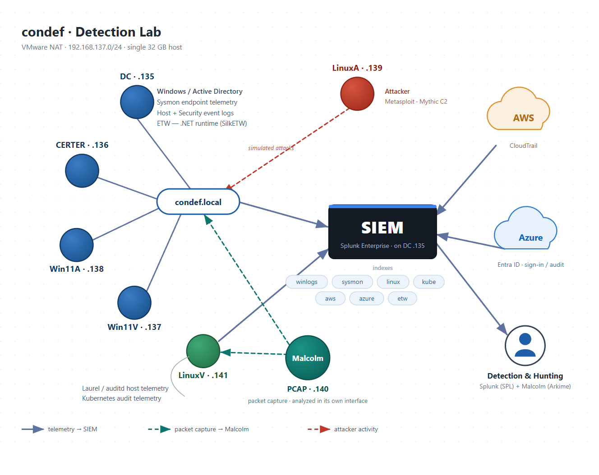

# Detection Engineering Lab

I built a fully monitored environment from scratch and I write detections against it, mapped to MITRE ATT&CK, across Windows and Active Directory, Linux, Kubernetes, and cloud (Entra ID and AWS).

Each detection writeup follows the same shape: run the technique in the lab, find the telemetry it produced, work out the signal that separates it from normal activity, and then tune it against the false positives that signal drags in. The queries are the easy part. The reasoning behind them is what I am actually practicing.

**Status:** the lab build is complete and written up, and detection writeups are going up as I finish them.

> **Safety:** this is an isolated lab on a NAT'd subnet. All credentials are throwaway values and all cloud resources use disposable accounts. Nothing here is production.

---

## Writeups

**[Building a Detection Lab on One Machine](building-a-detection-lab-on-one-machine.md)**
How the environment is put together and why. The network, the domain, endpoint telemetry, the collection tier, the cloud and Kubernetes pipelines, what the RAM constraint forced me to decide, and the failures that taught me the most.

**[Catching My First Reverse Shell](catching-my-first-reverse-shell.md)**
I detonated a Meterpreter reverse shell against a Windows workstation, then built two Splunk detections that catch it from different angles: one on the process that spawned it, one on the length of the command line that launched it. Covers why each signal works, where each one produces false positives, and why combining two weak signals beats tuning either one alone.

### Detection catalog

| Detection | Platform | Telemetry | ATT&CK | Status |
|---|---|---|---|---|
| [Reverse shell: anomalous parent process](catching-my-first-reverse-shell.md) | Windows | `sysmon` EID 1 | [T1059.003](https://attack.mitre.org/techniques/T1059/003/) | Published |
| [Reverse shell: command-line length](catching-my-first-reverse-shell.md) | Windows | `sysmon` EID 1 | [T1059.001](https://attack.mitre.org/techniques/T1059/001/) | Published |

More detections are in progress and get added as they land, each with its ATT&CK mapping and the false positives I had to tune out.

---

## Lab architecture

**Domain:** `condef.local` · **Network:** VMware NAT `192.168.137.0/24` (gateway `.2`)

| Host | Address | Role |
|---|---|---|
| DC | `192.168.137.135` | Windows Server 2019: domain controller, DNS, **Splunk Enterprise 9.3.2** |
| CERTER | `192.168.137.136` | Member server, Sysmon config-push host |
| Win11V | `192.168.137.137` | Domain-joined workstation (Sysmon), primary detonation target |
| Win11A | `192.168.137.138` | Domain-joined workstation (Sysmon) |
| LinuxA | `192.168.137.139` | Attacker box: Metasploit, later Mythic C2 |
| Malcolm | `192.168.137.140` | Network traffic analysis appliance |
| LinuxV | `192.168.137.141` | Minikube / Kubernetes host, auditd and Laurel telemetry |

Every VM runs on one physical host with 32 GB of RAM. Their combined minimum allocation is closer to 44 GB, so they cannot all run at once. Deciding which of them coexist turned out to be the most instructive constraint in the whole build.

LinuxA is the attacker box, and it's the only machine in the lab deliberately left uninstrumented. Nothing on it ships to Splunk. In a real incident you don't get telemetry from the attacker's machine, so everything has to be caught with what the victims produce. That's the constraint the rest of the environment is built around.

### Telemetry pipeline

Host and cloud telemetry lands in Splunk across purpose-built indexes. Network traffic is analyzed separately in Malcolm, and detections correlate across both.

| Index | Source |
|---|---|
| `winlogs` | Windows Security and System event logs |
| `sysmon` | Sysmon (sysmon-modular config) |
| `etw` | ETW providers (index created, not yet fed) |
| `linux` | auditd via Laurel |
| `kube` | Kubernetes audit logs via OTel collector |
| `azure` | Entra ID sign-in and audit logs via Event Hub |
| `aws` | CloudTrail via S3 |

**Ingest routes:** Universal Forwarder push on `9997`, HTTP Event Collector push on `8088`, S3 pull for AWS, Event Hub consume for Azure. Two push, two pull, with different failure modes each. Malcolm captures off the virtual network in promiscuous mode.

### Tooling

Splunk Enterprise 9.3.2 · Splunk Universal Forwarder · Splunk Add-on for AWS · Splunk Add-on for Microsoft Cloud Services · Splunk OpenTelemetry Collector · Malcolm · Sysmon + [sysmon-modular](https://github.com/olafhartong/sysmon-modular) · Laurel + auditd ([Neo23x0 ruleset](https://github.com/Neo23x0/auditd)) · Minikube + kubectl + Helm · Azure Event Hubs + Entra ID diagnostic settings · AWS CloudTrail + S3

---

## Background

I built this lab while working through [Constructing Defense](https://www.justhacking.com/course/condef-lite/)) by Anton Ovrutsky (justhacking.com). I took the Lite track, which means no provided cyber range: I stood up the entire environment myself, on my own hardware.

I followed the course's guidance for the lab architecture and the telemetry configuration. What I own is everything between the instruction and the working system: standing it up under a RAM constraint the guidance doesn't account for, diagnosing what broke, and understanding why each piece is there rather than just that it worked. The detection writeups run against my own environment, so the false positives I had to tune out are specific to my lab, not lifted from a worked example. The queries follow the techniques I was learning; the tuning is where I had to reason about my own data.
