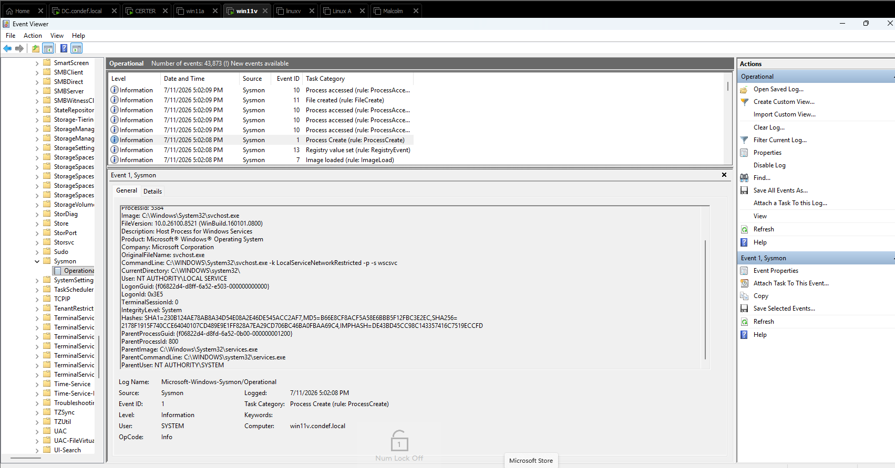
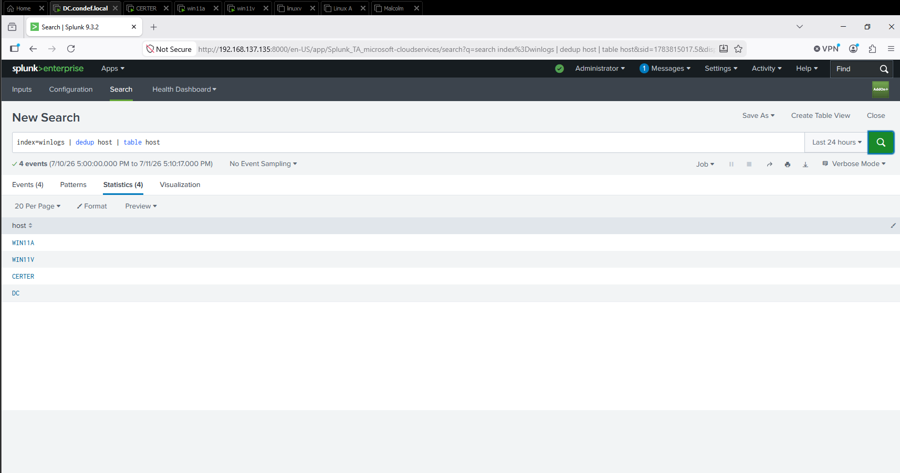
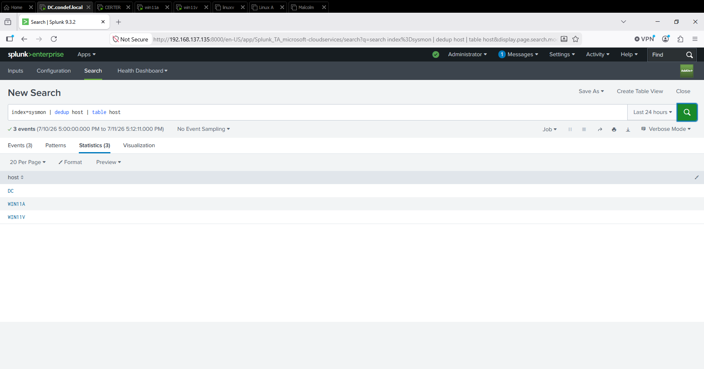
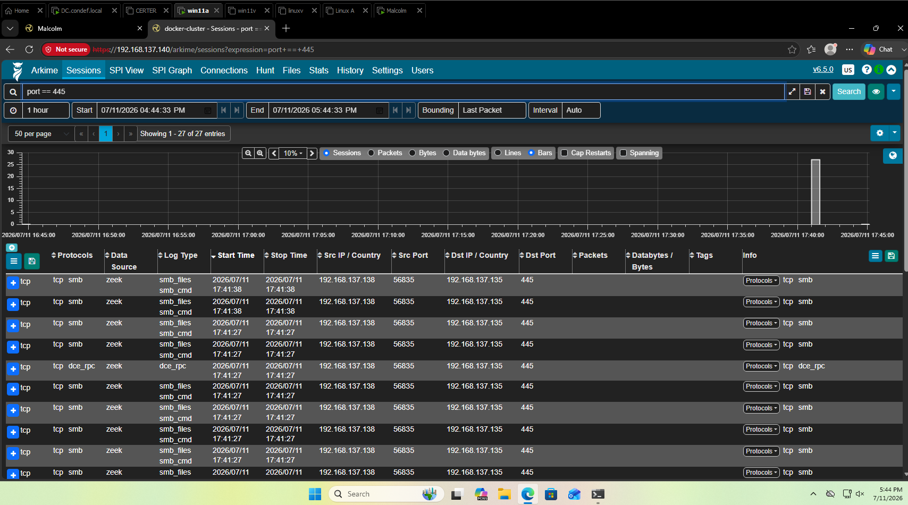
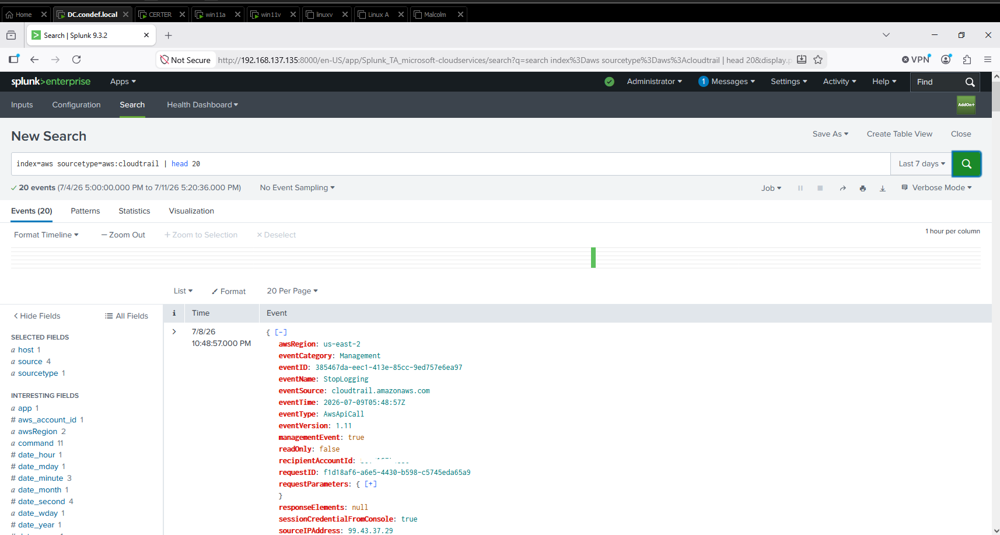
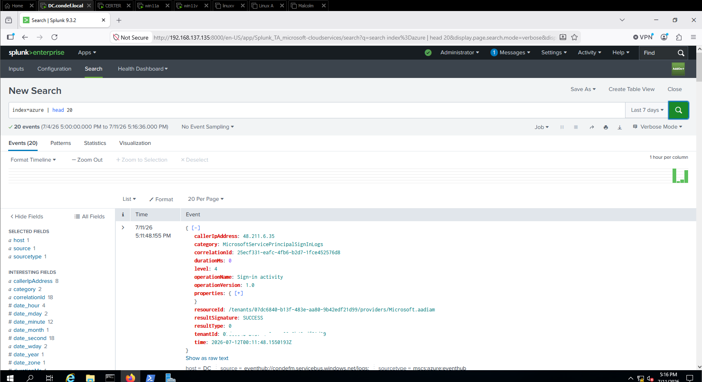
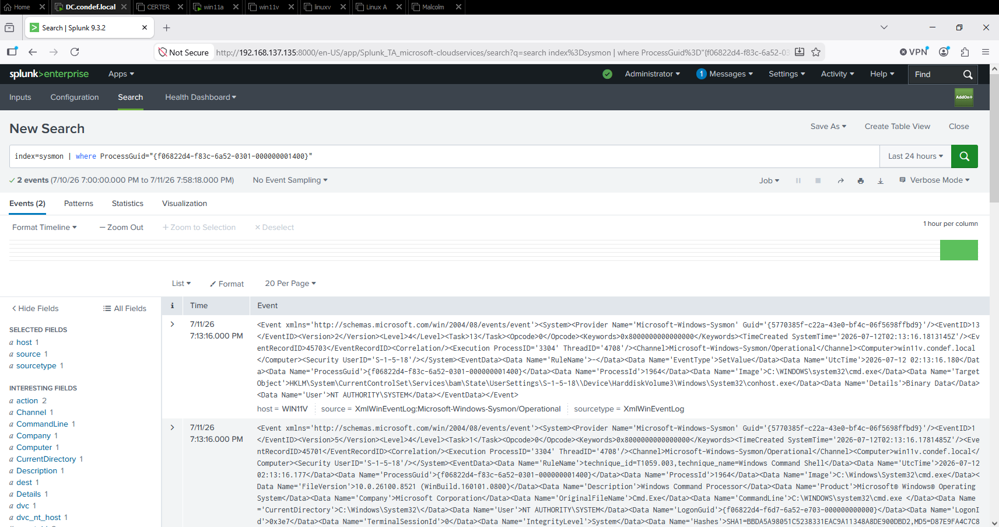
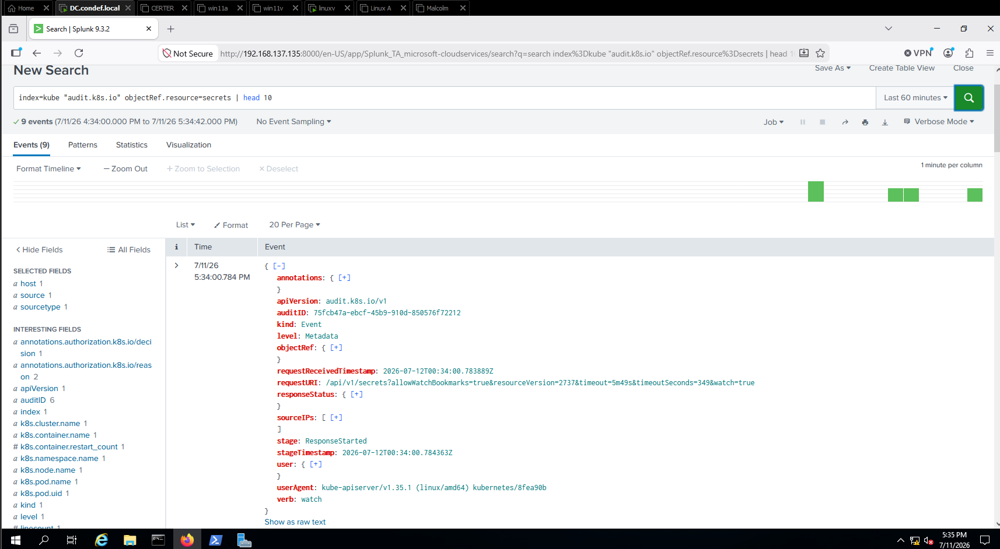

# Building a Detection Lab on One Machine

## Why I built this

I'm learning defensive security, and the fastest way I've found to actually understand how detection works is to build the whole pipeline myself: the identity layer, the endpoints, the sensors that watch them, and the log platform that collects everything so I can hunt across it in one place. Reading about it never stuck the way building it did.

This is the foundation the rest of my detection writeups sit on top of. It's the map of the environment those detections run in, so I want to lay out how the lab is wired before I start writing about what I catch with it.

## The one constraint that shaped everything

Everything runs on a single physical machine with 32 GB of RAM, using VMware for the virtual machines. If I add up the minimum RAM each machine needs, it comes to roughly 44 GB. That's more than the host has. So "turn everything on at once" was never an option. Every working session is me deciding which subset of the lab to run for the task in front of me.

The constraint made the lab better to learn on. It forced me to understand what each machine is for and what depends on what, because I couldn't just leave it all running and forget about it. Two machines are the heavy tenants: the network traffic appliance at 16 GB and the Kubernetes host at 8 GB. Those two would fit together on their own, but each needs the DC and a couple of other machines running alongside it, and with those added there isn't room for both tracks at once. Keeping the heavy tenants from ever running together is the main reason the whole thing fits. I'll come back to how I ration it near the end.

## Network layout

One flat subnet, `192.168.137.0/24`, on VMware NAT. A few addresses are reserved by NAT itself (the host adapter, the gateway at `.2`, and DHCP), and I learned the hard way to leave those alone. Every machine that belongs to the domain points its DNS at the domain controller, because the domain controller is the only thing that knows how to resolve names inside my domain.

Here's the fleet:

| Machine | Role | RAM | IP |
|---|---|---|---|
| DC | Domain controller, DNS, Splunk | 4 GB | `.135` |
| CERTER | Member server, config deployment host | 4 GB | `.136` |
| Win11V | Domain workstation, detonation target | 4 GB | `.137` |
| Win11A | Domain workstation | 4 GB | `.138` |
| LinuxA | Attacker box, deliberately uninstrumented | 4 GB | `.139` |
| Malcolm | Network traffic analysis | 16 GB | `.140` |
| LinuxV | Kubernetes host, auditd and Laurel telemetry | 8 GB | `.141` |

## Identity: the domain

The center of the lab is a Windows domain, `condef.local`, running on a Windows Server 2019 domain controller. I started here on purpose. Everything authenticates against it: a domain account logs into any client, and the DC vouches for that identity. If the DC is off, that vouching stops. A machine that has signed in before can still fall back to cached credentials, but anything that actually needs the DC, including a first-time domain join, fails. I found that out directly when a join failed and the only reason was that I'd left the DC powered off.

As a defender, the reason identity comes first is that the domain controller is the crown jewel. Whoever controls identity controls the environment, which is why so many real attacks are ultimately about getting to a domain admin. I can't sensibly defend the thing that governs all identity until I understand how identity flows through it, so that's where I began.

## Pushing configuration with Group Policy

A domain isn't just about who can log in. It also lets me push configuration to every machine from one place, and I leaned on Group Policy for a few things the rest of the lab quietly depends on.

The most important is logging. Windows doesn't record much of the security-relevant activity by default, so a lot of what a detection needs is simply never written unless you turn it on. I use a Group Policy that turns on the advanced audit policies and PowerShell script-block logging across the fleet. That produces the authentication, Kerberos, and directory-access events later detections rely on (failed logons, ticket requests, directory reads), along with a record of what PowerShell actually ran. Sysmon already covers process creation, so the job of this policy is the categories Sysmon can't give me. The dependency is worth being blunt about: without that policy, my forwarders would faithfully ship logs that were never written in the first place. The collection tier is only as good as what the endpoints are configured to record.

I also disable Windows Defender on my detonation target through its own policy, so I can run payloads and study what they look like instead of having the endpoint quietly eat them. That one taught me that "pushed through policy" isn't the same as "enforced": Defender's Tamper Protection overrides the registry changes the policy relies on, and is deliberately not itself controllable through Group Policy, so I had to confirm the actual state on the host rather than trust that the policy had taken. A smaller certificate-enrollment policy supports the Active Directory Certificate Services side of the lab.

## Endpoints and the sensor on them

The Windows clients and a member server are all joined to the domain. On the machines I want deep visibility into, I run Sysmon. It records the events that matter for detection: process creation with full command lines and parent/child lineage, network connections, and cross-process memory access (the signal you'd watch for when something tries to read another process's memory, like a credential dumper reaching into `lsass`).

For the config I use a community ruleset organized around MITRE ATT&CK, so the raw firehose gets filtered down to signal and matching events get tagged with the technique they map to. That tagging becomes a useful search pivot later.

Rather than hand-installing on each box, I push the config from one console using a deployment tool. It's the small-scale version of what a real shop does with Group Policy or an endpoint management platform. The thing that stuck with me: the same domain-enumeration-and-remote-execution machinery a defender uses to push a sensor everywhere is the machinery an attacker uses to move laterally. Same plumbing, different intent. Getting fluent with it is what makes you good at defending against it.

*A single Sysmon process creation event on one of my workstations. Every process gets recorded with its full command line, the hashes of the binary, the user it ran as, and the parent that spawned it. That last part is what makes detection possible: a process on its own is rarely suspicious, but a process with the wrong parent usually is.*

## The Linux side: auditd and Laurel

The Windows machines have Sysmon. The Linux machines need their own answer to the same question, and on Linux that starts with auditd, the kernel's audit subsystem. It sits below the process layer and records syscalls: the actual system calls a program makes when it opens a file, spawns a child, or reaches out over the network. That's a lower vantage point than Sysmon has, and it's the right one, because a lot of Linux attacker behavior is just ordinary binaries making ordinary syscalls in an unusual pattern.

I run a community ruleset that tells auditd what to watch, so I'm not recording every syscall on the box, which would be unusable.

The problem is that raw auditd output is close to unreadable. A single event gets split across multiple lines, keys are cryptic, and arguments come out hex-encoded. You can grep it. You cannot reasonably build detections on it.

Laurel fixes that. It sits between auditd and the log file and transforms those fragments into a single structured JSON record per event, with the pieces resolved into something a human and a SIEM can both work with. A Universal Forwarder then watches that file and ships it into the `linux` index, the same push path the Windows machines use.

What this buys me is syscall-level visibility. Something reading `/etc/shadow` shows up. A bash process with its input and output redirected to a socket, which is what a reverse shell actually is at the syscall layer, shows up. Neither of those has a tidy log entry the way a Windows process creation does. They exist as syscalls or they don't exist at all, which is exactly why the sensor has to sit that low.

The attacker box on the network is a Linux machine too, but deliberately uninstrumented. It's where I run Metasploit and generate the activity everything else is watching for. Nothing on it ships to Splunk, because in a real environment the attacker's machine is the one thing you never get telemetry from. The whole exercise is catching them with what the victims produce.

## The collection tier: Splunk

Splunk Enterprise runs on the domain controller and is the heart of the lab. Co-locating the SIEM on a domain controller isn't something I'd do outside a lab, since in a real environment you keep a DC lean and isolated rather than handing it the blast radius of a log platform, but on a single 32 GB host it's a deliberate, pragmatic compromise. My host and cloud log sources all end up here so I can search across them in one place. I created seven indexes, one per kind of telemetry: `winlogs`, `sysmon`, `linux`, `kube`, `aws`, `azure`, and `etw`.

The part I found most interesting is that the logs arrive four different ways, and understanding those four shapes taught me more about how real telemetry pipelines work than anything else in the build:

1. **Universal Forwarders push over port 9997.** These are lightweight agents on each Windows and Linux machine that read local logs and ship them to Splunk. The agent stores nothing itself; it only collects and forwards.
2. **The HTTP Event Collector (HEC) receives POSTs over port 8088.** Any producer that can make an HTTP request can send JSON straight in, with no agent required. My Kubernetes telemetry comes in this way.
3. **S3 polling, a pull path.** For AWS, Splunk reaches out over HTTPS and fetches log objects from cloud storage on an interval. Nothing is pushing; Splunk is doing the pulling.
4. **Event Hub consume, another pull path.** For cloud identity logs, Splunk opens an outbound connection to a managed message broker and consumes the stream.

Two of those are push, where the source sends to Splunk. Two are pull, where Splunk goes and gets the data. That push-versus-pull split is basically the difference between on-prem sources and cloud sources, and once it clicked, every new source I added made sense as a variation on one of the four.

What actually makes a forwarder useful is its input definition. On Windows that's an app I drop in that says which event channels to read. On Linux it's a config stanza that says which file to monitor and which index to route it to. Same idea both ways: the forwarder does nothing until I tell it what to read and where to send it. That's why my member server, which has the Windows input but not the Sysmon one, shows up in `winlogs` but not `sysmon`.

The reason to ship logs off-host at all is that an attacker who owns a machine owns its local logs. Forwarding evidence off the box in near real time means the record survives even if the endpoint gets wiped, and centralizing it is the only way to correlate activity across machines, which is the whole point of a SIEM.

*Every Windows host reporting into the `winlogs` index, and then the three that run Sysmon reporting into `sysmon`. CERTER drops out of the second search, and that gap is deliberate. It has the Windows event log input but not the Sysmon one, so the forwarder ships exactly what I told it to and nothing more. Same agent on every box. What differs is the input definition.*

## Network traffic: Malcolm

Splunk is log-centric. It collects what systems report about themselves. But some behavior only shows up on the wire, so I also run a network traffic analysis appliance (Malcolm, from Idaho National Laboratory), which decodes what actually happened on the network using Zeek, Suricata, and Arkime underneath. It can see that traffic because its capture interface sits on the virtual network in promiscuous mode, so it picks up the conversations between the other machines on the segment instead of only what's addressed to it. That's the virtual-lab version of a SPAN or mirror port on physical gear.

The two tools are complementary, not competing. Splunk answers "what do all my logs together say," and Malcolm answers "what happened on the wire." Real detection needs both, because some activity only appears in one of them. In my lab these stay as two separate planes: I query Malcolm in its own interface for the network view, and Splunk for everything host and cloud. The detection work is where I correlate across the two.

This is the 16 GB tenant, so I only bring it up when I'm doing traffic work and shut it down afterward to reclaim the memory.

*SMB traffic between two of my Windows machines, captured by an appliance that is not a party to the conversation. Its interface sits on the segment in promiscuous mode, which is the virtual version of a mirror port on a switch. Zeek decodes what it sees, so this is not just a record that two hosts talked on port 445. It is the individual SMB commands, the file operations, and the RPC calls underneath. This is the view my logs cannot give me, because it exists only on the wire.*

## Reaching into the cloud

Two cloud sources, both control-plane audit records, and both pull paths.

**AWS CloudTrail** records every API call in my AWS account. That's the cloud version of an audit log: who created, changed, or deleted what. Splunk pulls those records out of cloud storage into the `aws` index. The mental model that stuck for me is that in the cloud, the account is the box. An attacker with credentials operates through the same API surface CloudTrail records, so if the trail isn't on and being collected before an incident, the record was simply never kept.

**Azure and Entra ID** is the cloud identity provider, the SaaS equivalent of my on-prem domain controller. Its sign-in and audit logs are the authoritative record of who authenticated and what changed in the directory. A diagnostic setting streams those logs into a managed message broker, and Splunk consumes from it into the `azure` index.

The thing that took me longest here had nothing to do with Splunk. It was Azure's permission model. Azure separates control over resources (subscription-level access) from control over the identity directory (directory roles), and the two are independent. You can fully own a subscription and still be powerless in the directory it trusts. I ran straight into that when my first account landed inside an institution's directory where I had resource rights but no directory-admin rights, which silently blocked every piece of identity telemetry work. The fix was standing up my own directory where I'm the admin. As a defender, the lesson is the clean version of least privilege: resource control and identity control are deliberately different keys.

Cloud resources don't touch my host RAM, since they run on the provider's hardware. What I ration in the cloud is money, so the discipline is the opposite of the local lab: turn it off when I walk away, because some of these meters bill continuously whether or not I'm using them.

*CloudTrail records landing in the `aws` index. Splunk pulls these out of cloud storage on an interval rather than anything pushing them to it.*

*Entra ID sign-in and audit logs landing in the `azure` index, consumed from a managed message broker. This is my cloud identity provider reporting on itself, the same way the domain controller does on-prem.*

## Kubernetes

I run a small local Kubernetes cluster on the Linux host to learn container visibility without paying for a managed cluster. The log source I care about there is the API server audit log. The API server is the cluster's single front door, so every action passes through it, which makes its audit log the authoritative record of who did what in the cluster (the container-world equivalent of the Windows Security log). An audit policy filters that firehose down to what matters, and a collector running inside the cluster ships it out to Splunk over HEC into the `kube` index. It's the same "get the evidence off the box" logic as the forwarders, one layer up the stack.

This is the 8 GB tenant, the other heavy one.

*The OpenTelemetry collector running inside my cluster. It reads the API server audit log and ships it out over HTTP to Splunk. Same idea as the forwarders on my Windows and Linux machines, just one layer up the stack: get the evidence off the box before anything can tamper with it.*

*The API server audit log, landing in Splunk. Every action against the cluster gets recorded here with the user, the source IP, the verb, and the exact resource touched. This one is the cluster's own internal watch on secrets, but the same record gets written whether the caller is a system component or an attacker with a stolen token.*

## How I actually ration it

Back to the constraint that shaped everything. In practice I work one track at a time and power the heavy tenant down when I switch:

- **Domain and endpoint work:** the DC plus the Windows machines, around 16 GB. Plenty of headroom.
- **Network traffic work:** Malcolm plus the DC plus one client. Heavier, but fine, and the Kubernetes host stays off.
- **Kubernetes work:** the Linux hosts, plus the DC when I'm shipping cluster logs into Splunk. Malcolm off.
- **Cloud work:** really just the DC, since Splunk does the pulling and the cloud resources run on the provider.

The rule underneath all of it is that the DC stays on whenever identity or logging is involved, which is most of the time, and at 4 GB it's cheap to leave running. The two heavy tenants never share the table.

## A few things that cost me time, and what I took from them

A lot of the learning here was troubleshooting. A few lessons that generalize past this lab:

- **Duplicate IPs are brutal.** Three separate times two machines ended up on the same address. Twice it was a static collision, and Windows quietly drops one host to a self-assigned address that breaks its entire network identity: domain trust gone, authentication failing, and every error looking like an auth problem when the real cause is the IP. The third was sneakier, a Linux host that DHCP had handed an address a second machine also held statically. It stayed invisible because the two boxes never ran at the same time, right up until the moment they would have. Now I check addressing first, before anything else.
- **"It deployed" is not "data is flowing."** A log shipper can report success while pointing at the wrong destination, and the index just sits there empty. I learned to verify that the data actually landed, not that the command returned cleanly.
- **Reachability is not authentication.** A machine can ping and resolve names perfectly and still fail to authenticate. They're separate problems, and I diagnose them separately now.
- **The friendly status display is not ground truth.** More than once a UI showed something as healthy while the actual config on disk, or the actual message count upstream, told the real story. I trust the ground-truth signal over the dashboard.

The one method that kept working: when a tool fails, reproduce what it's doing by hand, one layer at a time. If every manual step succeeds, the fault is in the tool, not the environment. And in a screen full of errors, read the first one, because the rest are usually downstream of it.

## Where this goes next

The lab is the foundation, but the detections are the point. I've started turning this telemetry into actual detections, beginning on Windows with a reverse shell caught two different ways and then combined into a single query. Those writeups are coming, and from there I'm working across all the sources I've wired up, correlating between them, and feeding the one index I haven't fed yet (event tracing for Windows).

Live sources right now: Windows logs, Sysmon, Linux audit, Kubernetes, AWS, and Azure identity. Still to come: ETW.
