# Catching Credential Access Through File Shares

## What this is

When an attacker lands on a network, one of the quiet, low-effort ways to get more access is to go looking through file shares. People leave things lying around on shares that they shouldn't: config files with connection strings, spreadsheets of passwords, backup files, and yes, actual files literally named passwords.txt. An attacker doesn't need an exploit for any of this. If they have a domain account, they can just browse the shares that account can reach and read whatever is sitting there. That is the whole technique. It maps to Unsecured Credentials: Credentials In Files (T1552.001), Network Share Discovery (T1135), and Data from Network Shared Drive (T1039).

To do it at scale, attackers reach for a tool called Snaffler, which crawls every share it can find and flags files that look interesting by name, extension, or content. It is genuinely a great tool, and it can be used defensively too, to audit your own network for creds hanging around where they shouldn't be. In this writeup I stand up some shares, plant a fake passwords.txt, run Snaffler against it, and then figure out how to catch that activity from the logs.

## The detection primitive

The observable this whole detection rests on is Windows event ID **5145**, "a network share object was checked to see whether client can be granted desired access." The domain controller (acting as my file server here) writes a 5145 every time a client touches a share object, whether that access succeeds or fails.

The fields inside 5145 are what make it useful:

- **ShareName** tells me which share was accessed (Logs1, SYSVOL, ADMIN$, etc.).
- **RelativeTargetName** is the file or object touched inside the share. This is where a filename like passwords.txt shows up.
- **IpAddress** is the source machine that did the accessing.
- **Caller_User_Name** is the account that did it.
- **Keywords** tells me whether the access was Audit Success or Audit Failure.

So the detection idea is: a single account, from a single source IP, touching a large number of shares in a short span, especially with a pile of access failures, does not look like a person doing their job. It looks like a tool sweeping the estate. Normal file share use is narrow and slow. A user opens the one or two shares they actually work in. Enumeration is wide and fast, hitting everything at once. That difference in breadth and speed, plus the failure volume from shares the account can't reach, is the signal I key on. The queries later are just different ways of measuring that.

One important thing I learned the hard way (more on this below): 5145 is not logged by default. If Detailed File Share auditing isn't turned on, none of this exists in the logs no matter how much share access happens.

## Setting up the shares

I'll create some file shares in my domain. I start by opening up PowerShell ISE, which is the script editor.

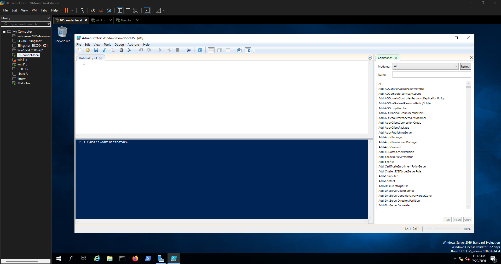

I put in the following PowerShell code:

```powershell
$numbers = 1..15

foreach($number in $numbers) 
{
    New-Item "C:\Shares\Share$number" -itemType Directory
    New-SmbShare -Name "Logs$number" -Description "Test Share $number" -Path "C:\Shares\Share$number" -NoAccess lowpriv -FullAccess 'Everyone'
}
```

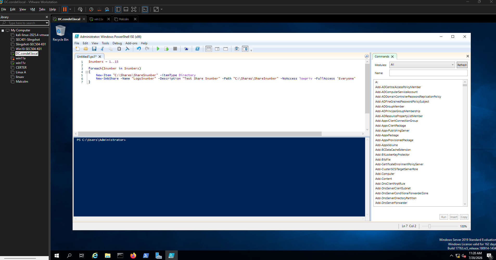

This script creates 15 folders in C:\Shares named Share1 through Share15, makes an SMB share out of each one called Logs1 through Logs15, and explicitly denies a user called lowpriv access to all of them. The lowpriv deny is deliberate, because later I want to see what it looks like when an account gets turned away, not just when it gets in. Those denials are what generate the failure events that give away a scanning tool.

Before running the script, I run the following in the bottom section of the ISE window to create the lowpriv account:

```powershell
New-ADUser -name 'lowpriv' -AccountPassword (Read-Host -AsSecureString "AccountPassword") -Enabled $true
```

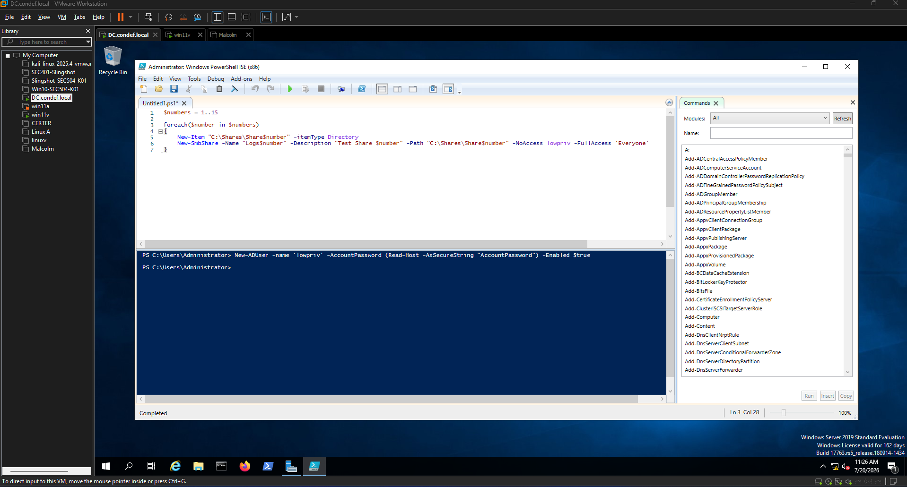

A box pops up and I set the password for that user.

I then click the run script button at the top.

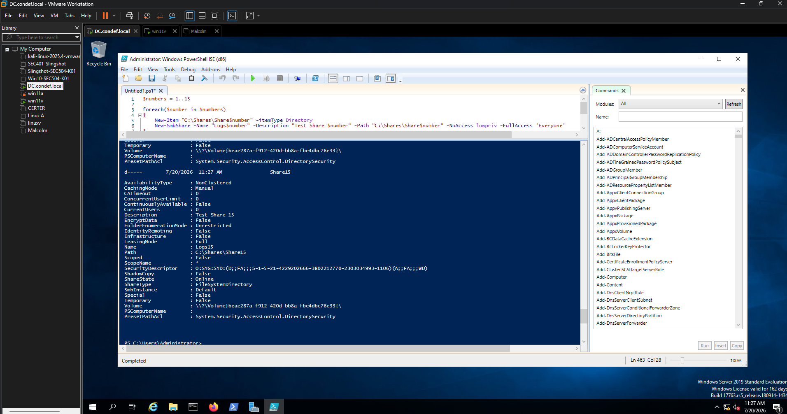

## Getting a feel for the telemetry

Before I can build a detection, I need to know exactly what each kind of share access looks like in the logs: authorized access, denied access, and reading an actual file. So I generate one of each and go look at it.

Let's see if I can access one of these shares from another Windows 11 machine in my domain, win11v. On there, I navigate to \\dc\logs1.

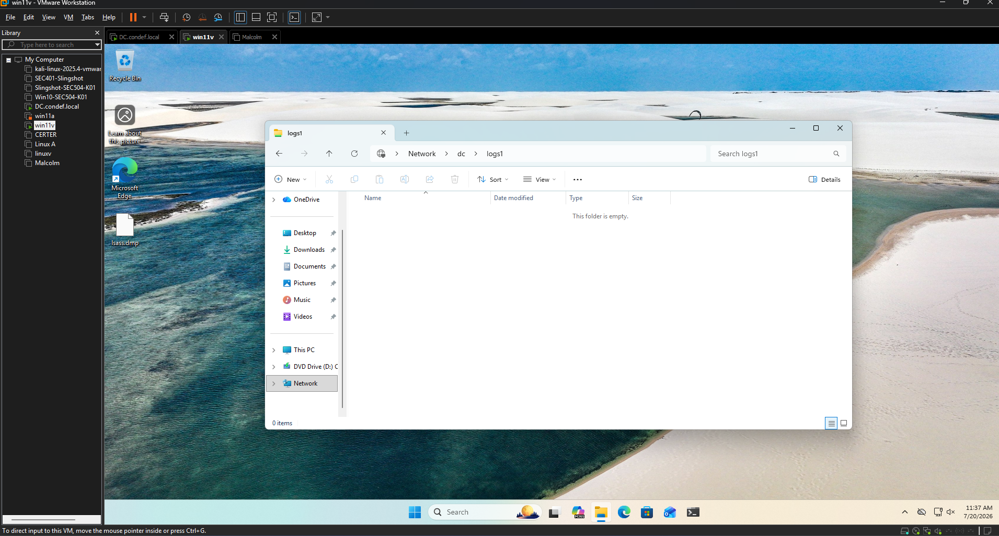

Back at my domain controller, I want to see if any events were generated from accessing that share. I open up Event Viewer, then Windows Logs, then Security, then Filter Current Log, and filter for event ID 5145.

I don't see any event from today. They're all from an earlier date. This is my first real snag. I wonder if this event type is even being logged. It turns out Detailed File Share auditing is off by default, so the browse I just did never got recorded. Audit policy isn't retroactive either, so the access that already happened is just gone. I turn the auditing on with the following PowerShell on the domain controller:

```
auditpol /set /subcategory:"Detailed File Share" /success:enable /failure:enable
```

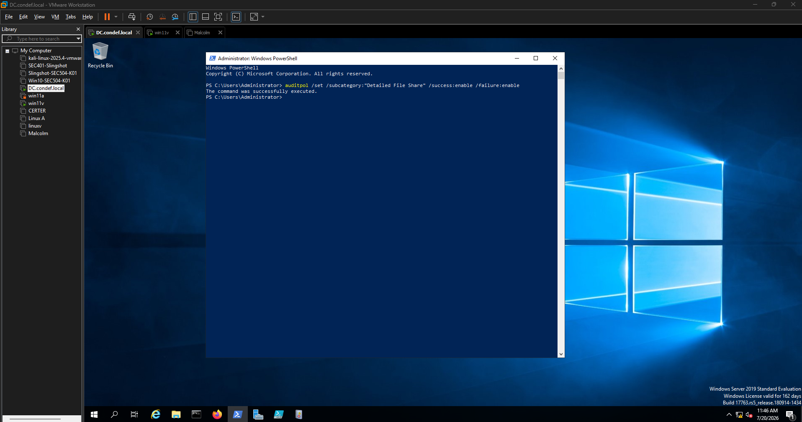

This is worth pausing on, because it's the kind of thing that makes a detection silently useless. If I had written a beautiful 5145 detection and shipped it without confirming the audit policy was on, it would never fire, and I'd have no idea why. The course environment apparently has this enabled as part of its setup, but I'm building my lab from scratch, so I hit the gap live. Lesson logged: before trusting any detection that leans on 5145, verify Detailed File Share auditing is actually enabled.

Now that auditing is on, I go back and access \\dc\logs1 again from win11v, then refresh the event viewer. Here it is. I can see the new log for today.


Now let's see what a denied access looks like. I want to know what the lowpriv account (which I denied on all these shares) generates when it tries to get in. On win11v I run this in command prompt:

```
runas /user:condef\lowpriv "C:\windows\system32\cmd.exe"
```

That brings up another command prompt running in the context of the lowpriv user.

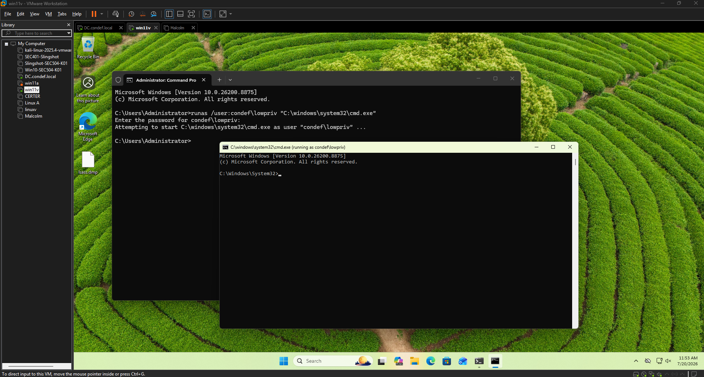

Then within that new command prompt, I try to hit the share:

```
dir \\dc\logs1
```

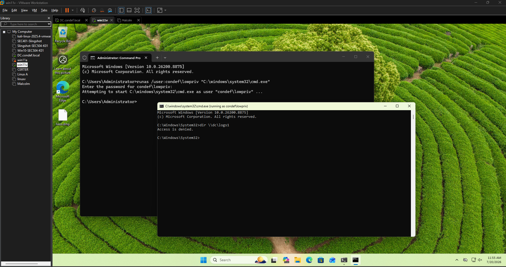

Access is denied, which is exactly what I set up. Now the question that matters for detection: does a denied attempt still write a 5145? It does. Here it is on the dc, this time with a failure result instead of success.

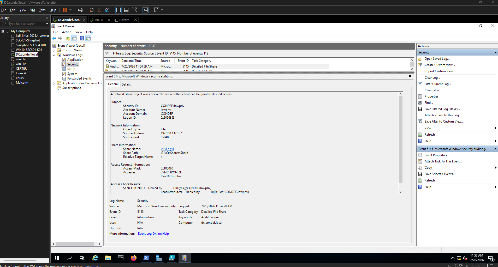

That failure event is a big deal for later. A legitimate user rarely racks up a stack of access-denied events across many shares. A scanning tool run by an account without broad rights does exactly that. The Keywords field (Audit Success vs Audit Failure) is what lets me separate the two.

So far I've made test file shares on my dc that's acting as the file server, and I've watched what happens when an authorized account gets in and when a denied account gets turned away. I know what both look like in Event Viewer now.

Let's do the last piece: reading an actual sensitive file. I create a passwords.txt with a fake password in it inside Share1 (which is the Logs1 share).

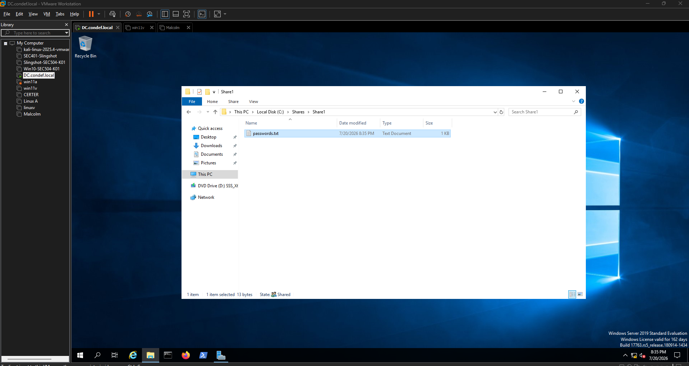

I go over to win11v and read it with my normal admin account:

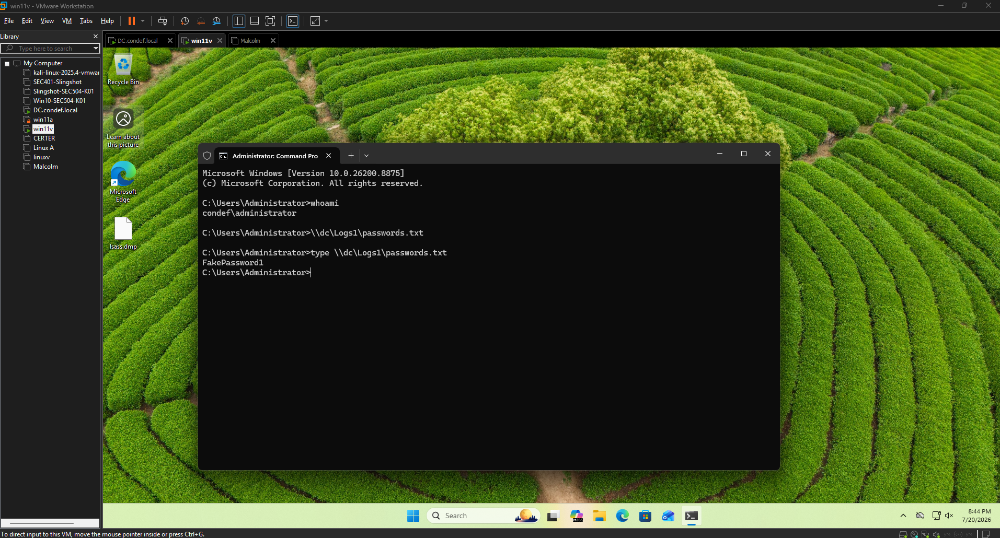

Let's look at the 5145 event this generated.

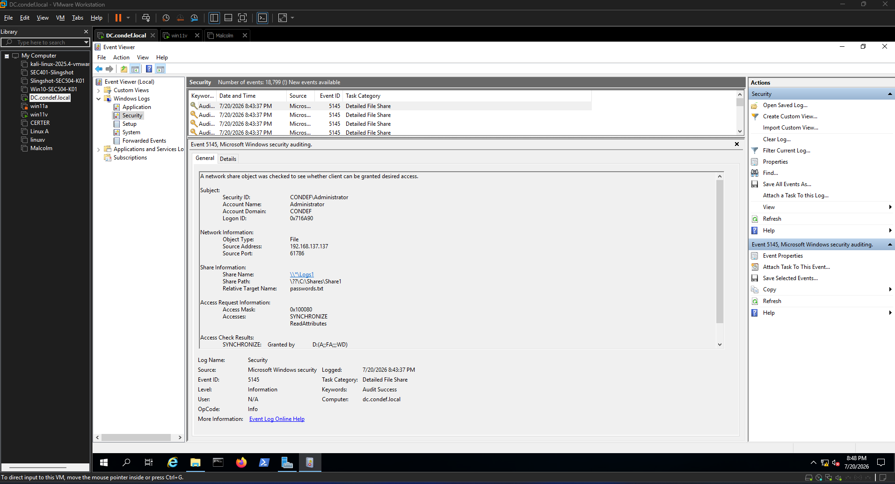

Here I can see the user who accessed it, the source IP, the file that was accessed (RelativeTargetName is now passwords.txt instead of just the share root), and that access was granted. This is the event that matters most for the "someone read a creds file" case, because RelativeTargetName is the field that carries the filename. That's the thing I can pattern-match on.

So now I've seen all three telemetry conditions: a user accessing a share, a user reading a file within a share, and a user being denied. That's the full vocabulary I need before I start hunting.

## Generating real activity with Snaffler

Poking shares by hand is fine for learning the events. To see what an actual crawl looks like, I use Snaffler. I run it with:

```
Snaffler.exe -s -o shares.log
```

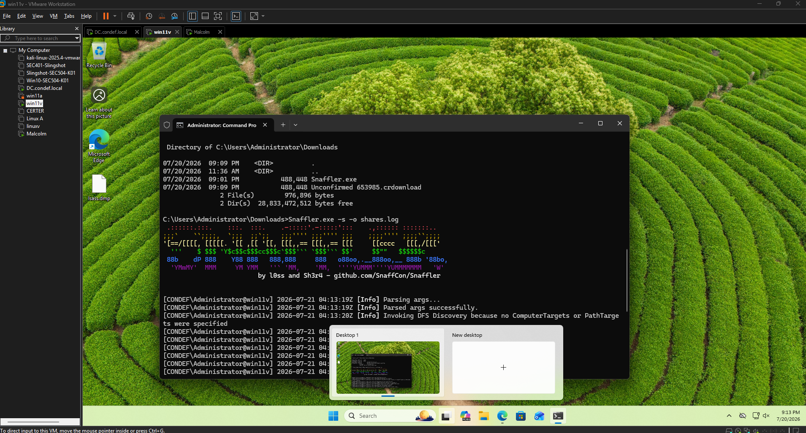

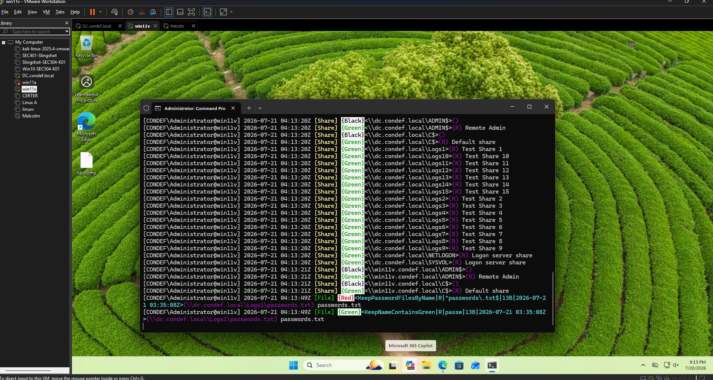

Snaffler discovers the shares in my network and looks inside them for files with interesting extensions, contents, or names. It finds my passwords.txt. This is a new tool for me and it's easy to see how it works both as an attacker's shortcut and as a defender's audit tool: it hands me a map of where the sensitive files actually are, which I can then feed straight into my alerting.

## Building the detection in Splunk

Now I take the events Snaffler generated and figure out how to catch this in Splunk.

First, a wide look at which shares got hit and how often:

```
index=winlogs EventCode=5145
| stats count(RelativeTargetName) as FileNameCount by ShareName 
| sort -FileNameCount
```

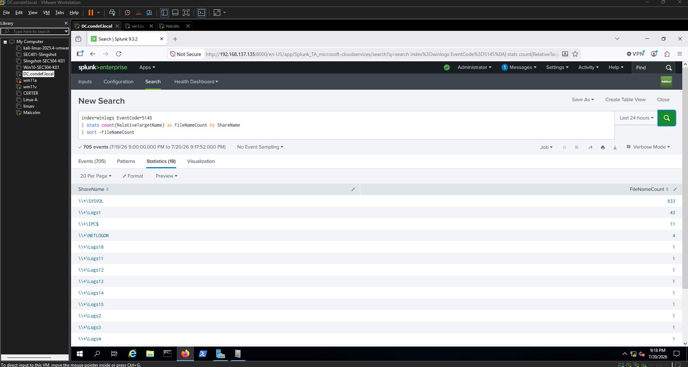

I can see a lot of activity, and my Logs shares all show up. But the useful thing this query shows me is the noise. ADMIN$, C$, SYSVOL, IPC$, and NETLOGON dominate the counts. These are system shares that every domain machine touches constantly for normal operation. If I'm hunting for someone crawling file shares looking for creds, that background chatter buries the signal. The course notes these are excluded at ingest via inputs.conf so they don't burn Splunk quota, but the point stands for the detection logic too: I need to filter them out to see the interesting access.

So I tweak the query to drop the system shares:

```
index=winlogs EventCode=5145
| where ShareName != "\\\\*\\SYSVOL" AND ShareName != "\\\\*\\NETLOGON" AND ShareName != "\\\\*\\IPC$" AND ShareName != "\\\\*\\ADMIN$"
| where RelativeTargetName != "\\"
| stats values(RelativeTargetName) as Filenames by IpAddress,ShareName
```

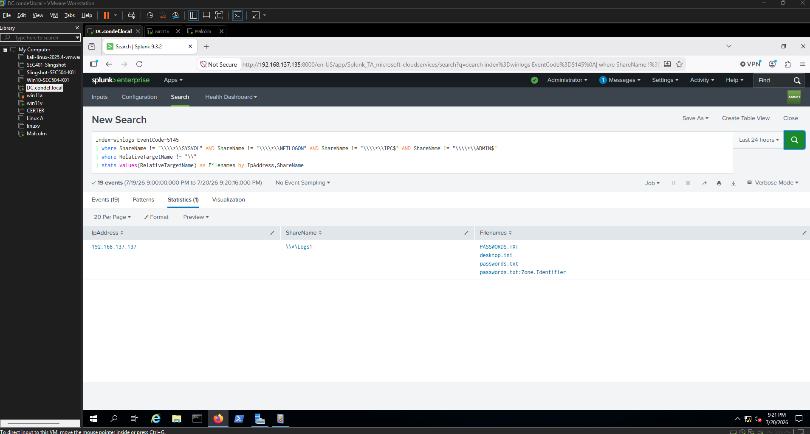

Now I'm looking at just the real file shares, grouped by which source IP touched which share and what files they saw. This is already a usable hunt: one IP showing up against a wide spread of shares is the crawl pattern.

Next I add the sensitive-file logic. Snaffler told me a creds file lives in my shares, so I know to watch for it. In a real network I'd get that list of sensitive filenames from a Snaffler audit and build my match patterns from it:

```
index=winlogs EventCode=5145
| where ShareName != "\\\\*\\SYSVOL" AND ShareName != "\\\\*\\NETLOGON" AND ShareName != "\\\\*\\IPC$" AND ShareName != "\\\\*\\ADMIN$"
| eval SensitiveFileAccess = if(match(RelativeTargetName,"password|passwords"),1,0)
| where RelativeTargetName != "\\"
| where SensitiveFileAccess = 1
| stats values(RelativeTargetName) as Filenames by IpAddress,ShareName
```

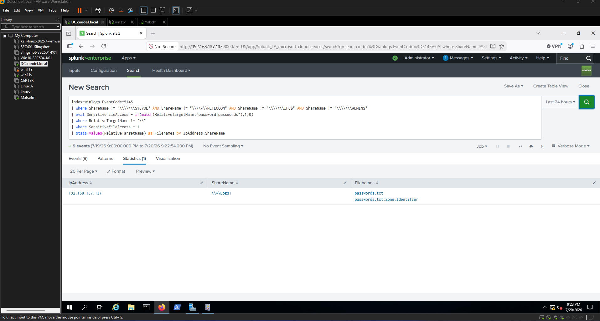

This flips a flag whenever RelativeTargetName matches password or passwords, then shows only those hits. So instead of "who touched shares," this answers "who read a file that looks like credentials," which is a much sharper alert. The regex is extensible: I'd add patterns for config extensions, key files, and whatever else a Snaffler pass in my environment turned up. The course is upfront that real-world data is messier and needs more tuning, and that the real technique here is combining qualifier statements with noise exclusion to carve out exactly what I care about.

Now the other angle: catching the scan itself, not just the sensitive file. Earlier I ran Snaffler as admin, which has access, so it succeeds quietly. What happens when a low-privileged account runs it and gets denied everywhere? I copy Snaffler.exe to Users\Public so the lowpriv account can reach it.

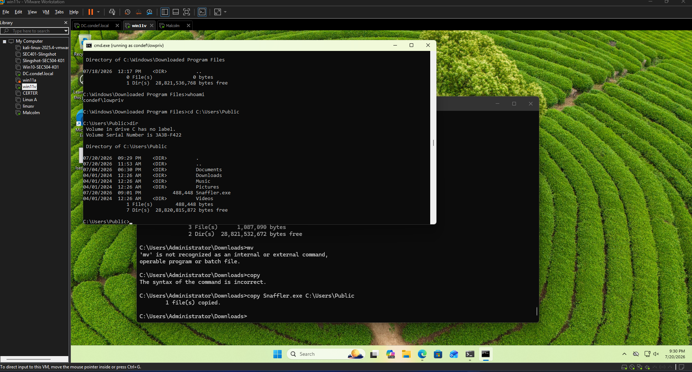

I run the same Snaffler command as the lowpriv user:

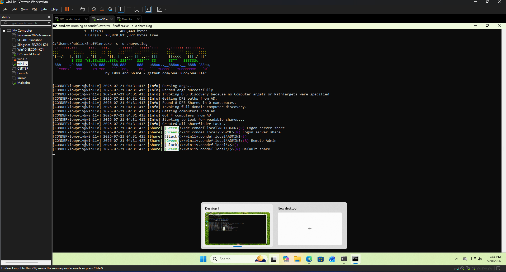

Then I query for the failures, counting attempts by source IP and account:

```
index=winlogs EventCode=5145
| where Keywords != "Audit Success"
| stats count(ShareName) as share_fail_count,values(ShareName) as ShareName by IpAddress,Caller_User_Name
```

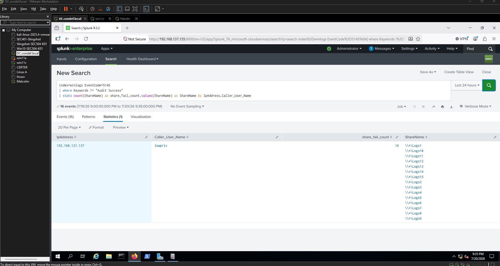

Splunk captured it. The lowpriv account failed to access a whole batch of shares, which is exactly the fingerprint of an account sweeping shares it has no rights to. A normal user does not fail against fifteen shares in a row.

The course points out the real-world problem: in a production network, accounts fail to reach shares all the time because permissions drift over years. So a raw failure count will be noisy. The fix is a threshold, only alerting when the failure count crosses a line that a normal user wouldn't:

```
index=winlogs EventCode=5145
| where Keywords != "Audit Success"
| stats count(ShareName) as share_fail_count,values(ShareName) as ShareName by IpAddress,Caller_User_Name
| eval high_share_failure_count = if(share_fail_count > 14,1,0)
| where high_share_failure_count = 1
```

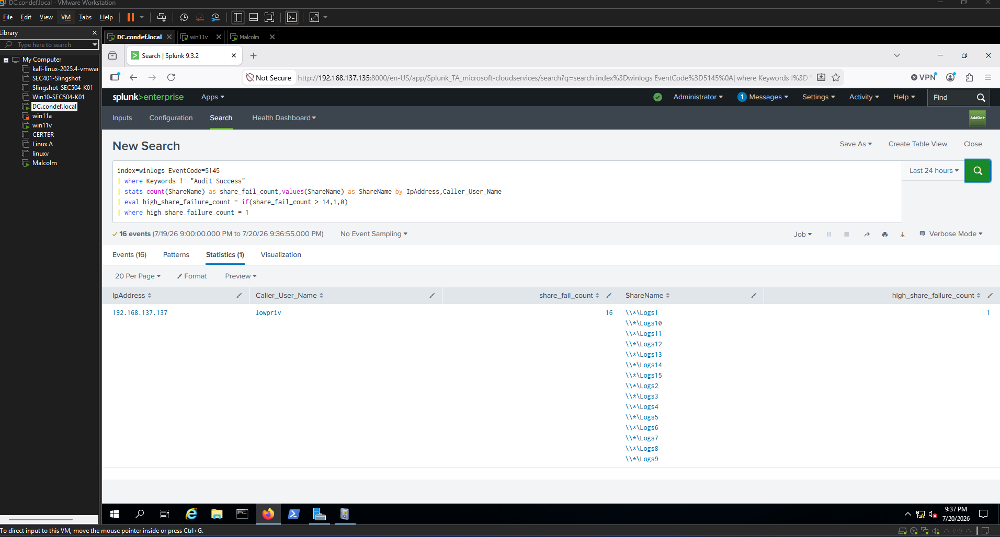

## False positives and tuning

That threshold of 14 is a real detection decision, not a throwaway number, so it's worth being honest about the tradeoff.

The most likely thing to trip this without being an attack is legitimate infrastructure that touches lots of shares: backup agents, file indexing or DLP tools, vulnerability scanners, or a migration script. All of those can rack up wide share access, and some rack up failures too when permissions are inconsistent. A brand new employee whose group memberships aren't fully sorted can also throw a burst of access-denied events across shares they should reach but can't yet.

The tuning I'm choosing here is the failure-count threshold: only alert when one account fails against more shares than a real user plausibly would in normal work. Setting it above 14 means a person hitting one or two shares they lost access to won't fire it, but a tool sweeping the estate will. The tradeoff I'm accepting is coverage at the low end. If an attacker is careful and only scans a handful of shares, or only ones their account can actually read (so no failures at all), this particular query won't catch them. I'd pair it with the breadth-based hunt (one IP against many distinct shares) and, in a real environment, allowlist known service accounts like the backup agent so their normal wide access doesn't drown the alert. The honest summary is that failure-volume is a strong signal against noisy tools like Snaffler run out of the box, and a weaker one against a patient attacker, which is why it's one detection and not the only one.

## The network layer

While running Snaffler I kept Malcolm up so I could see the same activity from the network side. The reason this matters: the network layer sees the SMB traffic completely independent of whether host logging is even on. Even if I'd never enabled that Detailed File Share auditing, Malcolm would still have captured the access on the wire. Two independent sources telling the same story is a much stronger position than relying on one.

In Arkime I search:

```
ip == 192.168.137.135 && ip == 192.168.137.137 && event.dataset == smb_cmd
```

This is the dc (192.168.137.135) and win11v (192.168.137.137).

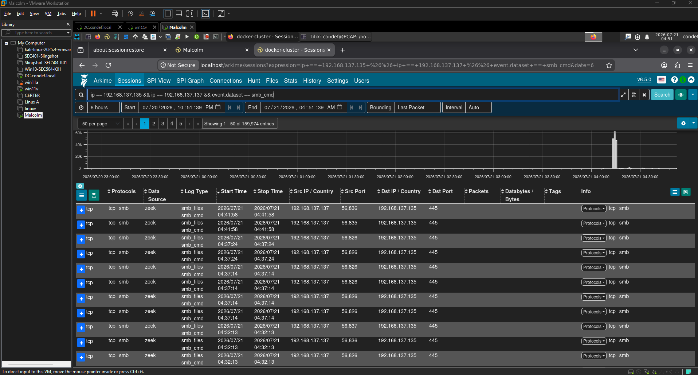

Then I use Malcolm's Connections view to visualize which source IPs accessed which files, by setting the destination field to the file path.

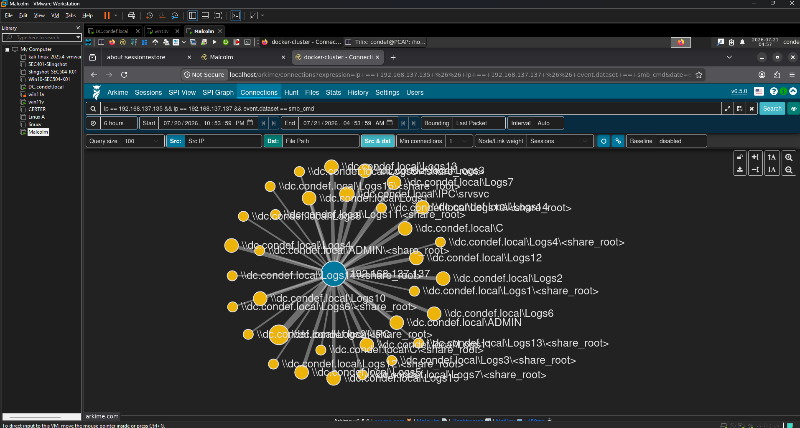

This graph is the payoff. The center node is win11v, and it fans out to every single share it touched: Logs1 all the way through Logs15, plus the system shares. That fan-out shape is the crawl, drawn as a picture. One machine reaching into the entire share estate at once is not what normal use looks like, and here it's obvious at a glance without reading a single log line. It's the same "breadth" signal from my Splunk queries, just visualized at the network layer.

## If this fired at 2am

If the sensitive-file alert (someone read passwords.txt) fired in a real SOC in the middle of the night, here's roughly how I'd work it:

1. **Validate.** Confirm the 5145 is real and pull the source IP, the account (Caller_User_Name), and the exact file. Check whether the file actually holds credentials or just has a scary name.
2. **Scope.** Pivot on that source IP and account. What else did they touch? If I see the same IP fanning out across many shares or a spike of access failures, this isn't one nosy file open, it's a crawl. Cross-check Malcolm for the SMB sessions to corroborate.
3. **Judge the account.** Is this a normal user, an admin, or a service account? A service account suddenly reading a passwords file it's never touched before is a much bigger deal than a sysadmin poking around.
4. **Contain or escalate.** If it looks like enumeration from a compromised account, escalate: consider disabling the account, and if the file did contain real creds, treat those creds as burned and start rotation. If it's benign (a known audit tool, an admin doing admin things), document it and feed it back into the allowlist so it stops paging people.

## What I took away

This one taught me the interplay between host and network telemetry more than anything I've done so far, and how each one can back up the other. It also drove home that a detection is only as good as the logging underneath it: my 5145 detection was worthless until I turned on the audit policy it depends on, and I'd never have known if I hadn't checked. The tools here (Snaffler, Malcolm's session and connection views) were all new to me and it was genuinely cool to see share-crawling light up from two completely different angles at once.

## References

- [Snaffler](https://github.com/SnaffCon/Snaffler)
- [Threat Labs: Cloud Theft of Windows Credentials](https://www.sumologic.com/blog/threat-labs-cloud-theft-windows-credentials/)
- [Sharing is Not Caring: Hunting for File Share Discovery](https://www.splunk.com/en_us/blog/security/sharing-is-not-caring-hunting-for-file-share-discovery.html)
