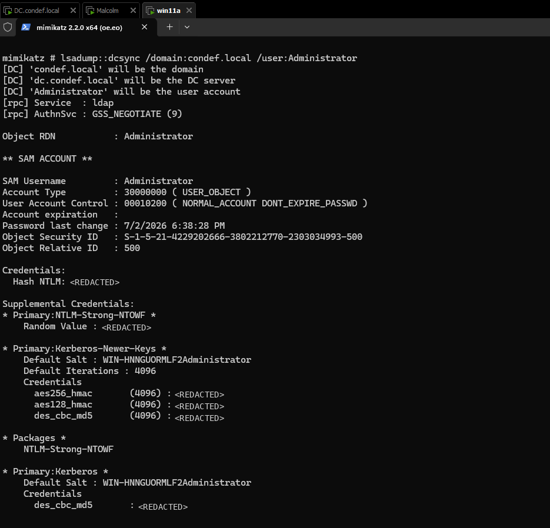
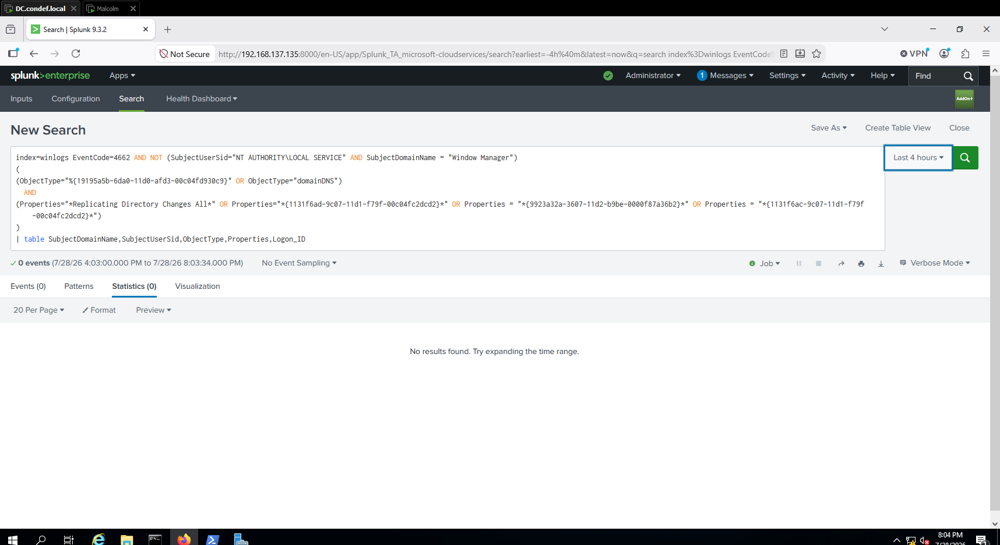
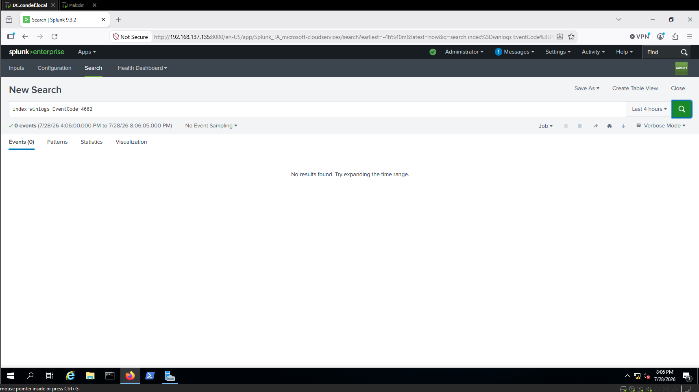
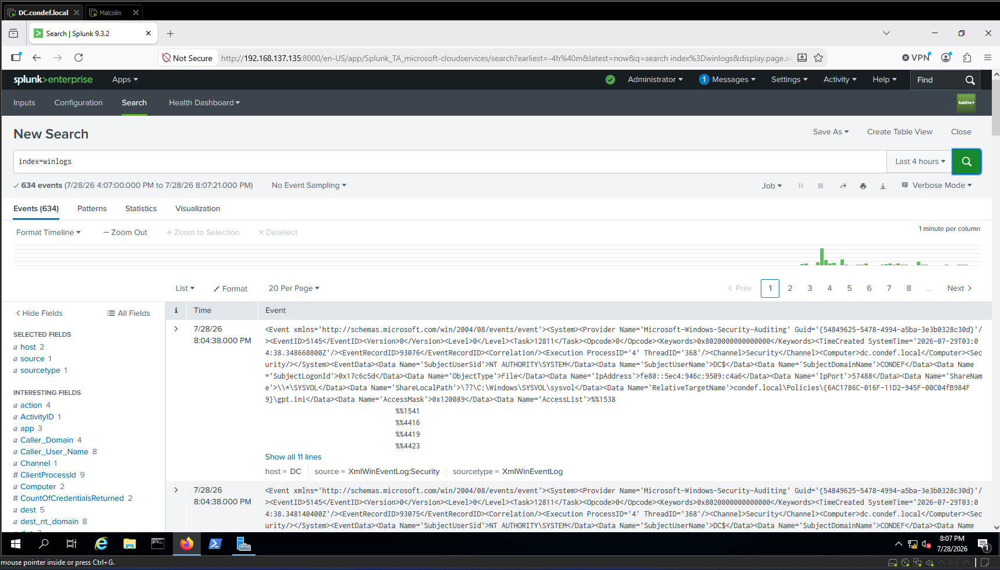
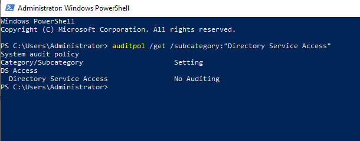
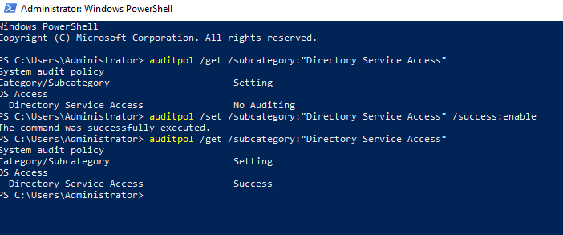
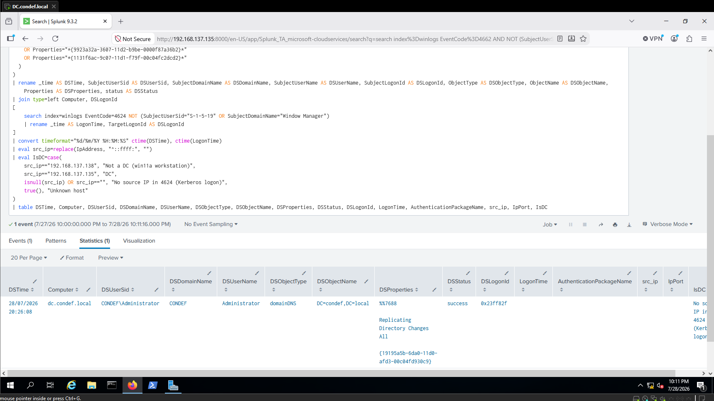
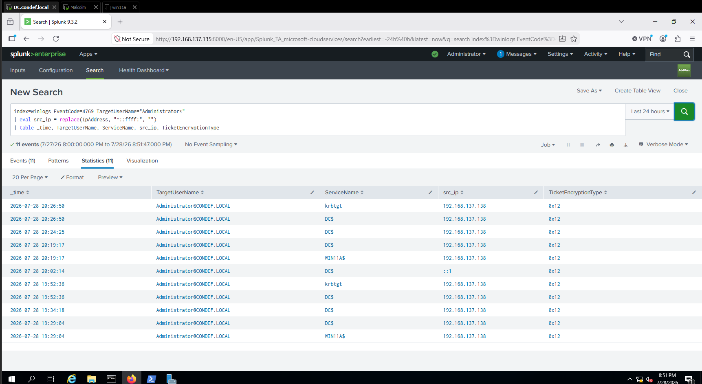
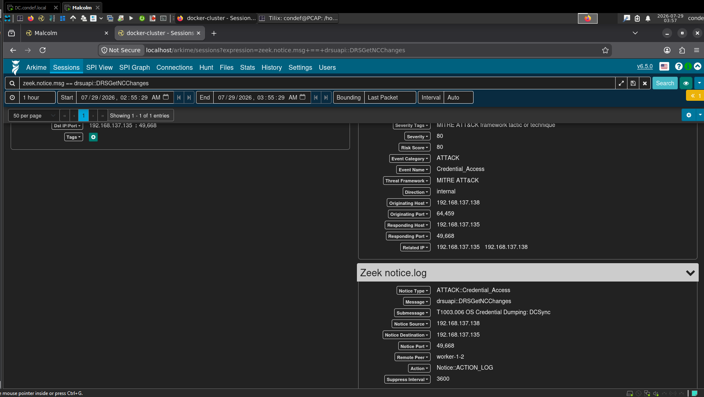

# Catching DCSync: Detecting Domain Replication Abuse

**Lab:** `condef.local` · **Platform:** Windows / Active Directory · **Log sources:** Windows Security (4662, 4769), Zeek/Arkime network capture · **SIEM:** Splunk · **ATT&CK:** T1003.006 (OS Credential Dumping: DCSync) · **Tactic:** Credential Access

## TL;DR

DCSync abuses Active Directory replication to request account password material from a domain controller. Instead of accessing `ntds.dit` directly or dumping LSASS memory on the DC, an attacker with the required replication permissions can ask the domain controller to return credential data through the normal directory replication protocol.

I ran DCSync from a Windows 11 workstation and searched for the replication operation in Windows Event 4662. My first search returned no results because the domain controller was not configured to generate the event. After confirming that the Windows event pipeline was healthy, I traced the missing telemetry to disabled Directory Service Access auditing and a missing SACL on the domain object.

Once both requirements were configured, Event 4662 recorded the replication-right operation. My Event 4624 enrichment did not return usable source-host information, so I investigated Event 4769 to recover the client IP. I then independently confirmed the `DRSGetNCChanges` request from the workstation to the domain controller through Malcolm, Zeek, and Arkime.

## What DCSync is

Active Directory uses replication to keep domain controllers synchronized. During legitimate replication, one domain controller requests directory changes from another.

DCSync abuses that functionality. An attacker using an account with the required replication permissions can send a replication request to a domain controller and retrieve password data for an account.

I performed the attack with Mimikatz using a domain administrator account that already had the necessary permissions. The technique returned credential material without requiring me to run credential-dumping code directly on the domain controller.

The impact depends on which account is requested. Retrieving the built-in Administrator account provides reusable privileged credential material. Retrieving the `krbtgt` account would expose the key material required to forge Golden Tickets.

## Running the attack

I ran the attack from `win11a` against the domain controller:

```text
lsadump::dcsync /domain:condef.local /user:Administrator
```



Mimikatz requested credential material for the built-in Administrator account. The output included:

- An NTLM hash
- AES256 and AES128 Kerberos keys
- The password's last-change date
- Object Relative ID `500`

The relative ID confirmed that the requested account was the built-in domain Administrator.

This was not a Golden Ticket test. Golden Ticket creation requires the password hash or Kerberos key material for the domain's `krbtgt` account. In this run, I specifically requested the Administrator account.

## Detecting replication-right use with Event 4662

The first Windows event I investigated was Event 4662, **"An operation was performed on an object."**

For this test, the important value was the replication right recorded in the event's `Properties` field:

```text
Replicating Directory Changes All
```

The corresponding GUID was:

```text
1131f6ad-9c07-11d1-f79f-00c04fc2dcd2
```

I began with the following Event 4662 search:

```spl
index=winlogs EventCode=4662 AND NOT (SubjectUserSid="NT AUTHORITY\LOCAL SERVICE" AND SubjectDomainName="Window Manager")
(
  (ObjectType="%{19195a5b-6da0-11d0-afd3-00c04fd930c9}" OR ObjectType="domainDNS")
  AND
  (
    Properties="*Replicating Directory Changes All*"
    OR Properties="*{1131f6ad-9c07-11d1-f79f-00c04fc2dcd2}*"
    OR Properties="*{9923a32a-3607-11d2-b9be-0000f87a36b2}*"
    OR Properties="*{1131f6ac-9c07-11d1-f79f-00c04fc2dcd2}*"
  )
)
| table SubjectDomainName, SubjectUserSid, ObjectType, Properties, Logon_ID
```

### It returned nothing

I ran the search immediately after the attack and received no results.



I stripped the search down to the event code to determine whether Event 4662 was present at all:

```spl
index=winlogs EventCode=4662
```



That search also returned nothing.

At that point, either the Windows event pipeline was not working or the domain controller was not generating Event 4662. I checked the entire index:

```spl
index=winlogs
```



Splunk returned 634 events from host `dc`. The event metadata showed the source as `XmlWinEventLog:Security` and the sourcetype as `XmlWinEventLog`.

Windows Security events were reaching Splunk, so the missing Event 4662 was not caused by a general forwarding failure. The domain controller was not generating the event.

## Enabling Directory Service Access auditing

Event 4662 depends on the **Directory Service Access** audit subcategory. I checked its status on the domain controller:

```powershell
auditpol /get /subcategory:"Directory Service Access"
```



The result was:

```text
No Auditing
```

This explained why the attack had not produced Event 4662. The DCSync request succeeded, but the audit policy required by the detection was disabled.

I enabled successful Directory Service Access auditing and verified the result:

```powershell
auditpol /set /subcategory:"Directory Service Access" /success:enable
auditpol /get /subcategory:"Directory Service Access"
```



Enabling the audit subcategory was only the first requirement.

Event 4662 is generated when an operation matches an auditing entry in the target object's system access control list, or SACL. Without the appropriate SACL on the Active Directory object, enabling the audit policy alone still did not produce the event I needed.

In ADSI Edit, I connected to the **Default naming context** and opened the domain root object:

```text
DC=condef,DC=local
```

Under **Security > Advanced > Auditing**, I added a successful auditing entry with:

- **Principal:** Everyone
- **Applies to:** This object and all descendant objects
- **Permission:** Replicating Directory Changes
- **Permission:** Replicating Directory Changes All

With both the audit subcategory and the SACL configured, I reran DCSync from `win11a`.

## Expanding the search with logon enrichment

I then expanded the original Event 4662 search with an Event 4624 left join. The enrichment was intended to retrieve logon context and help determine whether the replication activity came from a domain controller or another system:

```spl
index=winlogs EventCode=4662 AND NOT (SubjectUserSid="NT AUTHORITY\LOCAL SERVICE" AND SubjectDomainName="Window Manager")
(
  (ObjectType="%{19195a5b-6da0-11d0-afd3-00c04fd930c9}" OR ObjectType="domainDNS")
  AND
  (Properties="*Replicating Directory Changes All*" OR Properties="*{1131f6ad-9c07-11d1-f79f-00c04fc2dcd2}*" OR Properties="*{9923a32a-3607-11d2-b9be-0000f87a36b2}*" OR Properties="*{1131f6ac-9c07-11d1-f79f-00c04fc2dcd2}*")
)
| rename _time AS DSTime, SubjectUserSid AS DSUserSid, SubjectDomainName AS DSDomainName, SubjectUserName AS DSUserName, SubjectLogonId AS DSLogonId, ObjectType AS DSObjectType, ObjectName AS DSObjectName, Properties AS DSProperties, status AS DSStatus
| join type=left Computer, DSLogonId
[
    search index=winlogs AND EventCode=4624 NOT (SubjectUserSid="S-1-5-19" OR SubjectDomainName="Window Manager")
    | rename _time AS LogonTime, TargetLogonId AS DSLogonId
]
| convert timeformat="%d/%m/%Y %H:%M:%S" ctime(DSTime), ctime(LogonTime)
| eval src_ip = replace(IpAddress, "^::ffff:", "")
| eval IsDC = case(
    src_ip=="192.168.137.138", "Not a DC (win11a workstation)",
    src_ip=="192.168.137.135", "DC",
    isnull(src_ip) OR src_ip=="", "No source IP in 4624 (Kerberos logon)",
    true(), "Unknown host")
| table DSTime, Computer, DSUserSid, DSDomainName, DSUserName, DSObjectType, DSObjectName, DSProperties, DSStatus, DSLogonId, LogonTime, AuthenticationPackageName, src_ip, IpPort, IsDC
```



This time, the search returned an Event 4662 result.

The event showed:

- **Subject account:** `CONDEF\Administrator`
- **Object type:** `domainDNS`
- **Object:** `DC=condef,DC=local`
- **Property:** `Replicating Directory Changes All`
- **Status:** Success

The Subject fields identify the account that performed the directory operation. They do not identify the account whose credential material was requested.

In this test, `CONDEF\Administrator` was both the account I used to execute DCSync and the account I requested from the domain controller. Event 4662 confirmed that Administrator performed a successful replication-right operation against the domain object. The Mimikatz output separately confirmed that Administrator was the requested credential target.

## The 4624 enrichment did not provide a source

The first portion of the expanded query identified the Event 4662 replication operation. The second portion attempted to join that event to Event 4624 using the computer and logon ID.

I intended to retrieve:

- Logon time
- Authentication package
- Source IP
- Source port

Those fields would then feed the calculated `IsDC` field.

The result displayed:

```text
No source IP in 4624 (Kerberos logon)
```

That text came from my SPL `case` statement whenever `src_ip` was null or blank. It was not a value recorded directly by Windows.

The other joined fields, including `LogonTime`, `AuthenticationPackageName`, `src_ip`, and `IpPort`, were also blank. From this output alone, I could not determine whether the join found a matching Event 4624 with no IP address or failed to find a usable matching Event 4624 altogether.

The core Event 4662 search succeeded, but the enrichment did not provide enough information to identify the originating system.

## Recovering the source IP with Event 4769

Because the Event 4624 enrichment did not return usable source information, I investigated Event 4769, **"A Kerberos service ticket was requested."**

I searched for requests associated with the Administrator account:

```spl
index=winlogs EventCode=4769 TargetUserName="Administrator*"
| eval src_ip = replace(IpAddress, "^::ffff:", "")
| table _time, TargetUserName, ServiceName, src_ip, TicketEncryptionType
```



My first version of the search used the Windows Event Viewer display labels:

- `Account_Name`
- `Service_Name`
- `Client_Address`

Those field names returned no results. After inspecting the raw event in Splunk, I found that the Splunk Technology Add-on had parsed the fields as:

- `TargetUserName`
- `ServiceName`
- `IpAddress`

After correcting the field names, the search returned the events.

The client addresses appeared in IPv6-mapped IPv4 format:

```text
::ffff:192.168.137.138
```

I used `replace` to remove the `::ffff:` prefix.

The results included multiple requests from:

```text
192.168.137.138
```

That address belongs to `win11a`, the workstation from which I ran Mimikatz.

The `ServiceName` values included `krbtgt`, `DC$`, and `WIN11A$`. In Event 4769, `ServiceName` identifies the service or account for which a Kerberos service ticket was requested. It does not identify the originating computer. The client address was the evidence that identified `win11a` as the requester.

One result used the loopback address `::1`, indicating local activity on the domain controller.

The ticket encryption type was `0x12`, or AES256. I recorded that as additional context, but it was not part of the DCSync detection condition.

Event 4769 provided the source information that the Event 4624 enrichment did not.

## Confirming DCSync on the network

I then checked the network capture in Malcolm and searched Arkime for the DRSUAPI operation associated with the attack:

```text
zeek.notice.msg == drsuapi::DRSGetNCChanges
```



The search returned one matching session.

DCSync uses Microsoft's Directory Replication Service Remote Protocol. The `DRSGetNCChanges` operation requests directory replication data from a domain controller.

The Zeek notice classified the session with:

- **Notice Type:** `ATTACK::Credential_Access`
- **Message:** `drsuapi::DRSGetNCChanges`
- **Submessage:** `T1003.006 OS Credential Dumping: DCSync`
- **Event Category:** `ATTACK`
- **Risk score:** `80`

The network session showed:

- **Source:** `192.168.137.138` (`win11a`)
- **Destination:** `192.168.137.135` (`DC`)
- **Destination port:** `49668`

The source and destination matched the systems involved in my test. The client IP also matched the address recovered through the Event 4769 investigation.

This provided independent network-level confirmation of the replication request. Windows telemetry recorded the use of the replication right on the domain controller, while Malcolm identified the corresponding `DRSGetNCChanges` communication from the workstation to the DC.

## What the evidence established

| Evidence | What it established |
| --- | --- |
| Mimikatz output | Administrator credential material was successfully requested |
| Event 4662 | `CONDEF\Administrator` performed a successful replication-right operation against the domain object |
| Event 4769 | Kerberos service-ticket requests associated with Administrator came from `192.168.137.138` |
| Malcolm, Zeek, and Arkime | `192.168.137.138` sent a `DRSGetNCChanges` request to the domain controller |
| Lab inventory | `192.168.137.138` was `win11a`, not a domain controller |

Event 4662 alone did not identify the credential target or provide a usable source IP through my enrichment. The Mimikatz output established the requested account, while the Kerberos and network telemetry established the originating workstation.

## Key takeaways

- **A detection depends on its telemetry.** My initial search returned nothing because the domain controller was not generating Event 4662. Verifying the underlying event source prevented me from treating missing telemetry as a clean result.

- **Event 4662 required two auditing components.** I needed both successful Directory Service Access auditing and a SACL on the domain object covering the replication rights.

- **The Event 4662 subject is the actor, not the credential target.** The event showed that `CONDEF\Administrator` performed the replication operation. The Mimikatz output showed that Administrator was also the account requested during this specific test.

- **The core detection and the enrichment produced different results.** The replication-right search succeeded, but the Event 4624 join did not return usable source context.

- **A calculated label is not raw evidence.** The `IsDC` value came from my SPL logic. Because the joined fields were blank, the label could not prove why the source IP was missing.

- **Event 4769 provided client attribution.** Its client address identified `192.168.137.138`, while `ServiceName` identified the requested Kerberos service or account rather than the originating host.

- **Network telemetry independently confirmed the activity.** Malcolm observed `DRSGetNCChanges` from `win11a` to the domain controller and classified it as DCSync.

- **The suspicious condition was established through correlation.** In this single-domain-controller lab, directory replication originated from a known workstation rather than the DC. Windows and network evidence both pointed to the same source.

## References

- MITRE ATT&CK, T1003.006 DCSync: https://attack.mitre.org/techniques/T1003/006/
- MITRE ATT&CK, T1558.001 Golden Ticket: https://attack.mitre.org/techniques/T1558/001/
- Microsoft, Event 4662: https://learn.microsoft.com/en-us/previous-versions/windows/it-pro/windows-10/security/threat-protection/auditing/event-4662
- Microsoft, Audit Directory Service Access: https://learn.microsoft.com/en-us/previous-versions/windows/it-pro/windows-10/security/threat-protection/auditing/audit-directory-service-access
- Microsoft, Event 4769: https://learn.microsoft.com/en-us/previous-versions/windows/it-pro/windows-10/security/threat-protection/auditing/event-4769
- Microsoft, Directory Replication Service Remote Protocol overview: https://learn.microsoft.com/en-us/openspecs/windows_protocols/ms-drsr/eac7ee18-3630-449d-aefe-d7108d85b4cc
- NVISO, Detecting DCSync and DCShadow Network Traffic: https://blog.nviso.eu/2021/11/15/detecting-dcsync-and-dcshadow-network-traffic/
