# Catching Discovery Commands on Windows Hosts

**Lab:** `condef.local`
**Date:** 2026-08-05
**Platform(s):** Windows
**Primary log source(s):** Sysmon (EID 1, process creation)
**SIEM:** Splunk Enterprise 9.3.2
**ATT&CK:** T1033 System Owner/User Discovery, T1087.001 Account Discovery: Local Account, T1087.002 Account Discovery: Domain Account, T1082 System Information Discovery, T1555.004 Credentials from Password Stores: Windows Credential Manager · Tactics: Discovery (TA0007), Credential Access (TA0006)

---

## TL;DR

Discovery is often one of the loudest things an attacker does and one of the hardest things to alert on, because every command they run is a command a real admin also runs. For discovery that shells out to a utility, the observable is the binary the OS resolved, which Sysmon records in the `Image` field. Command line text is downstream of shell formatting that the caller controls and you do not. I built my first rule on command line text anyway, and across seven days it matched 11 of 23 selected process creation events in my own lab. All 12 misses were `net.exe` or `net1.exe`. Two different shells recorded the same command two different ways, and my pattern had a space in the middle of it.

## Attack overview

Once someone lands on a host they usually do not know where they are. They need to work out which account they have, what that account can reach, what the domain looks like, and whether anything useful is cached locally. MITRE ATT&CK groups this post-compromise information gathering under the Discovery tactic.

Most of what follows sits in Discovery. One command does not: `cmdkey /list` enumerates entries held by Windows Credential Manager, which puts it in Credential Access, and that is why the header carries two tactics.

What makes it awkward from the defensive side is that none of the individual commands are unusual. `whoami` is a legitimate command. `net user /domain` is a legitimate command. A helpdesk tech runs both of these on a normal Tuesday. There is no malicious binary to blocklist and no weird syntax to key on. The signal has to come from somewhere other than the command itself.

For a realistic set of commands to work from, I pulled the discovery sequence out of a NetSupport RAT intrusion documented by The DFIR Report. Their writeup lists the first batch of commands the actor ran after gaining a foothold, and I liked it as a starting point because it is a real intrusion rather than a generic list, and because the commands are unremarkable enough to make the detection problem obvious.

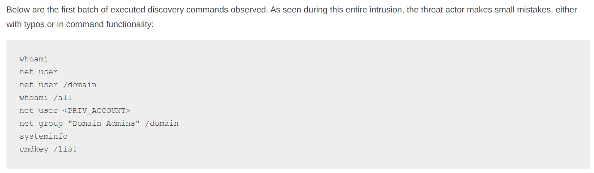
*Discovery commands observed during a NetSupport intrusion. Source: The DFIR Report, "NetSupport Intrusion Results in Domain Compromise" (October 2023).*

## Lab replication

**Environment:** `condef.local`. Commands executed on `WIN11V` as `CONDEF\Administrator`. Sysmon forwarding to Splunk on the DC at `192.168.137.135`, `index=sysmon`.

I ran a subset of that list from an elevated command prompt on WIN11V:

```
whoami
net user
net user /domain
whoami /all
```

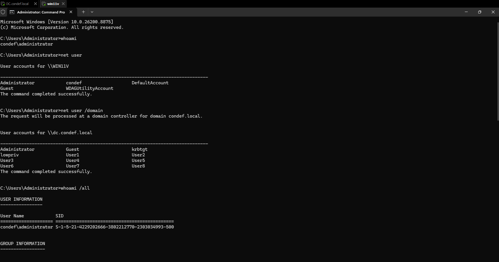

I had already run the same four commands from a PowerShell session about ten minutes earlier. At the time that felt like a mistake I was going to have to redo. It turned out to be the most useful thing in the whole exercise, because having both shells in the data is what exposed the problem in my detection.

## Telemetry

| Source | Event ID | Key fields | Why it matters |
|---|---|---|---|
| Sysmon | 1 (process creation) | `Image` | The resolved binary on disk. Not affected by how the caller quoted or spaced anything. |
| Sysmon | 1 | `CommandLine` | Arguments, which separate `net user` from `net user /domain`. Fragile as a match target, useful as context. |
| Sysmon | 1 | `ParentImage` | Immediate parent. Separated a shell from a service host on most events, but was not enough on its own for the remote execution case below. |
| Sysmon | 1 | `ParentCommandLine` | Where the remote execution wrapper and its output redirection showed up. This is the field that saved the second half of this exercise. |
| Sysmon | 1 | `ParentProcessGuid` | Identifies the specific parent process instance. Two separate shells can share an identical command line, so this is the field that actually separates one session from another. |
| Sysmon | 1 | `User`, `Computer` | Who and where, for scoping and baselining. |

**Gaps:** cmd.exe built-ins like `dir`, `set`, `ver`, and `cd` do not create a process, so EID 1 never sees them when they are typed at an interactive prompt. Discovery done entirely inside an already running process, whether that is a PowerShell session calling `Get-ADUser` or tooling that queries LDAP directly, also produces no process creation event and is invisible to everything here. I had no command line auditing (4688) or PowerShell script block logging enabled for this run, so Sysmon EID 1 was my only view of process execution.

## Detection

**Hypothesis:** for discovery that shells out to a utility, selecting on the resolved process image is more reliable than matching command line phrases. On top of that selection, the useful signal is not which command ran but how many distinct discovery binaries ran from one execution context inside a short window, and whether that context has any business spawning them.

### First attempt, and why it looked like it worked

I started where most people start, which is matching on the text of the command:

```spl
index=sysmon EventCode=1
| regex CommandLine="(net group|net user|cmdkey|systeminfo|whoami)"
| stats values(CommandLine) as CommandLines, count(CommandLine) as ReconCommandCount by ParentCommandLine
```

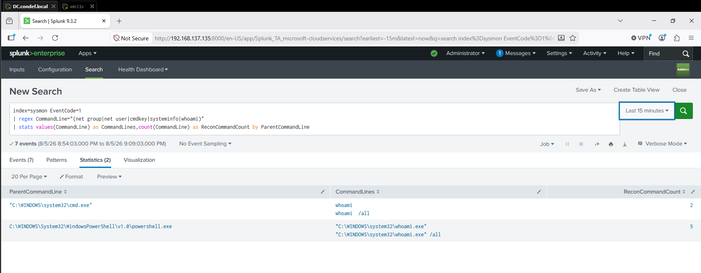

Results came back, so I moved on. Over seven days it looked even better, and I could see my WMIExec testing from a few days earlier showing up alongside the interactive runs:

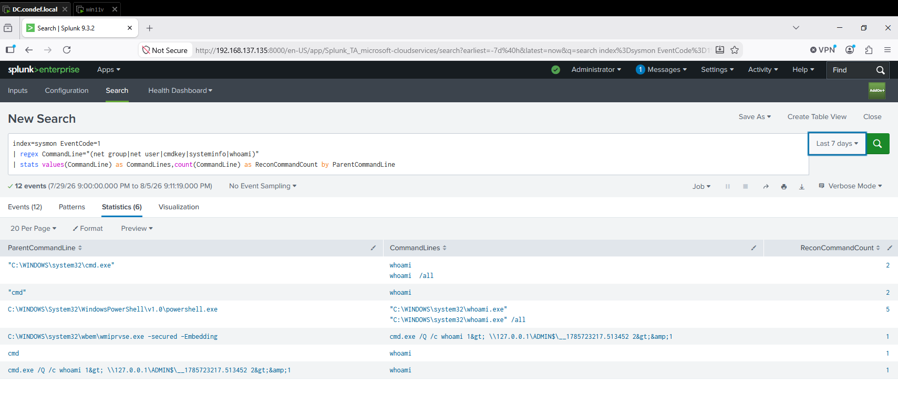

Then I noticed that every single row said `whoami`. Twelve events across a week, and not one `net user`, even though I had run `net user` and `net user /domain` twice that evening and could see both sitting in Sysmon under a broader search.

### Proving the miss

I rebuilt the search to select on `Image` instead of command line text, then added a column that reruns my original pattern against each event so I could see exactly which ones it would have caught:

```spl
index=sysmon EventCode=1
    Image IN ("*\\whoami.exe","*\\net.exe","*\\net1.exe","*\\nltest.exe",
              "*\\systeminfo.exe","*\\cmdkey.exe")
| eval old_rule_matches=if(match(CommandLine,"(net group|net user|cmdkey|systeminfo|whoami)"),"YES","NO")
| table _time host User Image CommandLine ParentImage old_rule_matches
| sort - _time
```

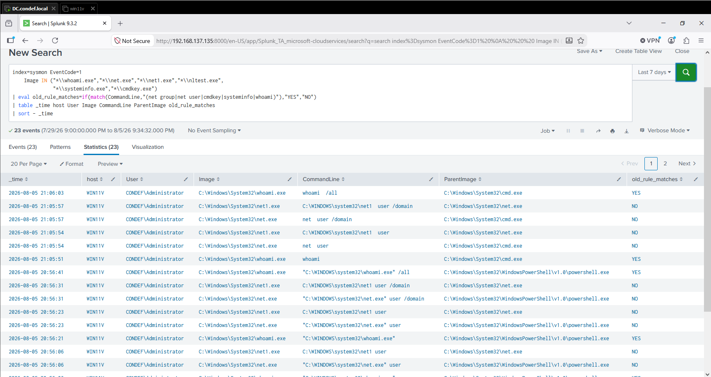
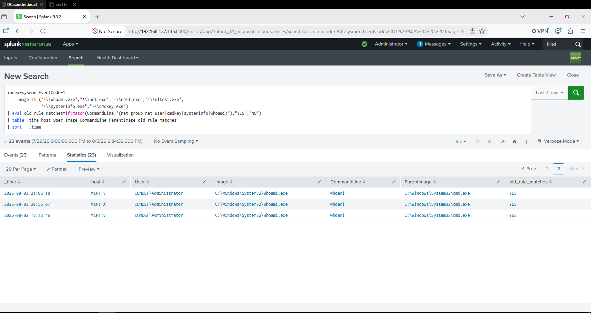

```spl
| stats count by old_rule_matches
```

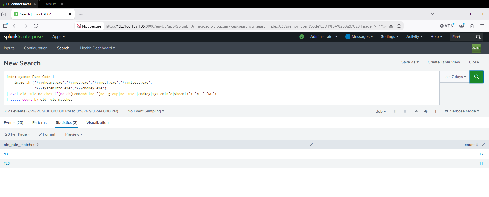

11 matched. 12 missed. Every miss was `net` or `net1`.

### Why it missed

I did not want to guess at the reason from how a results table renders, so I bracketed the field and counted characters:

```spl
index=sysmon EventCode=1 Image="*\\net.exe"
| eval bracketed="["+CommandLine+"]", chars=len(CommandLine)
| table _time ParentImage bracketed chars
| sort - _time
```

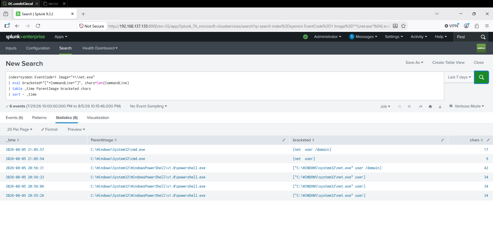

That settled it. `[net  user]` comes back at 9 characters. A single-spaced `net user` would be 8. The extra character is a second space that cmd.exe inserts and that I could not have confirmed by eye.

The two shells break the same pattern in two completely different ways:

| How I ran it | What Sysmon recorded in `CommandLine` | Length |
|---|---|---|
| `net user` from cmd.exe | `net  user` (two spaces) | 9 |
| `net user` from PowerShell | `"C:\WINDOWS\system32\net.exe" user` | 34 |

My pattern wanted `net`, one space, `user`. The cmd form has two spaces. The PowerShell form has no bare `net` token at all, just a quoted full path followed by the argument.

`whoami` survived both distortions for one reason only: it is a single token, so there is no space in the middle for a shell to mangle. My rule was not 48 percent effective. It was perfect on one word commands and completely blind to two word commands, and I could not tell the difference from the outside because the one word commands kept returning results.

That is the real takeaway, and it generalizes past this rule. **A detection keyed on a multi token command line phrase is quietly depending on whitespace and quoting behavior that the caller controls and you do not.**

### The rebuild

Selecting on `Image` removes the formatting problem, because `Image` is the path the OS resolved. It does not care which shell called it, how the arguments were quoted, or how many spaces were in between.

```spl
index=sysmon EventCode=1
    Image IN ("*\\whoami.exe","*\\net.exe","*\\nltest.exe","*\\systeminfo.exe",
              "*\\cmdkey.exe","*\\quser.exe","*\\tasklist.exe","*\\ipconfig.exe",
              "*\\hostname.exe","*\\arp.exe","*\\netstat.exe","*\\dsquery.exe")
| eval binary=lower(mvindex(split(Image,"\\"),-1))
| rex field=ParentCommandLine "ADMIN\$\x5c(?<session_key>__\d+\.\d+)"
| eval group_key=coalesce(session_key, ParentProcessGuid)
| bin _time span=10m
| stats dc(binary) as distinct_binaries,
        values(binary) as seen,
        count as process_events
    by _time host User group_key
| where distinct_binaries >= 3
| sort - distinct_binaries
```

**Logic walkthrough:**

- `Image IN (...)` isolates the discovery binaries themselves, immune to shell formatting.
- `eval binary=lower(...)` strips the path down to the filename and lowercases it. Case genuinely varies in my data, since the same event can show `C:\Windows\System32\` in one field and `C:\WINDOWS\system32\` in another, and without `lower()` a distinct count can treat one binary as two.
- `rex` and `coalesce` build the grouping key. `\x5c` is the hex escape for a backslash, which avoids fighting SPL string escaping. The `rex` pulls out the redirection filename shared by remotely executed commands, explained in the next section, and `coalesce` falls back to `ParentProcessGuid` for everything else. My first version of this used `ParentCommandLine` as the fallback, which was wrong: two separate cmd.exe windows produce byte identical command lines, so unrelated sessions on the same host would merge into one group. The GUID identifies the specific parent process instance.
- `bin _time span=10m` is the density window. A single `whoami` is noise. Several distinct discovery binaries close together is a pattern. `bin` creates fixed buckets rather than a rolling window, which turned out to matter.
- `dc(binary) >= 3` is the threshold. My earlier interactive runs used two distinct binaries, so they would not fire, which is the behavior I want.

I deliberately dropped `net1.exe` from this version. `net.exe` hands off to `net1.exe` with the same arguments, so every `net` command produces two EID 1 events. That is why six operator issued `net` commands became twelve missed events above, and why the 23 events in that dataset represent 17 actual commands. Leaving `net1.exe` in doubles the count for one family of commands and skews any threshold built on volume.

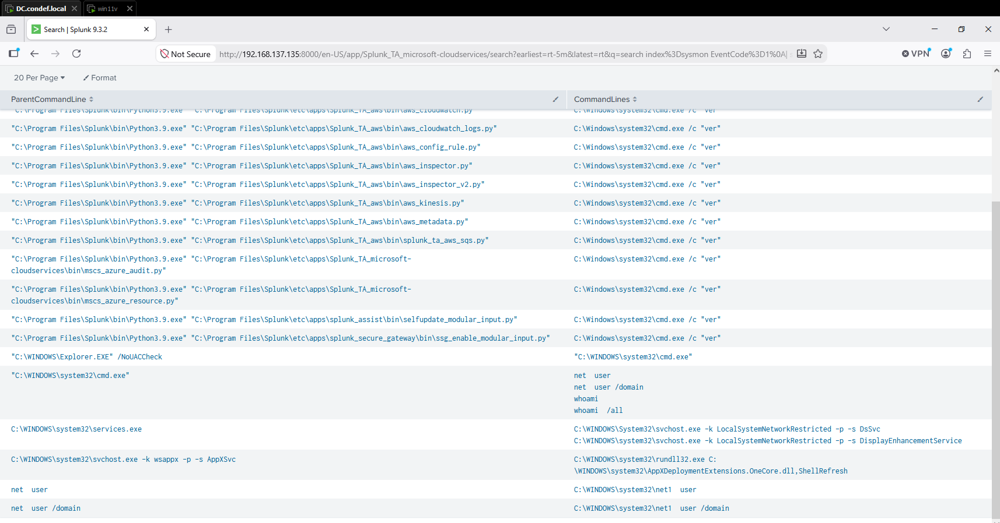
*`net.exe` spawning `net1.exe` with the same arguments. Notice the child inherits the parent's spacing: the cmd path gives `net1  user`, the PowerShell path gives `net1 user`.*

## Remote execution changes the shape of the problem

Among the seven day results was a `whoami` from 08-02 that looked identical to my interactive ones. Same `Image`, same `CommandLine`, same `ParentImage` of `cmd.exe`. I had assumed parent process would be enough to separate hands on keyboard activity from remote execution. It was not.

The distinction lives one field over:

```spl
index=sysmon EventCode=1
| search ParentCommandLine="*ADMIN$*" OR ParentImage="*wmiprvse.exe" OR CommandLine="*ADMIN$*"
| table _time host User Image CommandLine ParentImage ParentCommandLine
| sort - _time
```

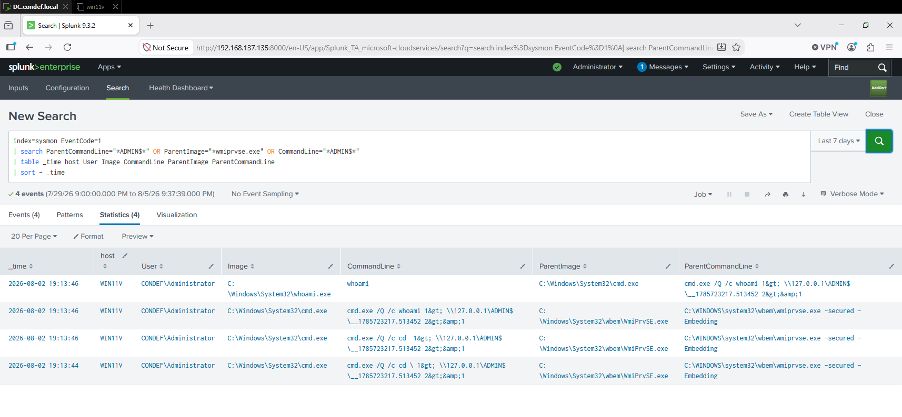

Four events across two seconds, from my own earlier WMI lateral movement testing:

```
WmiPrvSE.exe -secured -Embedding
  └─ cmd.exe /Q /c cd \    1> \\127.0.0.1\ADMIN$\__1785723217.513452 2>&1
  └─ cmd.exe /Q /c cd      1> \\127.0.0.1\ADMIN$\__1785723217.513452 2>&1
  └─ cmd.exe /Q /c whoami  1> \\127.0.0.1\ADMIN$\__1785723217.513452 2>&1
       └─ whoami.exe  "whoami"
```

Those redirections are shown decoded for readability. The value Splunk actually indexes carries the event log's XML escaping, which becomes important two sections down.

Three things came out of this that I would not have found by counting commands.

**The parent chain is the signal, not the command.** `WmiPrvSE.exe` spawning `cmd.exe` is not something that happens during normal interactive work. The `whoami` at the bottom of that tree is the same binary an admin runs, but the two hops above it are not.

**The output file is a session key.** Every command in that chain redirects to the same `\\127.0.0.1\ADMIN$\__1785723217.513452`. That epoch style filename is generated per session, so grouping on it recovers every command an operator ran through one remote shell. That is why the `rex` in my density query exists: each remote command gets its own wrapper command line, so grouping on parent command line alone would shatter one session into a pile of single-command groups that could never cross a threshold.

**Built-ins become visible when they are executed remotely.** `cd` and `cd \` are cmd built-ins. Typed at an interactive prompt they create no process and Sysmon never sees them. Here they are fully logged, because each one is wrapped in its own `cmd.exe /Q /c`. The wrapper that makes remote execution work is the same wrapper that drags built-ins into process creation telemetry. My blind spot on interactive built-ins does not apply to this execution path at all.

Worth being straight about the limit here. Even with the session key grouping, this particular sample only produced one discovery binary, so a density rule with a threshold of three would still not fire on it. Density and ancestry cover different things: density catches an operator sweeping a host with a handful of utilities, ancestry catches a single command arriving through a channel it has no business arriving through. Neither one subsumes the other, which is why I ended up writing both.

### The ancestry detection

The search above was a broad pivot, using ORs so it would catch anything touching `ADMIN$` or `WmiPrvSE`. Tightened into rule form, the four conditions have to hold together:

```spl
index=sysmon EventCode=1
    ParentImage="*\\WmiPrvSE.exe" Image="*\\cmd.exe"
    CommandLine="*/Q /c*" CommandLine="*ADMIN$*"
| rex field=CommandLine "ADMIN\$\x5c(?<session_key>__\d+\.\d+)"
| stats min(_time) as first_seen, max(_time) as last_seen,
        values(CommandLine) as commands,
        count as process_events
    by host User session_key
| convert ctime(first_seen) ctime(last_seen)
```

**Logic walkthrough:**

- `ParentImage` and `Image` together are the ancestry check. `WmiPrvSE.exe` spawning `cmd.exe` is the part that does not happen during ordinary interactive work.
- The two `CommandLine` terms are ANDed, not ORed. `/Q /c` is a quiet non-interactive shell, and `ADMIN$` is output going to an admin share. Either one alone is weak. Both together, under that parent, is a remote execution wrapper. I originally had a third term here for the stderr redirection, and the next section is about why it had to come out.
- Grouping by `session_key` collapses a whole remote session into one row rather than one row per command, which is the difference between an analyst seeing a session and an analyst seeing four disconnected alerts.
- `first_seen` and `last_seen` give the session duration straight away, which is the first thing I would want to know during triage.

Unlike the density rule, this one does not care how many commands ran. A single `whoami` arriving this way is worth looking at, because the delivery mechanism is the signal rather than the volume.

### It returned nothing, for a reason I did not expect

My first version of that rule had a fifth condition on it: `CommandLine="*2>&1*"`, matching the stderr redirection. It returned zero results across seven days, on data I had already screenshotted.

I broke the rule apart and tested each condition separately:

```spl
index=sysmon EventCode=1 ParentImage="*WmiPrvSE.exe"
| eval c1_image     = if(match(Image,"(?i)cmd\.exe$"),"Y","N")
| eval c2_qc        = if(match(CommandLine,"/Q /c"),"Y","N")
| eval c3_admin     = if(match(CommandLine,"ADMIN\$"),"Y","N")
| eval c4_raw_redir = if(match(CommandLine,"2>&1"),"Y","N")
| eval c5_esc_redir = if(match(CommandLine,"2&gt;&amp;1"),"Y","N")
| table _time Image CommandLine c1_image c2_qc c3_admin c4_raw_redir c5_esc_redir
| sort - _time
```

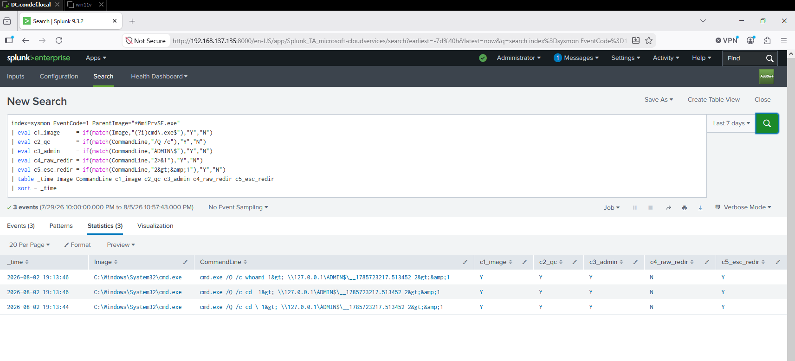

Y, Y, Y, N, Y on every row. The indexed field does not contain `2>&1`. It contains `2&gt;&amp;1`. The XML escaping from the Windows event log survived all the way through to the searchable value, so the string I was matching on never existed. One failing condition in a chain of ANDs took the whole rule to zero, and because the other four matched fine there was nothing on screen to hint at which one was broken.

I dropped the clause rather than matching the escaped form. Escape-matching would weld the rule to this particular ingestion path, and a different forwarder or add-on could serialize it differently. The remaining four conditions still captured the session without tying the rule to one encoded representation of a redirection.

How specific those four are on their own is a question I cannot answer from this lab. The rule returned exactly one row across seven days, but there is no legitimate WMI remote administration running here for it to trip over. Somewhere with management tooling built on WMI process creation, that number would be the thing to check first.

That is three detections in this writeup with three different hidden assumptions in them. Shell formatting the first time, fixed time boundaries the second, indexed encoding the third. None of the three was visible from reading the SPL, and every one of them looked reasonable until it met real telemetry. Two of the three came down to a literal string not being what I thought it was, which is a pattern I now treat as a warning rather than a coincidence.

### The working version

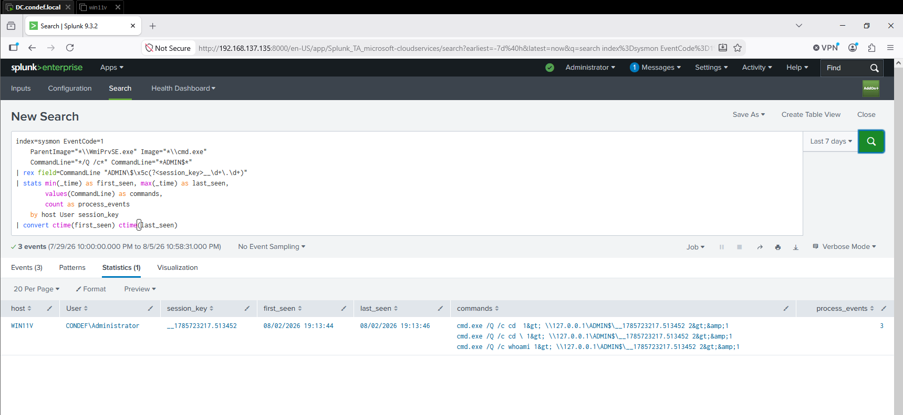

One row. WIN11V, one session key, three commands, 19:13:44 to 19:13:46. That is what I would want to land in a queue: not three separate alerts, but one session with its duration and everything that ran inside it.

## Validating the density rule

Everything above was built from activity I had already generated. To find out whether the density rule actually fires, I needed a real sweep to point it at, so I ran six discovery commands from a single cmd.exe window on WIN11V:

```
whoami /all
net user /domain
systeminfo
cmdkey /list
ipconfig /all
tasklist
```

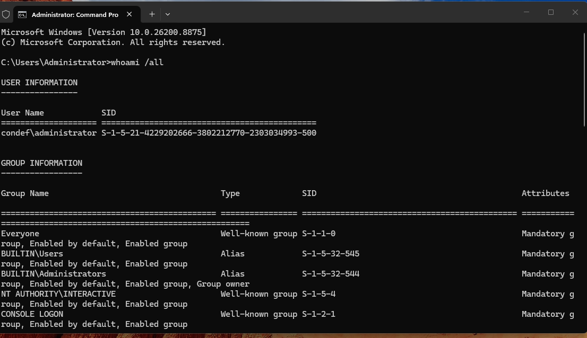

`cmdkey /list` came back with an actual stored credential rather than an empty list, which is a small reminder that credential enumeration is not always a dry hole.

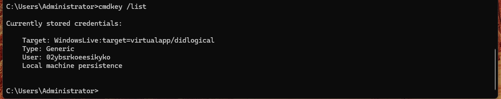

The rule fired.

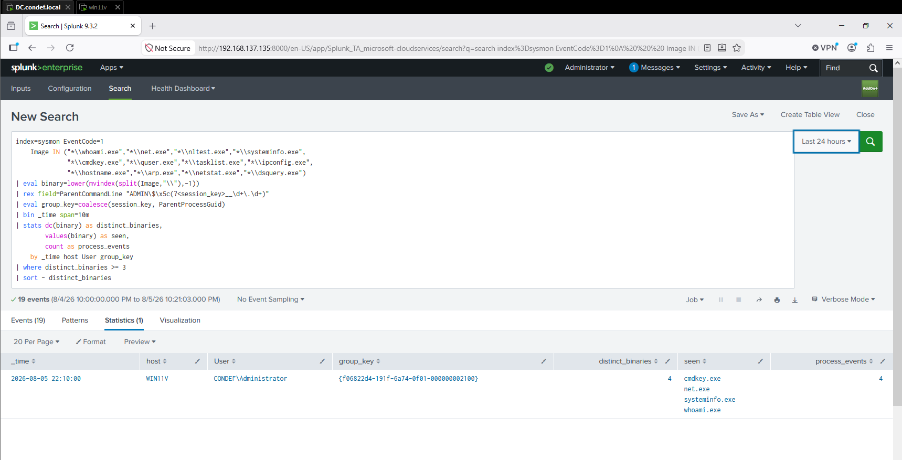

One row, one host, one `group_key` of `{f06822d4-191f-6a74-0f01-000000002100}`, which is the GUID of the single cmd.exe I typed everything into. The `ParentProcessGuid` grouping did exactly what it was supposed to do.

But I ran six commands and the result shows four. `ipconfig.exe` and `tasklist.exe` are missing.

### The rule dropped a third of its own true positive

```spl
index=sysmon EventCode=1
    Image IN ("*\\whoami.exe","*\\net.exe","*\\systeminfo.exe","*\\cmdkey.exe",
              "*\\ipconfig.exe","*\\tasklist.exe")
| table _time host Image CommandLine ParentProcessGuid
| sort - _time
```

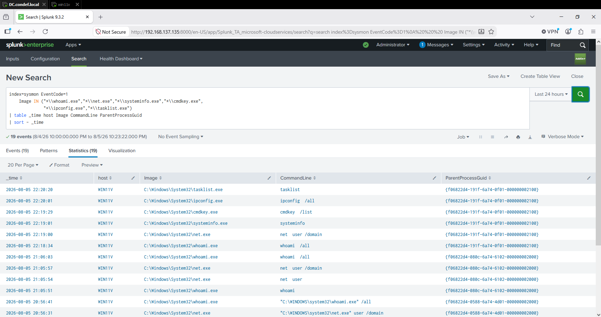

```
22:18:34  whoami /all      ┐
22:19:00  net user /domain │  bucket 22:10:00  ->  4 binaries  ->  fires
22:19:01  systeminfo       │
22:19:29  cmdkey /list     ┘
────────── 22:20:00 bucket boundary ──────────
22:20:01  ipconfig /all    ┐  bucket 22:20:00  ->  2 binaries  ->  filtered out
22:20:20  tasklist         ┘
```

Same `ParentProcessGuid` on all six events. Same operator, same window, 106 seconds start to finish. `bin` cut the session 32 seconds before it ended, and the tail landed in a bucket that scored 2 against a threshold of 3.

Worth being clear that this is not a collection problem. `ipconfig.exe` and `tasklist.exe` are both in the index and both selected by the query. The rule saw them and threw them away.

I had already written that fixed buckets were a limitation. Watching it happen to my own validation run on the first attempt is a better argument than the sentence was.

### Rolling window instead of fixed buckets

`streamstats` with a `time_window` evaluates a trailing period at every event rather than chopping the timeline into blocks, so a session that spans a boundary stays whole:

```spl
index=sysmon EventCode=1
    Image IN ("*\\whoami.exe","*\\net.exe","*\\nltest.exe","*\\systeminfo.exe",
              "*\\cmdkey.exe","*\\quser.exe","*\\tasklist.exe","*\\ipconfig.exe",
              "*\\hostname.exe","*\\arp.exe","*\\netstat.exe","*\\dsquery.exe")
| eval binary=lower(mvindex(split(Image,"\\"),-1))
| rex field=ParentCommandLine "ADMIN\$\x5c(?<session_key>__\d+\.\d+)"
| eval group_key=coalesce(session_key, ParentProcessGuid)
| sort 0 _time
| streamstats time_window=10m dc(binary) as distinct_binaries,
    values(binary) as seen, count as process_events
    by host User group_key
| where distinct_binaries >= 3
| table _time host User group_key distinct_binaries seen process_events
| sort - _time
```

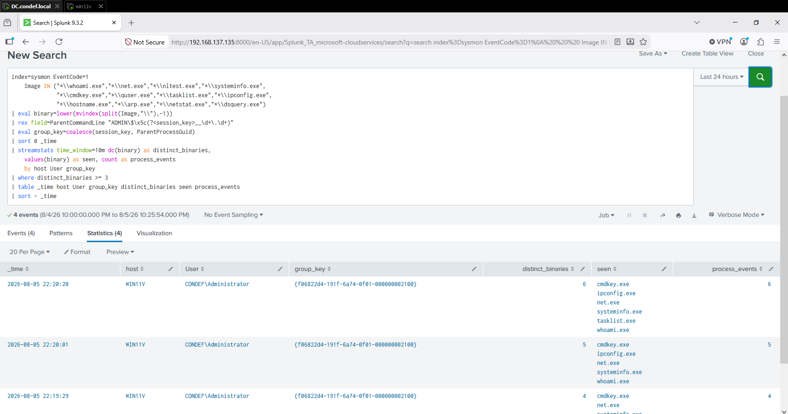

All six binaries, one group, six events. Same data, same threshold, same grouping key. The only thing that changed was `bin` to `streamstats`.

Two notes on the syntax. `sort 0 _time` is required because `time_window` only works on input already in time order, and the `0` removes the default result cap. And because `streamstats` is a streaming aggregate, it emits a row at every qualifying event rather than one row per session: you can read the count climbing 3, 4, 5, then 6 as each command lands, which is what an alert would see in flight. The first row appears at `systeminfo`, the third distinct binary, because that is where the sweep first crosses the threshold.

**Tradeoff:** `streamstats` with a time window costs more compute than `bin`, and it needs a sort in front of it. On a busy index that is not free. For a rule that only runs against a filtered set of a dozen binaries it is worth it, and if this were running against unfiltered process creation I would think harder about it.

## False positives and tuning

I have a small amount of real benign activity in the same dataset, which is enough to make a couple of points concrete rather than hypothetical.

**Seven days of lab activity, zero observed false positives.** I ran the rolling window rule across the whole week rather than just the validation window, so every piece of benign activity in the lab got tested against it.

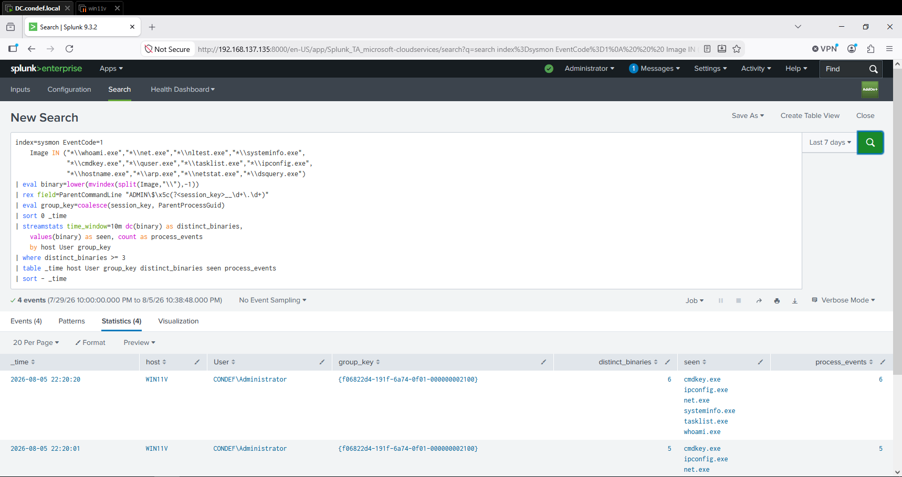

Four rows, all four from the burst, all under the same process GUID. Nothing else crossed the threshold in seven days.

That covers real activity, not silence. Three of those days include me running `whoami` from cmd.exe while building and troubleshooting the lab, spread across two hosts, and the week also holds the two interactive sessions from 08-05 where I ran `whoami` and `net user` back to back. Every one of those scored below three distinct binaries and stayed out of the results. A rule that fired on any lone `whoami` would have paged on all of them.

The WMI session from 08-02 also stayed below the threshold, but that one belongs in a different column. It was simulated attacker activity, so the rule staying quiet is a miss rather than a correct exclusion, and it is the same blind spot I described above: one discovery binary is not a sweep, no matter how it arrived. Benign activity not firing is the result I wanted from this run. Attack activity not firing is the reason the ancestry rule exists alongside it.

The honest caveat is scope rather than method. This is a lab with a handful of hosts and one admin, so a clean week here is not the same as a clean week in an environment with a service desk, patch automation, and inventory agents all running discovery utilities on a schedule. What it does establish is that the threshold is not so low that ordinary use trips it, which is the specific thing I wanted to know before calling the rule usable.

**Scripted automation generating process creation.** The Splunk add-on modular inputs on the DC repeatedly spawn `cmd.exe /c "ver"` from `Python3.9.exe`. That is a scripted parent producing a steady drip of process creations all day. It does not trip the discovery rule because `ver` is not a discovery binary, but it is a good reminder that "unusual parent spawning cmd.exe" on its own would be a noisy rule in this environment.

**Tuning approach and tradeoff.** I went with a density threshold over an allowlist because allowlisting parents is fragile and something an attacker gets to influence. The cost is that I accept blindness to a single discovery command in isolation, which is a real gap. An operator who runs one command per hour never crosses my threshold. I decided that was the right trade for a rule I would actually leave enabled, since the alternative alerts on every helpdesk session in the environment.

**One thing I would fix before running this anywhere real:** Splunk's `regex` command is case sensitive by default. Everything I typed was lowercase, so I never noticed. `Net User` or `WHOAMI` would have walked past my original pattern completely, on top of the spacing problem. Anything matching on text needs `(?i)` in front of the pattern, and needing that at all is a second argument for keying on `Image` instead.

## Evasion and limitations

These come out of my own rule's logic rather than tradecraft I tested.

- **Volume is the threshold, so low and slow defeats it.** Three distinct binaries inside the window fires. The same three spread across a day does not. The rolling window fixes the boundary problem but not this one.
- **Renamed or relocated binaries.** I am matching `Image` on filename suffix. Copying `whoami.exe` to `svchost.exe` in a temp directory beats that. Hashing known system binaries or bringing in `OriginalFileName` from the PE header would make a renamed utility harder to hide, and Sysmon provides both, though neither is a complete answer: hashes shift across Windows builds and PE metadata is itself something an attacker can alter or strip. I have not tested either yet.
- **Interactive built-ins remain invisible.** Anything an operator can do with `dir`, `set`, and `cd` at a live prompt produces no telemetry here.
- **The binary list is a fixed allowlist of its own.** Anything not in my `Image IN` list is invisible regardless of how suspicious the pattern around it looks. Every new LOLBin someone finds is a gap until the list is updated, and my own choice to drop `net1.exe` is an example: it stops the double counting, and it also means anyone calling `net1.exe` directly falls outside the rule.
- **Nothing in this covers API based discovery.** A tool that enumerates the domain through LDAP or Win32 calls without ever shelling out to a binary produces no process creation events at all. Everything in this writeup assumes the operator uses command line tools, which is an assumption a lot of modern tooling does not honor.

## Visualization note

I built a timechart broken down by host to see the daily shape of the activity, and turned on Splunk's conditional formatting to color the counts.

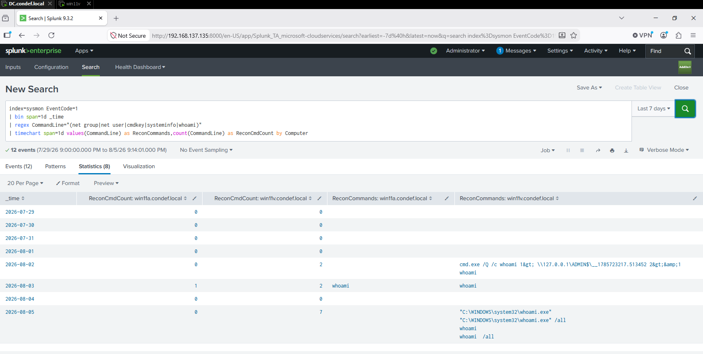
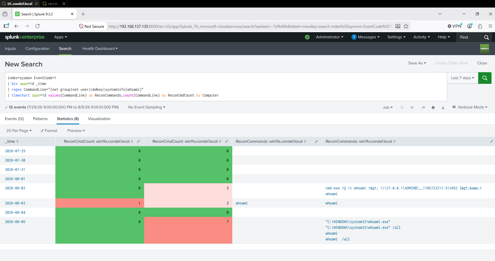

This is worth flagging as a trap. WIN11A shows a count of 1 in bright red while WIN11V shows a count of 2 in pale pink. Splunk scales the color per column, so the numbers are being compared against their own host's range and not against each other. On a quiet host a single event renders as the hottest thing on screen. It is a genuinely useful view for spotting a host that broke its own baseline, and a genuinely misleading one if you read the colors as absolute severity.

## Key takeaways

- **For discovery that shells out, the primitive is the binary, not the string.** `Image` is the path the OS resolved, so it survives the quoting and spacing that broke my pattern. That scope matters: discovery done inside an existing process or through direct LDAP and Win32 calls never creates a process at all, and nothing in this writeup sees it.
- **A clean baseline is only worth what the baseline covers.** Seven days with zero false positives is a real result, and it is also seven days of one admin on a handful of hosts. I would not carry the threshold into a production environment without rerunning this against activity that actually has service desks and scheduled automation in it.
- **A rule returning results is not a rule that works.** Mine returned results for a week while missing half of what I ran. The only reason I caught it was checking the output against what I knew I had executed. I validate against known ground truth now rather than treating a non empty result set as confirmation.
- **Single tokens hid the failure.** `whoami` matched because nothing could break it. If my test commands had all been two word commands I would have gotten zero results and found the bug in a minute. The partial success is what made it survive.
- **Remote execution and interactive execution look identical until you look at the grandparent.** `ParentImage` was not enough. `ParentCommandLine` and the process tree above it were.
- **Every detection carries implementation assumptions, and reading the query will not find them.** These three rules assumed things about shell formatting, about time boundaries, and about how a field gets encoded on its way into the index. All three assumptions were invisible in the SPL and all three were wrong.
- **Literal string matching is the most fragile part.** Two of the three failures were the indexed value not being the value I expected, once from shell spacing and once from XML escaping, and both produced a complete miss rather than a degraded one. I check the raw field before matching on it now.
- **Test the rule against activity you generated on purpose.** My six command burst was supposed to be a formality to confirm the threshold. It exposed a fixed bucket boundary that silently discarded a third of a real detection, and I would not have found that by reading the query.

---

## References

- MITRE ATT&CK Discovery tactic: https://attack.mitre.org/tactics/TA0007/
- MITRE ATT&CK T1033 System Owner/User Discovery: https://attack.mitre.org/techniques/T1033/
- MITRE ATT&CK T1087 Account Discovery: https://attack.mitre.org/techniques/T1087/
- MITRE ATT&CK T1082 System Information Discovery: https://attack.mitre.org/techniques/T1082/
- MITRE ATT&CK T1555.004 Credentials from Password Stores: Windows Credential Manager: https://attack.mitre.org/techniques/T1555/004/
- The DFIR Report, "NetSupport Intrusion Results in Domain Compromise": https://thedfirreport.com/2023/10/30/netsupport-intrusion-results-in-domain-compromise/
- Impacket: https://github.com/fortra/impacket
- Splunk `bin` command reference: https://help.splunk.com/en/splunk-enterprise/spl-search-reference/9.4/search-commands/bin
- Splunk `streamstats` command reference: https://help.splunk.com/en/splunk-enterprise/spl-search-reference/9.2/search-commands/streamstats
