# Catching Kerberoasting

**Status:** Lab validated / experimental
**Lab:** `condef.local`
**Date:** 2026-07-25
**Platforms:** Windows Active Directory / Network
**Primary log sources:** Windows Security Event ID 4769 · Zeek `kerberos.log` through Malcolm
**Analysis tools:** Splunk · Arkime
**ATT&CK:** [T1558.003 – Kerberoasting](https://attack.mitre.org/techniques/T1558/003/)

---

## TL;DR

I used Impacket's `GetUserSPNs.py` to request Kerberos service tickets for eight accounts with Service Principal Names configured in my Active Directory lab.

The course example produced RC4-encrypted tickets, but my environment continued returning AES256 tickets. Rather than changing the environment simply to reproduce the course's result, I adapted the detection to the telemetry my domain actually generated.

The useful behavioral signal in my lab was one account requesting tickets for many distinct services within a short period. I observed that activity in Windows Security Event ID 4769, corroborated it through Malcolm's network telemetry, and cracked one captured AES256 service ticket to recover the weak password protecting the account.

For this exercise, I authenticated to `GetUserSPNs.py` using the domain Administrator account. The exercise demonstrates the ticket-requesting, detection, network-correlation, and offline-cracking workflow, but it does not reproduce the complete attack path from a compromised low-privileged account.

---

## What Kerberoasting Is

Kerberoasting takes advantage of a normal Kerberos function.

A domain user can request a service ticket for an account that has a Service Principal Name, or SPN. Part of that ticket is encrypted using a key derived from the service account's password.

An attacker can take the ticket off the network and attempt to crack it offline. The attacker does not need to repeatedly communicate with the domain controller while guessing the password, so the cracking activity itself does not create additional authentication failures in the domain.

If the service account has a weak password, the attacker may recover it and gain whatever access that account possesses.

A real Kerberoasting attack can begin from a low-privileged domain account. In this lab, however, the objective was to generate and analyze representative telemetry rather than reproduce a complete privilege-escalation path.

---

## Lab Setup

I used three virtual machines for this exercise:

| Host      | Role                                                       |
| --------- | ---------------------------------------------------------- |
| `DC`      | Domain controller, Windows event source, and Splunk server |
| `LinuxA`  | Attacker system running Impacket and Hashcat               |
| `Malcolm` | Network traffic collection and analysis                    |

To create accounts that could be Kerberoasted, I ran the course-provided PowerShell script on the domain controller. The script created eight Active Directory users and assigned SPNs to them.

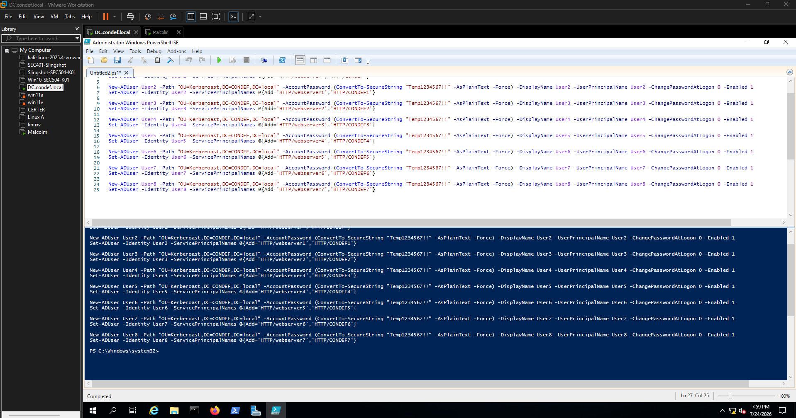

These were disposable lab accounts created specifically for the exercise. They did not represent real production service accounts or an actual privilege path.

---

## Running the Attack

I used Impacket's `GetUserSPNs.py` from `LinuxA`.

Before installing anything, I checked whether the tool was already available:

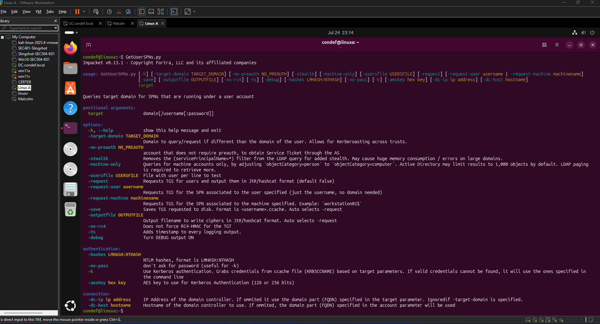

I then ran:

```bash
GetUserSPNs.py condef.local/Administrator -dc-ip 192.168.137.135 -request -outputfile kerbtickets.txt
```

The command:

* Authenticated to the domain as `Administrator`
* Located accounts with SPNs
* Requested service tickets for those accounts
* Saved the returned TGS-REP hash material to `kerbtickets.txt`

I examined the resulting file with:

```bash
cat kerbtickets.txt
```

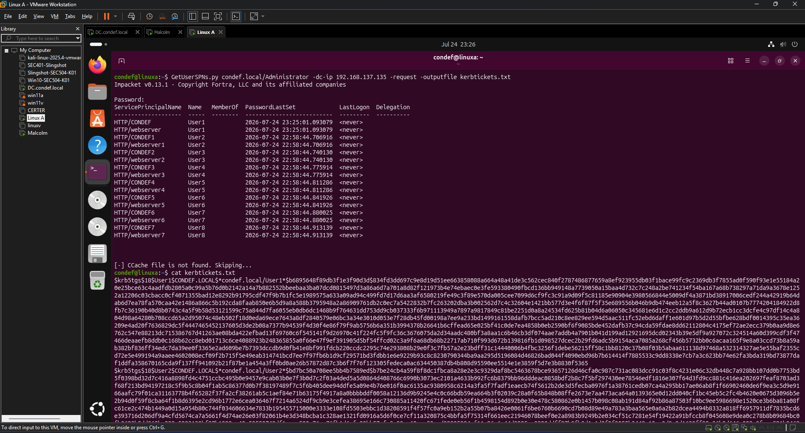

The output contained crackable service-ticket material for the accounts with SPNs.

These are not the service accounts' stored NTLM password hashes. They are representations of the encrypted Kerberos service tickets that password-cracking tools can test offline.

Before attempting to crack one, I investigated what the ticket requests produced in my host and network telemetry.

---

## Finding the Activity in Splunk

When an account requests a Kerberos service ticket, the domain controller records Windows Security Event ID 4769.

My first query counted how many distinct services each account requested tickets for:

```spl
index=winlogs EventCode=4769
| stats dc(ServiceName) as TicketRequestedCount,
        values(ServiceName) as ServicesRequested
        by TargetUserName
```

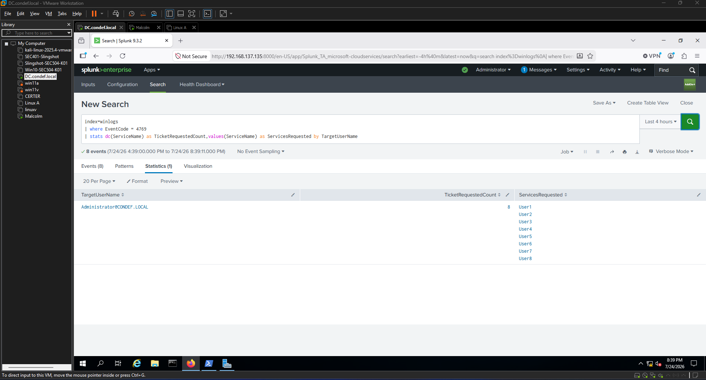

This gave me:

* The account requesting the tickets
* The number of distinct services requested
* The names of those services

The query is useful for initial investigation, but it is not yet a complete detection. It counts events across the entire selected Splunk time range and does not establish how quickly the requests occurred.

The behavior I wanted to detect was not simply that a service ticket was requested. Service-ticket requests are normal Kerberos activity.

The suspicious pattern was one account requesting tickets for many different services within a short period.

---

## Examining the Encryption Type

Event ID 4769 also contains the `TicketEncryptionType` field.

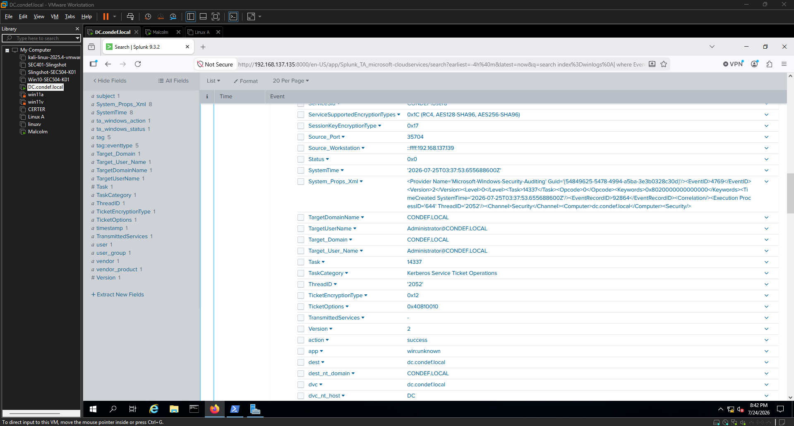

Microsoft documents the values used in this field:

https://learn.microsoft.com/en-us/windows/security/threat-protection/auditing/event-4769

Encryption type can provide useful context during a Kerberoasting investigation. RC4-encrypted tickets are particularly important because they are substantially faster to test with password-cracking tools than AES tickets.

However, RC4 is not required for Kerberoasting. AES-encrypted service tickets can also be taken offline and cracked.

I added the encryption type to my query:

```spl
index=winlogs EventCode=4769
| stats dc(ServiceName) as TicketRequestedCount,
        values(ServiceName) as ServicesRequested,
        values(TicketEncryptionType) as EncryptionTypes
        by TargetUserName
```

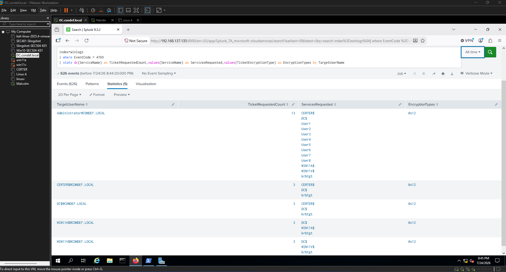

My service-ticket requests returned `0x12`, which represents AES256.

The course example produced RC4-HMAC tickets, but I was unable to reproduce that result in my environment. The same Kerberoasting workflow continued returning AES256 service tickets.

Instead of forcing the environment to match the example, I continued with the telemetry my domain actually produced.

---

## Translating the Encryption Values

The raw encryption values are hexadecimal, so I used an SPL `case` statement to translate them into readable names:

```spl
index=winlogs EventCode=4769
| eval Ticket_Type_Translate=case(
    TicketEncryptionType="0x1", "DES-CBC-CRC",
    TicketEncryptionType="0x3", "DES-CBC-MD5",
    TicketEncryptionType="0x11", "AES128-CTS-HMAC-SHA1-96",
    TicketEncryptionType="0x12", "AES256-CTS-HMAC-SHA1-96",
    TicketEncryptionType="0x17", "RC4-HMAC",
    TicketEncryptionType="0x18", "RC4-HMAC-EXP",
    true(), TicketEncryptionType
)
| stats dc(ServiceName) as TicketRequestedCount,
        values(ServiceName) as ServicesRequested,
        values(Ticket_Type_Translate) as EncryptionTypes
        by TargetUserName
```

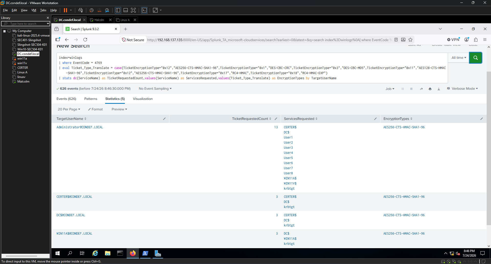

This confirmed that the tickets generated by my execution used AES256.

Because legitimate ticket requests in my environment also used AES256, encryption type alone did not distinguish the Kerberoasting activity from normal Kerberos behavior.

The more useful signal was the number of distinct services requested by one account in a short period.

---

## Building the Lab Detection

I grouped the events into one-hour buckets and counted the number of distinct services requested by each account:

```spl
index=winlogs EventCode=4769
| bin span=1h _time
| stats dc(ServiceName) as TicketRequestedCount,
        values(ServiceName) as ServicesRequested,
        values(TicketEncryptionType) as EncryptionTypes
        by TargetUserName, _time
| where TicketRequestedCount > 5
```

This detection fires when one account requests tickets for more than five distinct services within a one-hour bucket.

The encryption types remain in the results as analyst context, but they are not required for the alert to fire.

This is important because:

* My attack produced AES256 tickets.
* A different Kerberoasting procedure may produce RC4 tickets.
* Encryption type does not change the underlying burst of service-ticket requests.
* Requiring AES256 or RC4 would unnecessarily limit the behavioral detection.

The threshold of more than five distinct services is based only on the activity observed in my lab. It is not a production recommendation.

### Query Used During the Original Lab Validation

The version I initially used during the exercise included an AES256 filter:

```spl
index=winlogs EventCode=4769 TicketEncryptionType="0x12"
| bin span=1h _time
| stats dc(ServiceName) as TicketRequestedCount,
        values(ServiceName) as ServicesRequested
        by TargetUserName, _time
| where TicketRequestedCount > 5
```

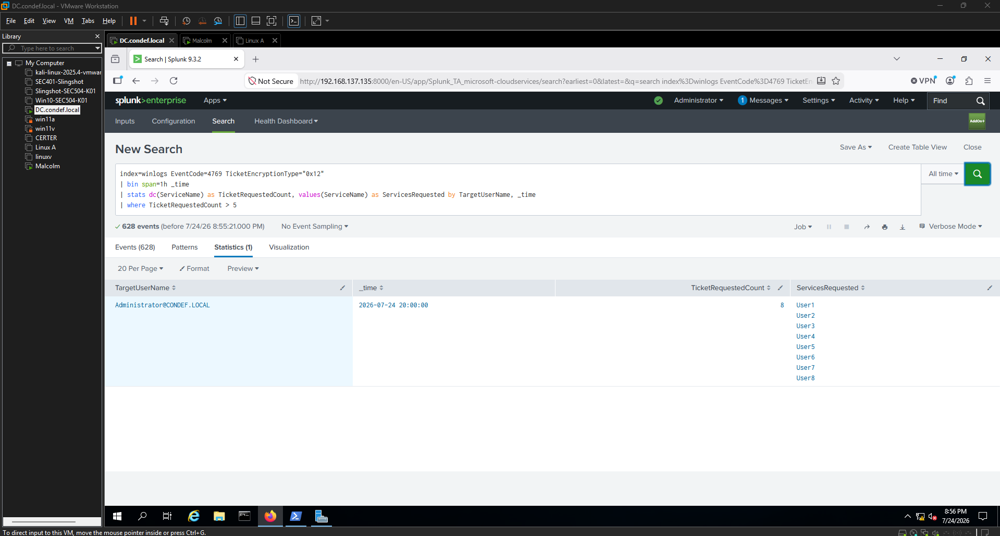

That query successfully identified my execution because all of my generated tickets used AES256.

After reviewing the result, I determined that AES256 was an environmental characteristic rather than the malicious behavior itself. The broader version above retains encryption type for context but bases the alert on the burst of distinct service-ticket requests.

---

## Why the Detection Works

The detection focuses on a behavioral requirement of bulk Kerberoasting.

To collect several service-ticket hashes, the attacking account must request tickets for several SPNs. Each request generates Event ID 4769 on the domain controller.

The query therefore looks for:

1. One requesting account
2. Many distinct service names
3. Within a limited period

The exact tool is less important than the ticket-requesting behavior it produces.

The encryption type can increase or decrease confidence:

* RC4 requests may be more suspicious in an AES-dominant environment.
* AES requests cannot be dismissed because AES tickets can still be cracked.
* The account, service names, source address, ticket count, and normal environmental baseline must be considered together.

---

## Network-Layer Corroboration

I also investigated the activity from the network perspective using Malcolm.

Kerberos network telemetry exposed the requesting account and requested service names, even though the ticket contents were encrypted.

Because my tickets used AES256, I searched Arkime with:

```text
zeek.kerberos.cipher == aes256-cts-hmac-sha1-96 && zeek.kerberos.request_type == TGS
```

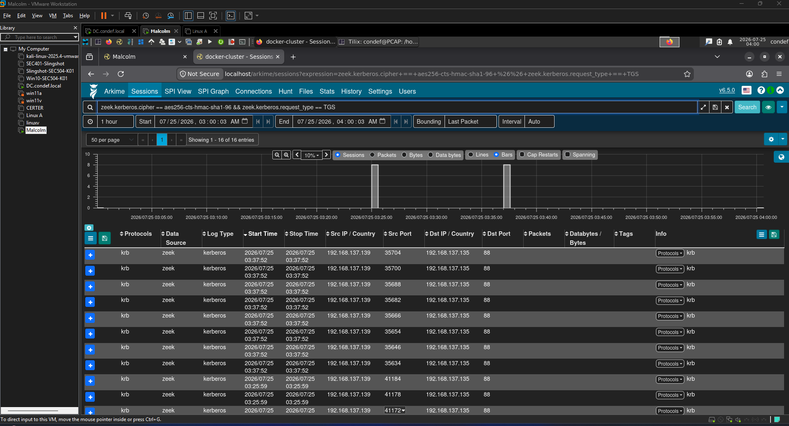

In the Connections view, I set:

```text
Source: zeek.kerberos.cname
Destination: zeek.kerberos.sname
```

This graphed the requesting accounts against the services for which they requested tickets:

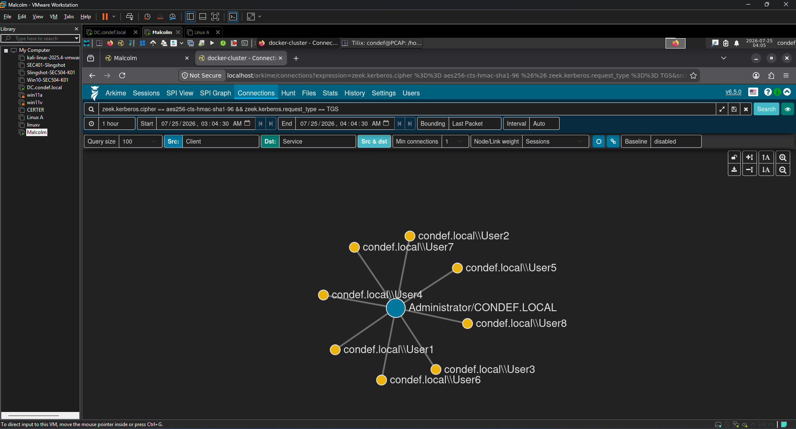

The graph showed `Administrator/CONDEF.LOCAL` fanning out to the service accounts created for the exercise.

That was the same one-to-many relationship I observed in Splunk:

* One requesting account
* Multiple service names
* Requests occurring close together

Splunk showed the activity from the domain controller's event logs, while Malcolm showed it from independently collected network traffic.

The agreement between those two sources increased confidence that I was looking at the intended execution rather than an isolated parsing or collection issue.

---

## Cracking an AES256 Ticket

The course exercise focused primarily on detection and did not require cracking the captured tickets. I continued beyond that point to demonstrate the offline-cracking stage.

My tickets used AES256, corresponding to Kerberos encryption type 18. The matching Hashcat mode is `19700`.

My attacker VM was CPU-only, so I extracted one ticket into a separate file and ran:

```bash
hashcat -m 19700 -a 0 onehash.txt rockyou.txt --force
```

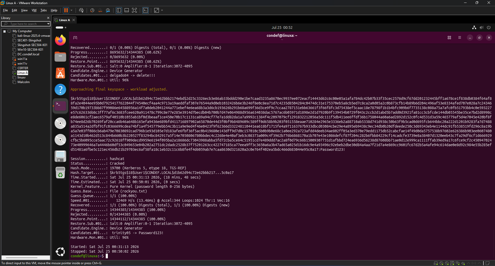

Hashcat ran at approximately 12,000 guesses per second and recovered the password `Password123!` for the `User1` account.

That completed the technical workflow demonstrated in this lab:

1. Request the service ticket
2. Save the TGS-REP hash material
3. Detect the requests in Windows telemetry
4. Corroborate the requests in network telemetry
5. Test the captured ticket offline
6. Recover the weak service-account password

For this execution, I authenticated to `GetUserSPNs.py` as the domain Administrator. I therefore did not demonstrate the complete attack path beginning with a compromised low-privileged account.

I demonstrated the ticket-requesting, detection, correlation, and offline-cracking portions of Kerberoasting.

The AES256 ticket cracked much more slowly than an equivalent RC4 ticket would. That does not make AES tickets safe when the underlying service-account password is weak, but it makes each password guess more computationally expensive.

---

## False Positives and Tuning

Requesting several service tickets is not automatically malicious.

Potential benign causes may include:

* Administrative scripts that contact several services
* Management or monitoring platforms
* Service-discovery activity
* Authentication workflows involving several SPNs
* Accounts that legitimately interact with many services
* Lab, development, or vulnerability-assessment tools

Before using this detection outside the lab, I would baseline:

* The normal number of distinct services requested by each account
* Accounts that routinely request large numbers of tickets
* Expected service names
* Expected source systems
* Normal encryption types
* Time-of-day patterns
* Differences between human, machine, and service accounts

Possible tuning approaches include:

* Maintaining a reviewed list of known high-volume requesting accounts
* Separating human and machine-account baselines
* Increasing risk when RC4 is unusual in the environment
* Increasing risk when the requesting account has not previously contacted the services
* Correlating the requests with endpoint or network activity from the same source
* Alerting separately on access to especially privileged service accounts

Allowlisting should be narrow and evidence-based. Excluding an account solely because it often generates high ticket volume could hide abuse if that account is later compromised.

---

## Limitations

This lab detection does not identify every possible Kerberoasting attempt.

### Low-volume requests

An attacker requesting only one or two high-value service tickets may remain below the threshold.

### Slow activity

An attacker can distribute requests over a longer period to avoid creating a visible burst.

### Fixed time buckets

The use of one-hour `bin` buckets can split related requests across the boundary between two buckets.

A production detection would need a carefully defined schedule and may benefit from a rolling rather than fixed window.

### Threshold specificity

The `TicketRequestedCount > 5` threshold comes from a small lab environment. A production domain may have very different normal behavior.

### Encryption-type differences

Requiring only RC4 would miss AES Kerberoasting. Requiring only AES would miss RC4 Kerberoasting.

Encryption type is therefore retained as context rather than treated as a universal requirement.

### Telemetry dependency

The host-side detection depends on the domain controller generating and collecting Event ID 4769.

The network-side view depends on having visibility into the Kerberos traffic and correctly parsed Zeek telemetry.

### Attacker account context

The requesting account shown in the event is not necessarily the final target of the investigation. It may be a legitimate account whose credentials have already been compromised.

---

## Analyst Investigation

If this detection fired, I would investigate:

1. Which account requested the tickets?
2. From which IP address or system did the requests originate?
3. Which service accounts were targeted?
4. How many distinct services were requested?
5. Over what period did the requests occur?
6. Which encryption types were used?
7. Is this ticket volume normal for the requesting account?
8. Are the targeted accounts privileged or broadly accessible?
9. Is there related process or network telemetry on the source system?
10. Did the same source perform additional Active Directory discovery?
11. Does the account show signs of earlier compromise?
12. Are any of the targeted service-account passwords weak, old, or reused?

The alert would be stronger if the requesting account were unusual, the service accounts were privileged, RC4 were rare in the environment, or the same source showed additional discovery or credential-access behavior.

---

## Key Takeaways

* Event ID 4769 provides the requesting account, requested service, and ticket encryption type needed to investigate Kerberoasting activity.
* The course example produced RC4 tickets, but my environment returned AES256.
* I adapted the detection to my observed telemetry rather than changing the results to match the example.
* AES tickets can still be Kerberoasted and cracked offline.
* In my lab, the strongest signal was one account requesting tickets for many distinct services in a short period.
* Encryption type is useful context, but it is not a universal requirement for detecting Kerberoasting.
* Splunk and Malcolm independently showed the same one-to-many service-request pattern.
* Cracking one AES256 ticket demonstrated that encryption strength cannot compensate for a weak service-account password.
* The threshold and exclusions are lab-specific and require baselining before operational use.
* This exercise demonstrated representative Kerberoasting telemetry, not a complete low-privilege attack path.

---

## References

* [MITRE ATT&CK T1558.003 – Kerberoasting](https://attack.mitre.org/techniques/T1558/003/)
* [Microsoft – Event 4769: A Kerberos service ticket was requested](https://learn.microsoft.com/en-us/windows/security/threat-protection/auditing/event-4769)
* [The Hacker Recipes – Kerberoast](https://www.thehacker.recipes/ad/movement/kerberos/kerberoast)
* [TrustedSec – The Art of Bypassing Kerberoast Detections with Orpheus](https://www.trustedsec.com/blog/the-art-of-bypassing-kerberoast-detections-with-orpheus)
* [Lares – Active Directory Attacks: Enumeration at the Network Layer](https://www.lares.com/blog/active-directory-ad-attacks-enumeration-at-the-network-layer/)
