# Catching LSASS Credential Dumping Three Ways With One Detection Primitive

**Lab:** `condef.local`
**Date:** 2026-07-18
**Platform(s):** Windows
**Primary log source(s):** Sysmon (ProcessAccess EID 10, FileCreate EID 11)
**SIEM:** Splunk
**ATT&CK:** T1003.001, OS Credential Dumping: LSASS Memory · Tactic: Credential Access (TA0006)

---

## Summary

LSASS holds credential material in memory for every account logged onto a Windows host, so an attacker who can read that memory harvests hashes and tickets without cracking anything. I dumped LSASS three different ways in my lab (Mimikatz through a Meterpreter session, Windows Task Manager, and Procdump) and found that all three collapse to the same behavior at the sensor level: a process opening a handle to `lsass.exe` with the memory-read access right set. The detection keys on that shared primitive rather than on any one tool, which is why a single Sysmon ProcessAccess rule catches all three even though none of them share a binary, a parent, or a file artifact.

## Attack overview

LSASS (Local Security Authority Subsystem Service, `lsass.exe`, running from `C:\Windows\System32`) is the Windows process that handles proving who you are and enforcing what that identity is allowed to do. A few things it does that matter here:

- **Authentication broker.** When you log on, LSASS validates the credentials. Locally it checks against the SAM database. On a domain-joined box it hands the work to the right authentication package and talks to the domain controller.
- **Runs the authentication packages.** Kerberos, NTLM, Digest, CredSSP, WDigest and others are DLLs loaded inside LSASS. Each implements a protocol and each needs credential material to do its job, which is why all of that material ends up resident in one process.
- **Issues access tokens.** After a successful logon LSASS creates the token attached to your session and every process you spawn, carrying your SID and group memberships.
- **Enforces local security policy** and writes the Security event log, which is why events like 4624, 4625, and 4672 come from LSASS.

To support single sign-on it keeps credential material resident in its own memory for the life of each logon session: NTLM hashes, Kerberos tickets and keys, and on older or misconfigured systems, plaintext passwords. That design is the whole reason attackers target it. Reading LSASS memory is not an exploit, it is a read. A process running with high enough privilege (local admin or SYSTEM) can open a handle to another process and read its memory. The attack just points that capability at the one process that stores every credential on the box, which frequently includes accounts more privileged than the one the attacker started with.

This technique shows up constantly in real intrusions. Credential dumping from LSASS is a staple of ransomware crews and hands-on-keyboard operators because it is how they turn a single foothold into domain-wide movement. The three tools I used cover a useful spread: Mimikatz is purpose-built offensive tooling, Procdump is a signed Microsoft Sysinternals utility that admins use legitimately, and Task Manager is a built-in OS binary that every user opens. If one detection can catch all three, it is keying on the behavior and not the tool, which is exactly what I wanted to prove.

## Lab conditions

I disabled a few protections in this lab on purpose so I would get clean, uncontaminated telemetry rather than a truncated event or a blocked action. This is a lab choice, not something you would do in production, and each of these being present in a real environment is itself a control worth having.

- **LSA Protection (RunAsPPL) turned off.** By default a modern Windows host can run `lsass.exe` as a Protected Process Light, which blocks handle opens with memory-read rights even for admin. I set `HKLM\SYSTEM\CurrentControlSet\Control\Lsa\RunAsPPL` to `0` and rebooted so the dumps would succeed and generate the ProcessAccess telemetry I was after. Flipping that key from `1` to `0` is its own detectable event (a registry value change), and in a real environment LSA Protection being on would have blocked or degraded all three of these dumps.
- **Defender disabled.** With Defender live, loading Mimikatz in memory is exactly the kind of thing that gets flagged and killed on execution.

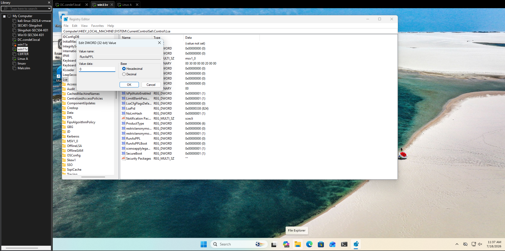

## Lab replication

**Environment:** `condef.local` — attacker box (LinuxA, Kali), target workstation (Win11V), telemetry into Splunk on the DC.

I ran three procedures against the same target, all aiming at LSASS memory.

**1. Mimikatz through a Meterpreter session.** I already had a SYSTEM Meterpreter session on Win11V from a PsExec payload. Setting it up was not totally smooth: I first tried to run the handler on lport 443 and the exploit would not execute, so I switched to lport 8443 and it went through.

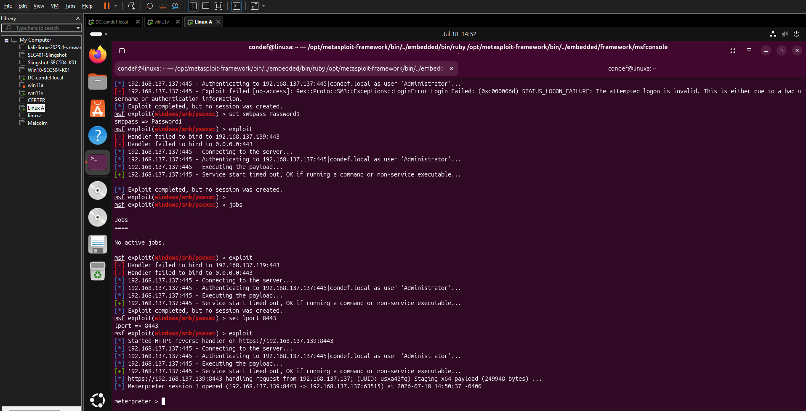

Meterpreter's `kiwi` extension embeds Mimikatz and runs it in memory, so nothing touches disk. Once loaded, `creds_all` reads credential material straight out of LSASS.

```
meterpreter > load kiwi
meterpreter > creds_all
[+] Running as SYSTEM
[*] Retrieving all credentials
```


This did not work on the first attempt. I ran `creds_all` and it timed out. I tried again, same timeout. I ran `getuid` and that timed out too, which made it look like my session had died. When I checked the Windows VM, it had suspended itself. I resumed it, retried the whole thing, and `creds_all` worked. Worth writing down because a suspended target looks exactly like a dead session, and the fix was just resuming the VM, not rebuilding the session.

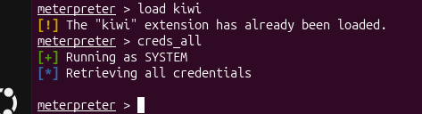

**2. Windows Task Manager.** Fully built in. I searched for `lsass` in Task Manager, right-clicked the Local Security Authority Process, and chose Create memory dump file.

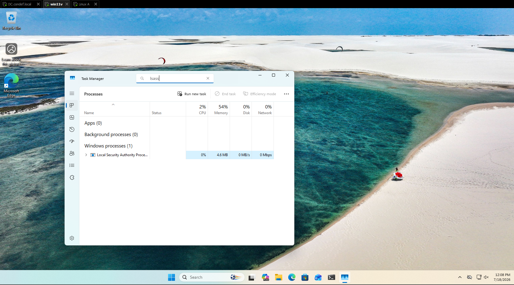

Task Manager wrote the dump to the user temp directory and told me exactly where.

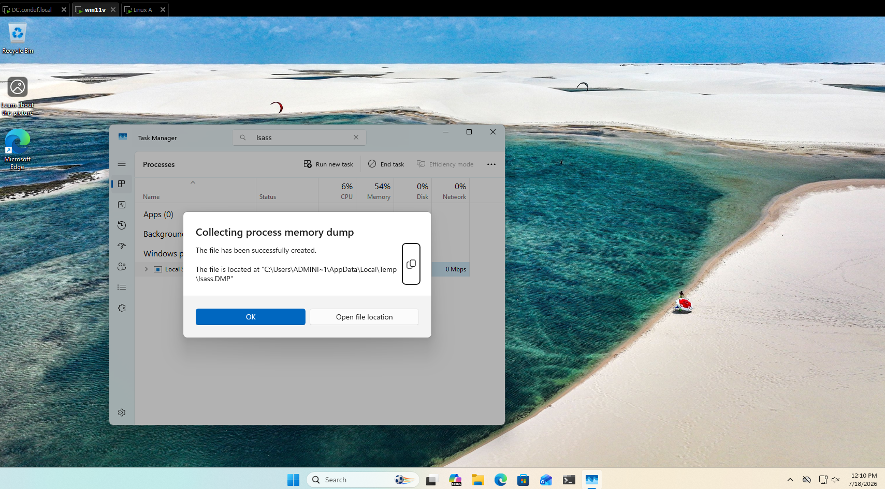

The dump landed at `C:\Users\ADMINI~1\AppData\Local\Temp\lsass.DMP`.

**3. Procdump.** I pulled the signed Sysinternals binary down and ran it against LSASS.

```powershell
Invoke-WebRequest -UseBasicParsing https://live.sysinternals.com/procdump.exe -OutFile procdump.exe
.\procdump.exe -accepteula -r -ma lsass.exe lsass.dmp
```

That produced an 82.7 MB `lsass.dmp` on the Public desktop.

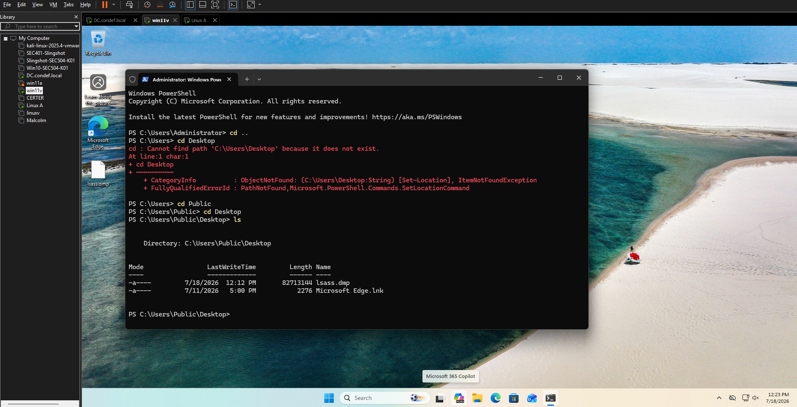

At this point I had dumped LSASS three ways: Mimikatz in memory, Task Manager to a `.DMP` in temp, and Procdump to a `.dmp` on disk.

## ATT&CK framing

Before touching Splunk it helped me place these correctly. Looking at the Credential Access tactic page on ATT&CK, there are 17 techniques under it. My three methods all land on the same one, and the same sub-technique within it.

- **Tactic (why):** Credential Access, TA0006
- **Technique (what):** T1003, OS Credential Dumping
- **Sub-technique (which surface):** T1003.001, LSASS Memory
- **Procedure (which tool):** Mimikatz / Task Manager / Procdump

The thing that clicked for me is that these are not three techniques. They are three procedures for one sub-technique. That distinction is the whole point of the detection: the tools differ, but the behavior they must all perform is the same, and that is where I want my rule to sit.

## Telemetry

Two Sysmon event types carry the story:

| Source | Event ID / Type | Key fields | Why it matters |
|---|---|---|---|
| Sysmon | EID 10 ProcessAccess | `SourceImage`, `TargetImage`, `GrantedAccess` | Logs one process opening a handle to another. `TargetImage` is lsass; `GrantedAccess` says what rights the handle carries |
| Sysmon | EID 11 FileCreate | `Image`, `TargetFilename` | Logs the dump file being written. Catches the tools that leave a `.dmp` behind |

The single most important field is `GrantedAccess` on the EID 10 event. Opening a handle to LSASS is not rare on its own. Plenty of legitimate processes do it with low-privilege rights. What separates a credential dump is that the handle carries the memory-read right, `PROCESS_VM_READ` (`0x0010`). That one bit is the behavioral invariant across all three of my procedures.

**Gap I found:** Task Manager did not generate an EID 10 ProcessAccess event at all in my data. Its dump was only visible as an EID 11 FileCreate. So a detection built purely on ProcessAccess would have missed one of my three procedures entirely. That gap is what drives the combined query below and is the strongest argument for watching both event types.

## Detection

I built this up in stages rather than jumping to the final query, because each stage taught me something about the data.

**Stage 1: who is touching LSASS at all.**

```spl
index=sysmon
| where EventCode = 10
| where TargetImage = "C:\WINDOWS\system32\lsass.exe"
| table TargetImage
```

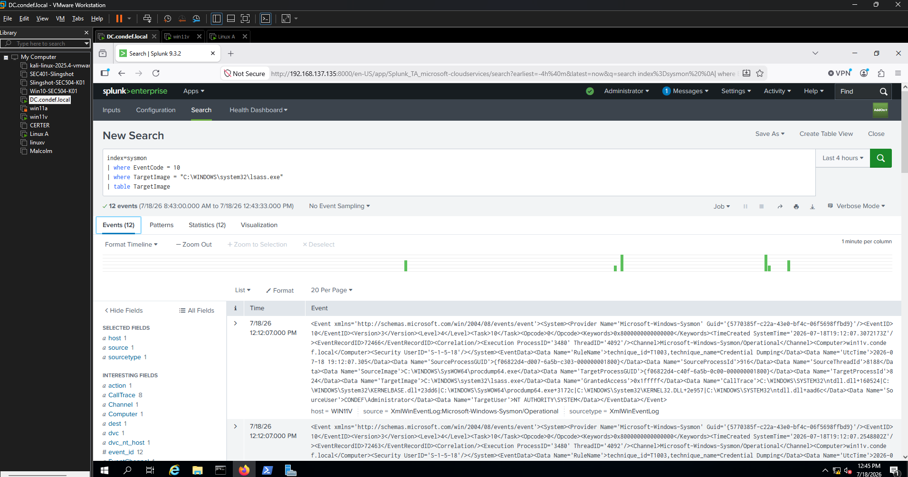

This returns events but tells me nothing useful, every row just says lsass. I need to see the accessing process.

**Stage 2: group by the accessing process.**

```spl
index=sysmon
| where EventCode = 10
| where TargetImage = "C:\WINDOWS\system32\lsass.exe"
| stats count(SourceImage) as AccessCount, values(TargetImage) as TargetImage by SourceImage
```

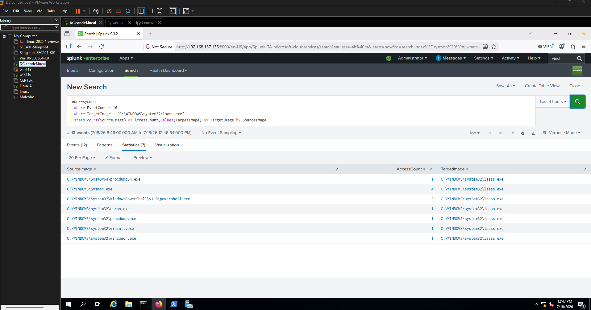

Now I can see the actors. Alongside my dumpers there are legitimate accessors: `csrss.exe` and `wininit.exe`, which touch LSASS as part of normal Windows operation. Those are my baseline noise.

**Stage 3: subtract the known-good.**

```spl
index=sysmon
| where EventCode = 10
| where TargetImage = "C:\WINDOWS\system32\lsass.exe"
| where SourceImage != "C:\WINDOWS\system32\csrss.exe" and SourceImage != "C:\WINDOWS\system32\wininit.exe"
| stats count(SourceImage) as AccessCount, values(TargetImage) as TargetImage by SourceImage
```

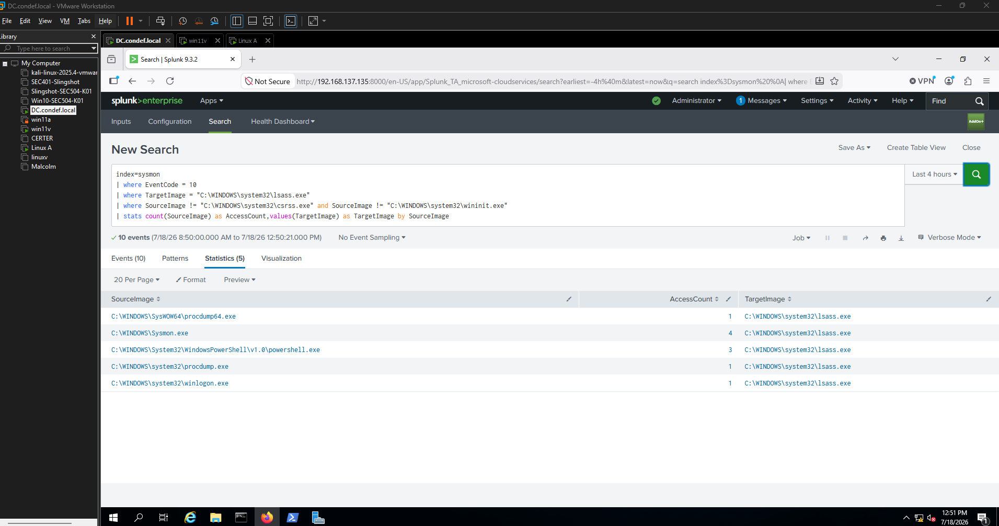

With csrss and wininit removed, `procdump.exe`, `procdump64.exe`, and `powershell.exe` (my Meterpreter host) are left standing. This is the baseline-then-subtract pattern: I do not search for the bad thing by name, I remove everything that is supposed to touch LSASS and see what remains.

**Stage 4: catch the file-write procedures too.**

Stage 3 still misses Task Manager, because Task Manager never produced a ProcessAccess event. To catch it I have to also look at the FileCreate events for a dump file. Because the two event types name the actor field differently (EID 10 uses `SourceImage`, EID 11 uses `Image`), I normalize them into one field with `coalesce`.

```spl
index=sysmon
| where EventCode = 10 OR EventCode = 11
| where TargetImage = "C:\WINDOWS\system32\lsass.exe" OR TargetFilename like "%lsass%"
| eval Image = coalesce(SourceImage, Image)
| where Image != "C:\WINDOWS\system32\csrss.exe" and Image != "C:\WINDOWS\system32\wininit.exe"
| fillnull value="-"
| stats values(TargetImage) as TargetImage, values(TargetFilename) as TargetFilename, values(EventDescription) as EventDescription by Image
```

**Logic walkthrough:**
- `EventCode = 10 OR 11` — grab both handle-opens and file-writes
- `TargetImage = lsass OR TargetFilename like "%lsass%"` — the first clause scopes the ProcessAccess events to LSASS, the second scopes the FileCreate events to any dump file with lsass in the name
- `eval Image = coalesce(SourceImage, Image)` — unify the actor field so both event types share one column
- exclude csrss and wininit — same baseline subtraction as before
- `stats ... by Image` — one row per actor, showing whether it opened a handle, wrote a file, or both

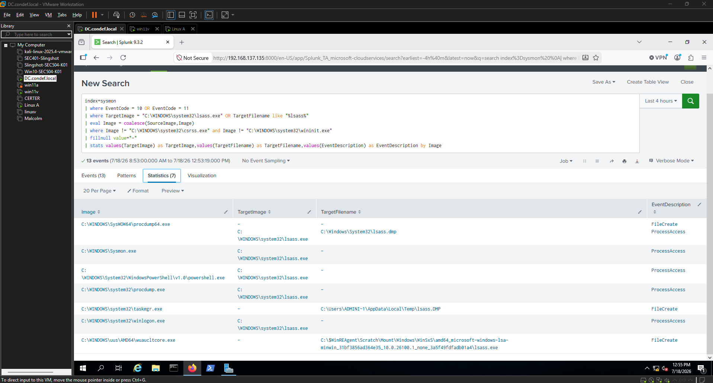

Now `taskmgr.exe` appears, caught by its FileCreate to `C:\Users\ADMINI~1\AppData\Local\Temp\lsass.DMP`. The combined query surfaces all three procedures: procdump (both paths), the Meterpreter PowerShell, and Task Manager. Task Manager was invisible to ProcessAccess and only the FileCreate branch caught it.

**Stage 5: read the access rights.**

Knowing who touched LSASS is not the same as knowing what they did to it. That is what `GrantedAccess` tells me.

```spl
index=sysmon
| where EventCode = 10
| where SourceImage != "C:\WINDOWS\system32\csrss.exe" and SourceImage != "C:\WINDOWS\system32\wininit.exe"
| where TargetImage = "C:\WINDOWS\system32\lsass.exe"
| stats count(SourceImage) as ImageCount, values(TargetImage) as TargetImage, values(GrantedAccess) as GrantedAccess by SourceImage
```

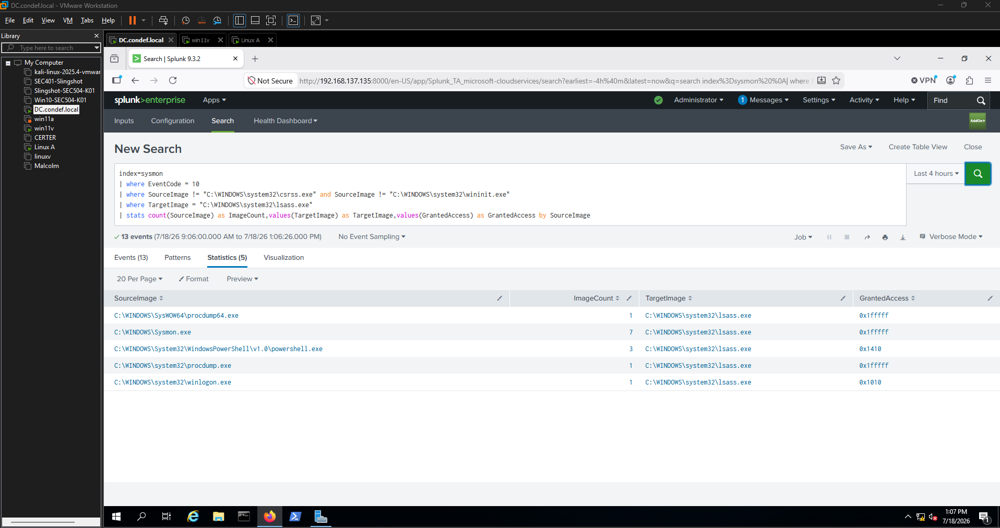

The `GrantedAccess` values are access-rights bitmasks. Reading them:

| SourceImage | GrantedAccess | Meaning |
|---|---|---|
| `SysWOW64\procdump64.exe` | `0x1fffff` | full access (PROCESS_ALL_ACCESS) |
| `system32\procdump.exe` | `0x1fffff` | full access |
| `WindowsPowerShell\v1.0\powershell.exe` (Meterpreter) | `0x1410` | VM_READ + query information |
| `system32\winlogon.exe` | `0x1010` | VM_READ + query limited info |

To decode these I used the `Get-SysmonAccessMask` function from the PSGumshoe module, which maps a mask to its individual rights. The Sysmon Community Guide has the reference table of what each bit means.

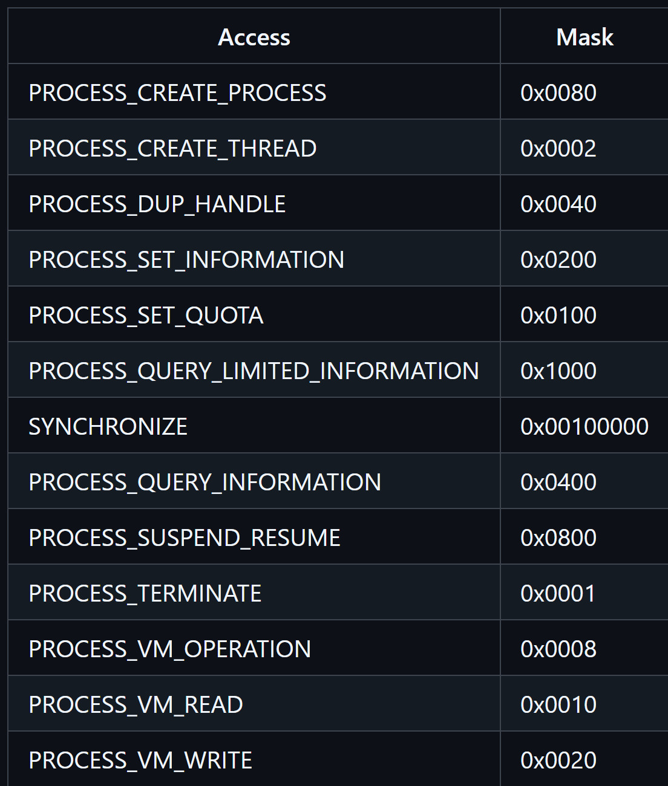

Decoding `0x1fffff`:

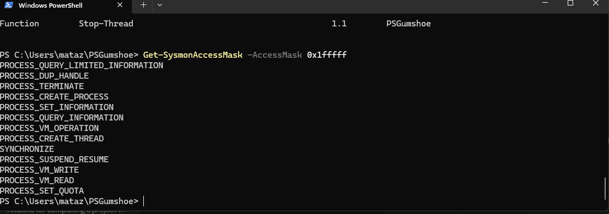

Decoding `0x1010`:

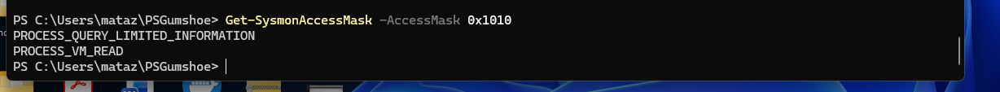

Putting the decodes together:
- `0x1fffff` = every process right, including VM_READ, VM_WRITE, CREATE_THREAD. This is a tool grabbing total control of LSASS, and nothing legitimate needs all-access to it. Both Procdump instances requested this.
- `0x1410` = VM_READ + QUERY_INFORMATION + QUERY_LIMITED_INFORMATION. This is the Meterpreter-driven PowerShell reading memory with a narrower footprint than Procdump.
- `0x1010` = VM_READ + QUERY_LIMITED_INFORMATION. This one is `winlogon.exe`, a legitimate system process. It contains VM_READ but it is not an attack.

**Hypothesis:** a process opening a handle to `lsass.exe` with a `GrantedAccess` mask that includes `PROCESS_VM_READ` (`0x0010`), and that is not a known legitimate accessor, is reading LSASS memory. The exact mask varies by tool, but the VM_READ bit is the invariant.

That last row is the important lesson. My first instinct was to tier by total access and treat the high mask as malicious and the low mask as safe. But `0x1010` (winlogon, benign) and `0x1410` (Meterpreter, malicious) both contain VM_READ, and they differ by a single bit. So the mask alone cannot cleanly separate good from bad. The real trigger is the VM_READ bit plus the actor not being on my known-good list, not the size of the mask.

**Stage 6: flag by mask for triage priority.**

Even though the mask does not decide malicious-versus-benign on its own, it is still useful for triage priority. A full-access handle to LSASS deserves attention before a narrow one.

```spl
index=sysmon
| where EventCode = 10
| where SourceImage != "C:\WINDOWS\system32\csrss.exe" and SourceImage != "C:\WINDOWS\system32\wininit.exe"
| where TargetImage = "C:\WINDOWS\system32\lsass.exe"
| eval FullProcessAccess = if(GrantedAccess = "0x1fffff", 1, 0)
| eval LimitedProcessAccess = if(GrantedAccess = "0x1410", 1, 0)
| where FullProcessAccess = 1
| stats count(SourceImage) as ImageCount, values(TargetImage) as TargetImage, values(GrantedAccess) as GrantedAccess by SourceImage
```

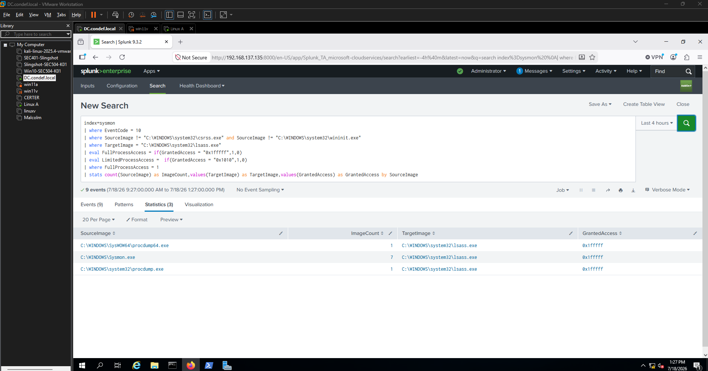

This surfaces the full-access accessors, which in my data are both Procdump instances plus `Sysmon.exe` itself, since Sysmon legitimately opens LSASS with full access. That is a useful reminder that a high mask is not automatically malicious, Sysmon sits right there at `0x1fffff` alongside the dumpers. Flipping the filter to `LimitedProcessAccess = 1` surfaces the Meterpreter PowerShell instead. I would not ship this as the alert itself, because filtering to exact masks would blind me to any tool that requests a slightly different rights combination. It is a triage lens, not the detection.

## False positives & tuning

- **Likely FP source:** legitimate system processes hold VM_READ handles to LSASS. In my own data `winlogon.exe` (`0x1010`) did exactly that, and `csrss.exe` and `wininit.exe` access LSASS constantly. My baseline also caught `wuauclt` / `wuacltcore.exe` (Windows Update) writing a file whose path contained the string `lsass` under WinSxS, which my `%lsass%` wildcard matched even though it was not a dump.
- **Tuning approach:** maintain an allowlist of known-good accessors (csrss, wininit, winlogon, and whatever EDR or backup agent legitimately opens LSASS in the environment), and tighten the FileCreate branch so `%lsass%` does not match servicing files under WinSxS. The VM_READ bit stays as the trigger; the allowlist is what keeps it quiet.
- **Tradeoff accepted:** the `%lsass%` wildcard is deliberately loose so it catches oddly named dump files, at the cost of matching benign files with lsass in the path (like the Windows Update file-write above). I would rather review a few Windows Update file-writes than miss a dump named to look innocent. The allowlist is specific to this lab; a production baseline would need to be built from that environment's own normal.

## Limitations

The clearest limitation showed up in my own testing: no single event type caught all three methods.

- The **ProcessAccess** branch (EID 10) never saw Task Manager, because Task Manager did not generate a ProcessAccess event in my data. It was only visible as a FileCreate.
- The **FileCreate** branch (EID 11) never saw the Mimikatz-in-memory dump, because that method runs in memory and does not write a `.dmp` file to catch.

So each branch on its own has a blind spot, and only watching both together surfaced all three procedures. That is a limitation to be honest about rather than a solved problem.

## Analyst response

If this fired at 2am I would:

1. **Validate.** Pull the raw EID 10, confirm `TargetImage` is lsass and `GrantedAccess` includes VM_READ, and check the `SourceImage` against the known-good allowlist.
2. **Scope.** Pivot on the host and the SourceImage PID. Look for the matching EID 11 dump file and the process that spawned the accessor.
3. **Contain / escalate.** If it is a real dump, assume every credential used on that host is burned. Isolate the host, force password and Kerberos key resets for accounts that had sessions there, and escalate as a credential-access incident rather than a single-host event.

## Key takeaways

- Three different tools, one sub-technique (T1003.001), and one behavioral invariant: a handle to LSASS carrying `PROCESS_VM_READ`. Building the detection on the primitive instead of the tool is what makes it survive a tool swap.
- No single event type covered everything. ProcessAccess missed Task Manager, FileCreate missed in-memory Mimikatz. Watching both, and normalizing the actor field across them, was necessary to see all three procedures.
- The access mask is a triage signal, not a verdict. A benign process (winlogon, `0x1010`) and a malicious one (Meterpreter, `0x1410`) can sit one bit apart, so the VM_READ bit plus a good baseline does the real work, not the size of the mask.
- Allowlisting known-good processes is unavoidable for keeping the detection quiet, but the list is specific to this lab and would have to be rebuilt from scratch in any other environment.

---

## References
- MITRE ATT&CK: [T1003.001 OS Credential Dumping: LSASS Memory](https://attack.mitre.org/techniques/T1003/001/)
- [TrustedSec Sysmon Community Guide, Process Access](https://github.com/trustedsec/SysmonCommunityGuide)
- [PSGumshoe Get-SysmonAccessMask](https://github.com/PSGumshoe/PSGumshoe)
- [Threat Hunter Playbook, LSASS Memory Read Access](https://threathunterplaybook.com/hunts/windows/170105-LSASSMemoryReadAccess/notebook.html)
- [Red Canary Threat Detection Report, LSASS Memory](https://redcanary.com/threat-detection-report/techniques/lsass-memory/)
