# Catching LSASS Credential Dumping Three Ways

**Status:** Lab validated / experimental
**Lab:** `condef.local`
**Date:** 2026-07-18
**Platform:** Windows
**Primary log sources:** Sysmon ProcessAccess Event ID 10 · Sysmon FileCreate Event ID 11
**SIEM:** Splunk
**ATT&CK:** [T1003.001 – OS Credential Dumping: LSASS Memory](https://attack.mitre.org/techniques/T1003/001/)

---

## TL;DR

I tested three procedures for accessing or dumping LSASS memory:

* Mimikatz through a Meterpreter session
* Windows Task Manager
* Microsoft Sysinternals Procdump

The three procedures did not produce identical telemetry in my lab.

Mimikatz and Procdump generated Sysmon ProcessAccess events showing processes opening handles to `lsass.exe`. Task Manager did not produce a ProcessAccess event in the data collected by my Sysmon configuration, but it did generate a FileCreate event when it wrote `lsass.DMP`.

Covering all three procedures therefore required two complementary detection paths:

1. ProcessAccess events in which a process accesses `lsass.exe` with memory-read rights
2. FileCreate events associated with an LSASS dump file

The result is behavior-focused coverage that does not depend on detecting one specific dumping tool.

---

## Why Attackers Target LSASS

The Local Security Authority Subsystem Service, or `lsass.exe`, is a core Windows process responsible for authentication and local security policy.

LSASS works with authentication packages such as Kerberos and NTLM and maintains credential-related material needed to support active logon sessions and single sign-on.

Depending on the system configuration and the accounts that have logged on, its memory may contain material such as:

* NTLM password hashes
* Kerberos tickets
* Kerberos encryption keys
* Authentication package data
* Reusable credential material

An attacker who gains sufficient privileges on a Windows system may attempt to read or dump LSASS memory and extract that material.

This can allow an attacker to move from control of one system to control of additional accounts or systems.

MITRE ATT&CK categorizes this behavior as:

* **Tactic:** Credential Access, TA0006
* **Technique:** OS Credential Dumping, T1003
* **Sub-technique:** LSASS Memory, T1003.001

The tools used to perform the dumping are procedures. Mimikatz, Task Manager, and Procdump are different ways of carrying out the same ATT&CK sub-technique.

---

## Lab Conditions

I modified security controls in the isolated lab so the dumping procedures could execute and produce telemetry.

### LSA Protection

I set the following registry value to `0` and restarted the target:

```text id="gqpn49"
HKLM\SYSTEM\CurrentControlSet\Control\Lsa\RunAsPPL
```

This disabled LSA Protection for the exercise.

Disabling the protection was a lab decision. In an operational environment, attempts to disable or modify LSASS protections would be valuable security events in their own right.

### Microsoft Defender

I also disabled Microsoft Defender in the lab because it could otherwise detect or block the offensive tooling used in the exercise.

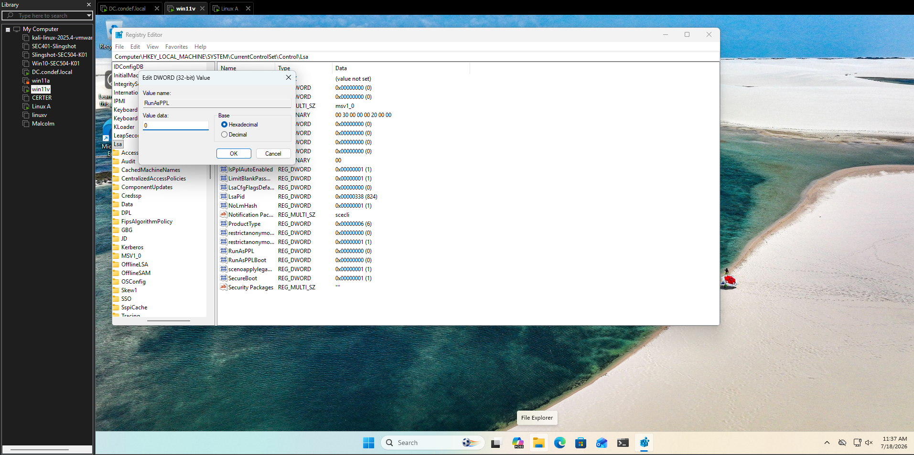

These changes were made only inside the isolated lab. They are not recommended production settings.

---

## Environment

| Host     | Role                                     |
| -------- | ---------------------------------------- |
| `LinuxA` | Attacker system running Metasploit       |
| `Win11V` | Windows 11 target                        |
| `DC`     | Splunk server receiving Sysmon telemetry |

I used three different procedures against LSASS on `Win11V`.

---

## Procedure 1: Mimikatz Through Meterpreter

I already had a SYSTEM-level Meterpreter session on `Win11V` from the earlier PsExec exercise.

My first handler configuration used local port 443, but the exploit did not execute successfully. I changed the local port to 8443 and obtained the session.

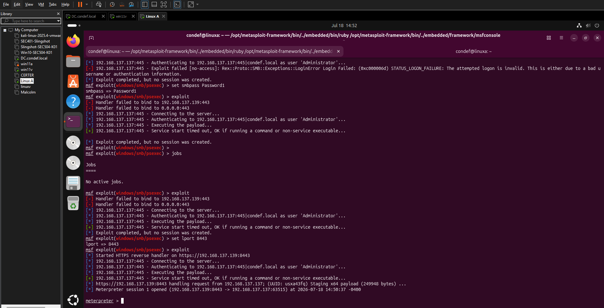

Inside Meterpreter, I loaded the `kiwi` extension and executed:

```text id="0k492h"
meterpreter > load kiwi
meterpreter > creds_all
```

The `kiwi` extension provides Mimikatz functionality inside the Meterpreter session.

My first attempts timed out. Even `getuid` stopped responding, which initially made the Meterpreter session appear dead.

When I checked the Windows VM, I found that it had suspended itself. After resuming the VM and retrying the procedure, the command worked.

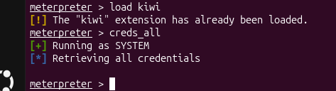

This was a useful troubleshooting lesson: a suspended target can look like a failed or disconnected session even when the attack configuration itself is correct.

This procedure accessed LSASS memory without creating a traditional `.dmp` file.

---

## Procedure 2: Windows Task Manager

I opened Task Manager on `Win11V`, searched for the Local Security Authority Process, right-clicked it, and selected **Create memory dump file**.

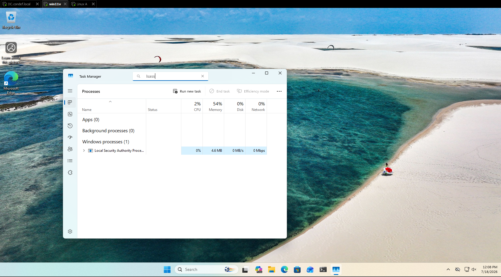

Task Manager reported the location of the resulting dump:

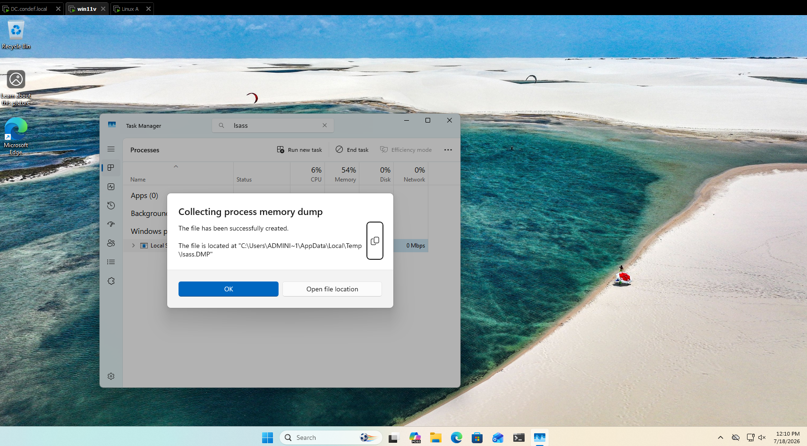

The file was written to:

```text id="r80bnh"
C:\Users\ADMINI~1\AppData\Local\Temp\lsass.DMP
```

This method used a built-in Windows utility rather than a dedicated offensive tool.

---

## Procedure 3: Procdump

I downloaded the signed Microsoft Sysinternals Procdump utility:

```powershell id="b6u657"
Invoke-WebRequest -UseBasicParsing https://live.sysinternals.com/procdump.exe -OutFile procdump.exe
```

I then used it to dump LSASS:

```powershell id="uazga4"
.\procdump.exe -accepteula -r -ma lsass.exe lsass.dmp
```

The procedure created an 82.7 MB file named `lsass.dmp` on the Public desktop.

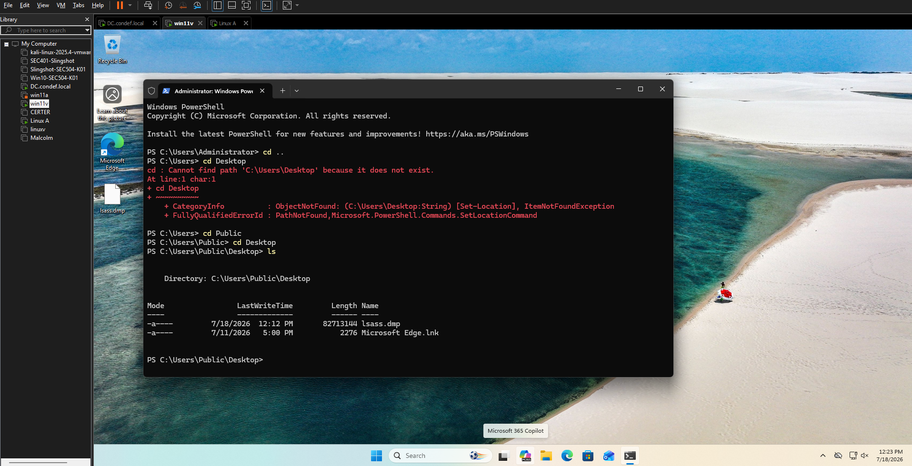

At this point, I had performed the same ATT&CK sub-technique through three different procedures:

| Procedure                    | Tool type                             | Result                                                    |
| ---------------------------- | ------------------------------------- | --------------------------------------------------------- |
| Mimikatz through Meterpreter | Offensive tooling operating in memory | LSASS memory accessed without a normal dump-file artifact |
| Task Manager                 | Built-in Windows utility              | `lsass.DMP` written to the user's temporary directory     |
| Procdump                     | Signed Microsoft Sysinternals utility | `lsass.dmp` written to disk                               |

---

## Telemetry Sources

Two Sysmon event types provided the relevant visibility.

| Event                      | Important fields                                                                                 | Purpose                                                 |
| -------------------------- | ------------------------------------------------------------------------------------------------ | ------------------------------------------------------- |
| Event ID 10: ProcessAccess | `SourceImage`, `TargetImage`, `GrantedAccess`, `SourceProcessId`, `TargetProcessId`, `CallTrace` | Records one process opening a handle to another process |
| Event ID 11: FileCreate    | `Image`, `TargetFilename`, `ProcessGuid`, `ProcessId`                                            | Records a process creating a file                       |

The two event types cover different parts of the behavior.

ProcessAccess can reveal which program accessed LSASS and which rights it requested. FileCreate can reveal a dump written to disk.

Neither source provided complete coverage by itself in my testing.

---

## Stage 1: Find Processes Accessing LSASS

I started by searching for Sysmon ProcessAccess events targeting `lsass.exe`:

```spl id="llfcik"
index=sysmon
| where EventCode = 10
| where lower(TargetImage) = "c:\\windows\\system32\\lsass.exe"
| table TargetImage
```

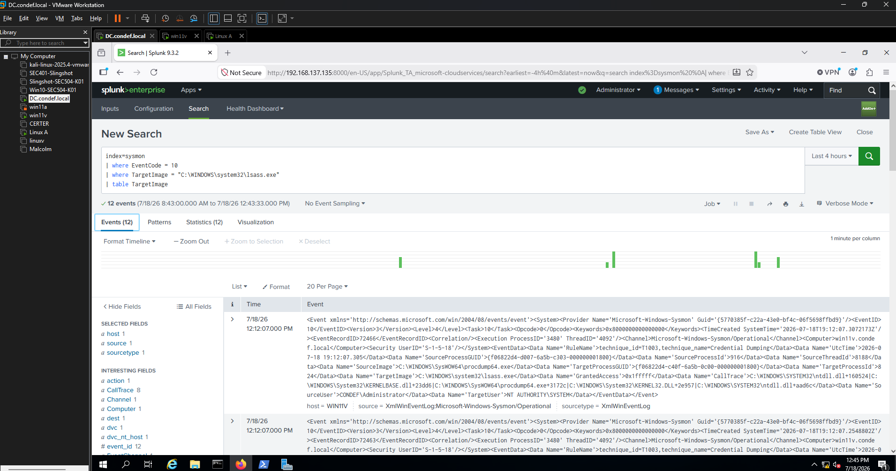

This confirmed that ProcessAccess events existed, but displaying only `TargetImage` did not identify the processes responsible.

---

## Stage 2: Group by the Accessing Process

I added `SourceImage` and grouped the results:

```spl id="w1gg09"
index=sysmon
| where EventCode = 10
| where lower(TargetImage) = "c:\\windows\\system32\\lsass.exe"
| stats count as AccessCount,
        values(TargetImage) as TargetImage
        by SourceImage
```

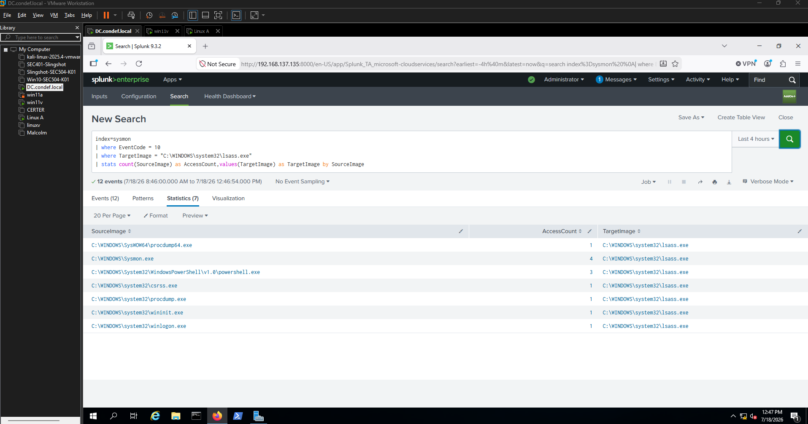

This exposed both expected Windows processes and the processes associated with my dumping procedures.

Normal processes such as `csrss.exe` and `wininit.exe` also accessed LSASS, so targeting LSASS alone was not sufficient to distinguish malicious from legitimate activity.

---

## Stage 3: Remove Known Lab Noise

I removed two common accessors observed in my lab:

```spl id="pnt51x"
index=sysmon
| where EventCode = 10
| where lower(TargetImage) = "c:\\windows\\system32\\lsass.exe"
| where lower(SourceImage) != "c:\\windows\\system32\\csrss.exe"
    AND lower(SourceImage) != "c:\\windows\\system32\\wininit.exe"
| stats count as AccessCount,
        values(TargetImage) as TargetImage
        by SourceImage
```

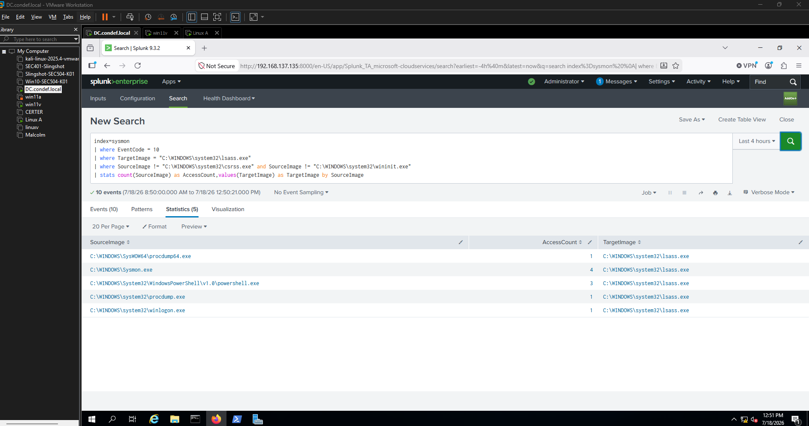

After removing those processes, the remaining results included:

* `procdump.exe`
* `procdump64.exe`
* `powershell.exe`, associated with the Meterpreter procedure

This demonstrated the value of baselining, but it did not yet provide complete coverage.

Task Manager was still absent.

---

## The Task Manager Visibility Gap

In my collected data, Task Manager did not generate a Sysmon Event ID 10 showing it accessing LSASS.

That does not prove that Task Manager performed no process access at the operating-system level. It means that I did not observe the corresponding ProcessAccess event with my deployed Sysmon configuration and collected telemetry.

The dump was still visible through Event ID 11 because Task Manager created:

```text id="9iwhc3"
C:\Users\ADMINI~1\AppData\Local\Temp\lsass.DMP
```

A detection based only on Event ID 10 would therefore have missed one of my three tested procedures.

---

## Stage 4: Combine ProcessAccess and FileCreate

The course exercise combined the ProcessAccess and FileCreate events with this query:

```spl id="2s73wa"
index=sysmon
| where EventCode = 10 OR EventCode = 11
| where TargetImage = "C:\WINDOWS\system32\lsass.exe"
    OR TargetFilename like "%lsass%"
| eval Image = coalesce(SourceImage, Image)
| where Image != "C:\WINDOWS\system32\csrss.exe"
    AND Image != "C:\WINDOWS\system32\wininit.exe"
| fillnull value="-"
| stats values(TargetImage) as TargetImage,
        values(TargetFilename) as TargetFilename,
        values(EventDescription) as EventDescription
        by Image
```

The query normalizes the actor fields because:

* Event ID 10 identifies the accessing process with `SourceImage`
* Event ID 11 identifies the file-creating process with `Image`

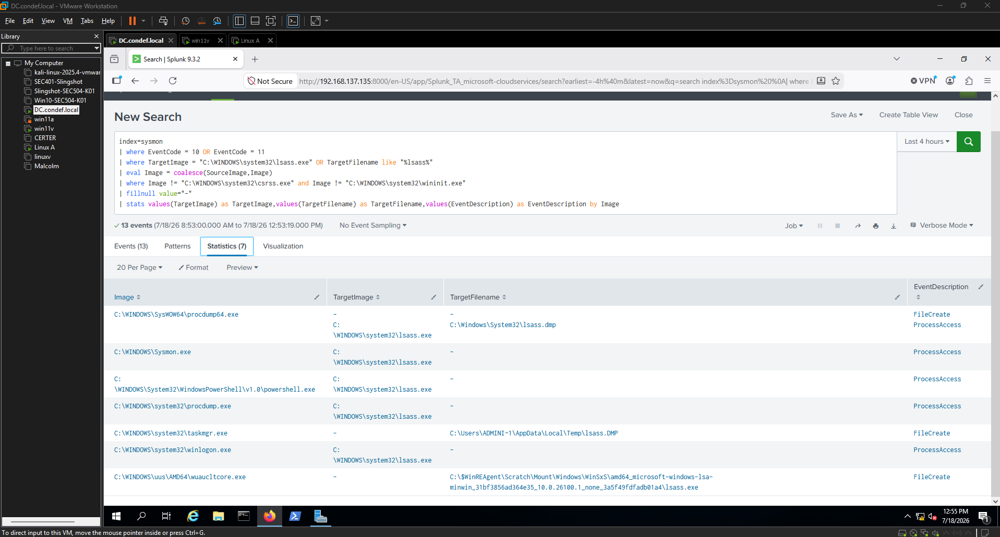

This produced visibility into all three procedures:

* Procdump appeared through ProcessAccess and FileCreate
* The Meterpreter-associated PowerShell process appeared through ProcessAccess
* Task Manager appeared through FileCreate

This query was useful for validating the lab behavior, but it is broad.

The condition:

```spl id="u6rvja"
TargetFilename like "%lsass%"
```

can also match benign files whose paths happen to contain the string `lsass`.

I observed this with Windows Update activity under the WinSxS directory.

---

## Understanding GrantedAccess

The `GrantedAccess` field in Event ID 10 is a hexadecimal bitmask representing the rights requested for the target process.

I examined the access masks with:

```spl id="rj5muw"
index=sysmon
| where EventCode = 10
| where lower(TargetImage) = "c:\\windows\\system32\\lsass.exe"
| where lower(SourceImage) != "c:\\windows\\system32\\csrss.exe"
    AND lower(SourceImage) != "c:\\windows\\system32\\wininit.exe"
| stats count as ImageCount,
        values(TargetImage) as TargetImage,
        values(GrantedAccess) as GrantedAccess
        by SourceImage
```

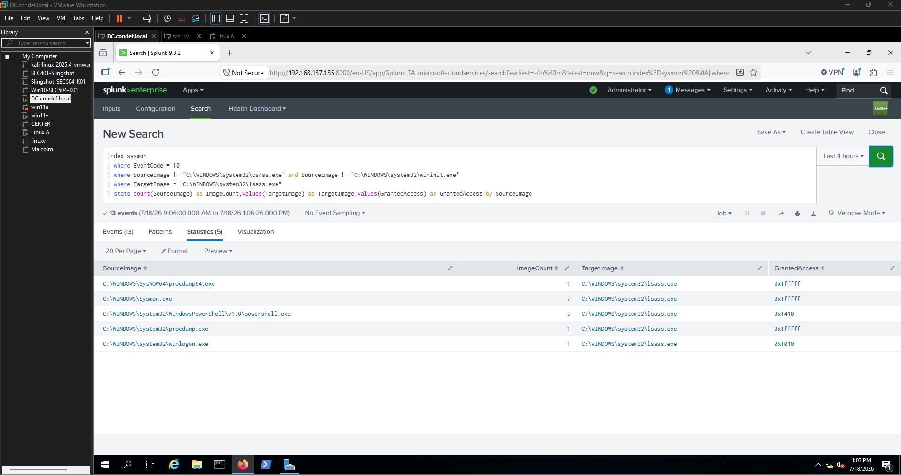

My data included:

| Source process                          | GrantedAccess | Relevant interpretation                               |
| --------------------------------------- | ------------: | ----------------------------------------------------- |
| `SysWOW64\procdump64.exe`               |    `0x1fffff` | Broad process access including memory-read rights     |
| `System32\procdump.exe`                 |    `0x1fffff` | Broad process access including memory-read rights     |
| `WindowsPowerShell\v1.0\powershell.exe` |      `0x1410` | Includes process memory-read and query rights         |
| `System32\winlogon.exe`                 |      `0x1010` | Includes process memory-read and limited-query rights |

I used the `Get-SysmonAccessMask` function from PSGumshoe to decode the masks.

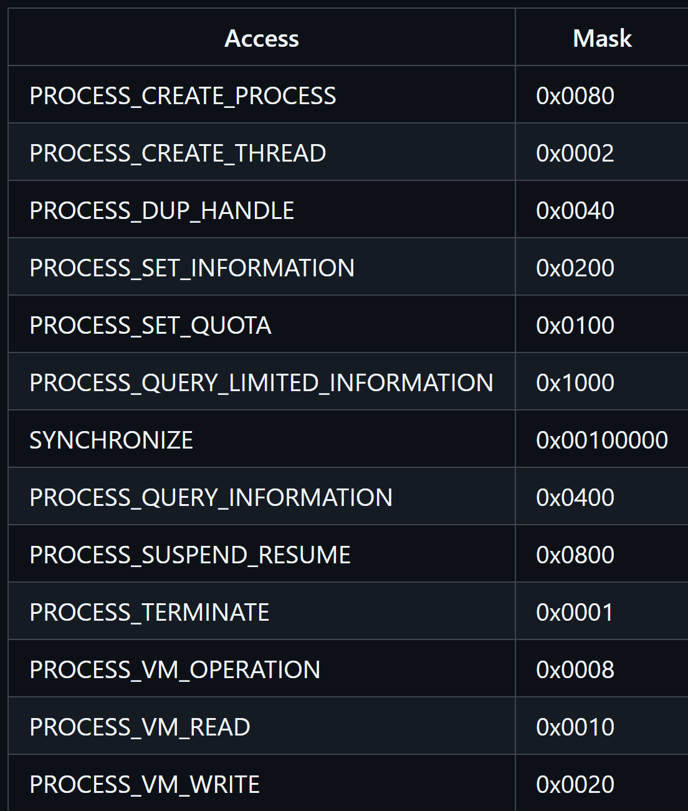

Decoding `0x1fffff`:

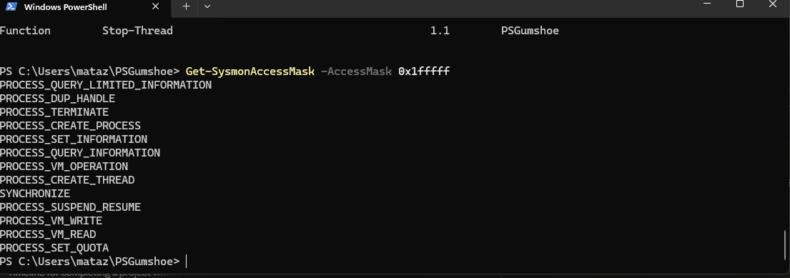

Decoding `0x1010`:

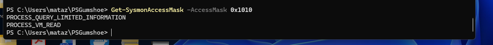

One important access right present in the observed masks was:

```text id="637bqe"
PROCESS_VM_READ = 0x0010
```

That right permits a process to read memory from another process.

However, its presence is not proof of malicious activity. The legitimate `winlogon.exe` process in my lab also accessed LSASS with a mask containing `PROCESS_VM_READ`.

Similarly, `Sysmon.exe` appeared with broad access to LSASS in my results.

This means neither a high total mask nor the VM_READ bit can be treated as a perfect malicious fingerprint.

They must be evaluated together with:

* The source process
* Its expected behavior
* Its path and signature
* Its parent process
* The user and integrity level
* The surrounding endpoint activity
* The environment's baseline

---

## Testing Exact Masks

I also used the exact masks observed in the lab as a triage experiment:

```spl id="981i20"
index=sysmon
| where EventCode = 10
| where lower(TargetImage) = "c:\\windows\\system32\\lsass.exe"
| where lower(SourceImage) != "c:\\windows\\system32\\csrss.exe"
    AND lower(SourceImage) != "c:\\windows\\system32\\wininit.exe"
| eval FullProcessAccess=if(GrantedAccess="0x1fffff", 1, 0)
| eval LimitedProcessAccess=if(GrantedAccess="0x1410", 1, 0)
| where FullProcessAccess = 1
| stats count as ImageCount,
        values(TargetImage) as TargetImage,
        values(GrantedAccess) as GrantedAccess
        by SourceImage
```

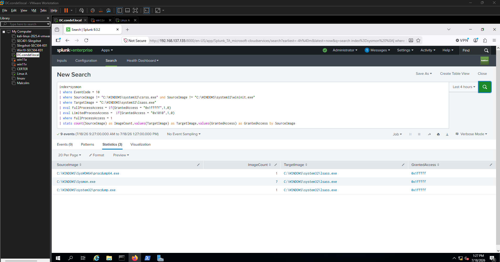

This surfaced the Procdump processes, but it also surfaced `Sysmon.exe`.

Changing the filter to `LimitedProcessAccess = 1` surfaced the Meterpreter-associated PowerShell process.

This was useful for examining my data, but an operational detection should not depend only on exact masks such as `0x1fffff` or `0x1410`.

Another dumping procedure may request a different combination of rights while still including the ability to read process memory.

---

## Detection Hypothesis

My final hypothesis contains two complementary branches.

### ProcessAccess branch

A process opens a handle to `lsass.exe` with a `GrantedAccess` mask containing `PROCESS_VM_READ`, and the process is not an expected accessor in the environment.

### Dump-file branch

A process creates a file whose name and extension are consistent with an LSASS memory dump.

The two branches cover different telemetry paths:

* ProcessAccess can identify memory-access procedures that do not write a dump file.
* FileCreate can identify disk-backed procedures that may not appear in the collected ProcessAccess telemetry.

---

## Generalized Lab Detection

The following query expresses both branches while testing the VM_READ bit rather than relying on one exact access mask:

```spl id="c6b4ua"
index=sysmon (EventCode=10 OR EventCode=11)
| eval ActorImage=coalesce(SourceImage, Image)
| eval ActorImageLower=lower(ActorImage)
| eval TargetImageLower=lower(TargetImage)
| eval TargetFilenameLower=lower(TargetFilename)
| eval GrantedAccessDecimal=if(
    EventCode=10,
    tonumber(replace(lower(GrantedAccess), "0x", ""), 16),
    null()
)
| eval HasProcessVmRead=if(
    EventCode=10 AND bit_and(GrantedAccessDecimal, 16)=16,
    1,
    0
)
| eval DetectionBranch=case(
    EventCode=10
        AND TargetImageLower="c:\\windows\\system32\\lsass.exe"
        AND HasProcessVmRead=1,
        "LSASS ProcessAccess with VM_READ",
    EventCode=11
        AND match(TargetFilenameLower, "(^|\\\\)lsass[^\\\\]*\\.(dmp|dump)$"),
        "LSASS dump-file creation"
)
| where isnotnull(DetectionBranch)
| where ActorImageLower!="c:\\windows\\system32\\csrss.exe"
    AND ActorImageLower!="c:\\windows\\system32\\wininit.exe"
    AND ActorImageLower!="c:\\windows\\system32\\winlogon.exe"
| fillnull value="-"
| table _time,
        host,
        DetectionBranch,
        ActorImage,
        TargetImage,
        TargetFilename,
        GrantedAccess,
        SourceProcessId,
        TargetProcessId,
        User
```

The query converts the hexadecimal `GrantedAccess` value to a number and performs a bitwise comparison against decimal `16`, which represents `0x0010` or `PROCESS_VM_READ`.

Splunk supports `tonumber` for base conversion and `bit_and` for evaluating individual bits in a numeric mask.

The allowlist is based only on processes observed in my lab. It would need to be rebuilt and reviewed for another environment.

---

## What the Query Detects

The ProcessAccess branch can identify events such as:

* Procdump opening LSASS with broad process rights
* The Meterpreter-associated PowerShell process opening LSASS with memory-read rights
* Other unexpected programs requesting a mask that contains VM_READ

The FileCreate branch can identify filenames such as:

```text id="pixcwa"
lsass.DMP
lsass.dmp
lsass-memory.dump
```

The file condition is narrower than searching for `%lsass%` anywhere in the complete path, reducing matches from benign Windows servicing paths.

It is still not complete coverage because an attacker-controlled utility such as Procdump can save the dump under an unrelated filename.

---

## Why Two Branches Are Necessary

No single telemetry source caught all three procedures in my lab.

| Procedure                    |    ProcessAccess EID 10 | FileCreate EID 11 |
| ---------------------------- | ----------------------: | ----------------: |
| Mimikatz through Meterpreter |                Observed |      Not observed |
| Task Manager dump            | Not observed in my data |          Observed |
| Procdump                     |                Observed |          Observed |

The testing therefore did not prove that one ProcessAccess rule catches every LSASS-dumping method.

It demonstrated that combining memory-access telemetry with dump-file creation provides broader coverage than either source alone.

That is the central lesson from the exercise.

---

## False Positives and Tuning

### Legitimate LSASS access

Windows components and security products may legitimately access LSASS.

Processes observed in my lab included:

* `csrss.exe`
* `wininit.exe`
* `winlogon.exe`
* `Sysmon.exe`

A production environment may also contain:

* Endpoint detection and response agents
* Antivirus software
* Credential providers
* Backup software
* Authentication products
* Identity security tools

The expected processes must be baselined for the environment.

### Broad allowlists

A process name alone is not a sufficient allowlist condition.

For example, malware could masquerade under a familiar filename or execute from an unexpected path.

A stronger allowlist may consider:

* Complete executable path
* Digital signature
* File hash or signer
* Parent process
* Service name
* User context
* Host role
* Expected access mask
* Normal frequency

### FileCreate noise

A broad search for paths containing `lsass` matched benign Windows Update activity under WinSxS.

Restricting the search to filenames resembling LSASS dump files reduces that noise, but it also creates a blind spot for dumps saved under unrelated names.

### Security tooling

`Sysmon.exe` appeared with broad access to LSASS in my data.

This proves that even `0x1fffff` is not automatically malicious.

The access mask affects triage priority, but context determines whether the activity is expected.

---

## Limitations

### Task Manager ProcessAccess was not visible

I did not observe a ProcessAccess event for Task Manager under my deployed Sysmon configuration.

The FileCreate branch was required to detect the dump.

### In-memory procedures may not create files

The Meterpreter and Mimikatz procedure did not create a normal `.dmp` artifact.

A FileCreate-only detection would miss it.

### Dump files can be renamed

An attacker-controlled utility can save LSASS memory under a filename that does not contain `lsass` and may not use `.dmp` or `.dump`.

The FileCreate branch is therefore useful but incomplete.

### Access rights are not unique to attackers

Legitimate processes can request VM_READ or broad access to LSASS.

The bitmask must be interpreted with the source-process context and the environment's baseline.

### ProcessAccess visibility depends on configuration

Sysmon only records events permitted by its active configuration.

Collection, filtering, forwarding, parsing, and retention can all create visibility gaps.

### Security controls may block the technique

Controls such as LSA Protection, Credential Guard, Microsoft Defender, and endpoint security products can block or alter the behavior before the expected telemetry appears.

This lab intentionally weakened some protections to permit testing.

---

## Analyst Investigation

If this detection fired, I would investigate:

1. Which host generated the event?
2. Which process accessed LSASS or created the file?
3. Is the executable running from its expected path?
4. Is it digitally signed, and by whom?
5. Which process launched it?
6. Which user and integrity level were associated with it?
7. Which access rights were requested?
8. Is the process expected to access LSASS on this host?
9. Was a dump file created?
10. What is the dump file's location, size, and hash?
11. Did the source process make unusual network connections?
12. Was there earlier privilege escalation or remote execution?
13. Were LSA Protection or other security controls modified?
14. Which privileged users had active or recent sessions on the host?

If the activity were confirmed as malicious, I would treat credentials present on the system as potentially exposed and follow the incident-response process for host isolation, credential scoping, credential rotation, and lateral-movement investigation.

---

## Key Takeaways

* Mimikatz, Task Manager, and Procdump are three procedures for the same ATT&CK sub-technique.
* The procedures did not produce identical telemetry in my lab.
* Sysmon ProcessAccess events provided visibility into Mimikatz and Procdump.
* Sysmon FileCreate events provided the only visibility I observed for the Task Manager dump.
* Covering all three required two complementary detection branches.
* The `PROCESS_VM_READ` bit is an important memory-access signal, but legitimate processes may also request it.
* Exact masks such as `0x1fffff` and `0x1410` are useful for understanding the data but should not be treated as universal signatures.
* A broad `%lsass%` filename search creates avoidable Windows servicing noise.
* Allowlisting must be specific to the environment and should use more context than the process name alone.
* Testing multiple procedures exposed a visibility gap that a single-tool test would not have revealed.
* The most valuable result was not proving that one rule catches everything. It was learning where each telemetry source succeeds and fails.

---

## References

* [MITRE ATT&CK – T1003.001: LSASS Memory](https://attack.mitre.org/techniques/T1003/001/)
* [Microsoft Sysinternals – Sysmon](https://learn.microsoft.com/en-us/sysinternals/downloads/sysmon)
* [TrustedSec – Sysmon Community Guide: Process Access](https://github.com/trustedsec/SysmonCommunityGuide)
* [PSGumshoe – Get-SysmonAccessMask](https://github.com/PSGumshoe/PSGumshoe)
* [Threat Hunter Playbook – LSASS Memory Read Access](https://threathunterplaybook.com/hunts/windows/170105-LSASSMemoryReadAccess/notebook.html)
* [Red Canary – LSASS Memory](https://redcanary.com/threat-detection-report/techniques/lsass-memory/)
