# Detecting Lateral Movement in a Windows Domain: WMIExec and PsExec

**Lab:** `condef.local`
**Date:** 2026-08-02 to 2026-08-04
**Platform(s):** Windows (domain-joined workstations + DC)
**Primary log source(s):** Sysmon, Windows Security (4624 / 5145), Windows System (7045), Zeek via Malcolm
**SIEM:** Splunk
**ATT&CK:** T1047 Windows Management Instrumentation · T1021.002 Remote Services: SMB/Windows Admin Shares · T1569.002 System Services: Service Execution · T1570 Lateral Tool Transfer · Tactics: Execution, Lateral Movement

---

## TL;DR

Two tools attackers reach for constantly to move between Windows machines are Impacket's WMIExec and Sysinternals PsExec. I ran both against a workstation in my lab and worked out how to catch them. The thing I want to lead with is the split between what a tool has to do and what it happens to be called, because the name is the part attackers change and the mechanism is the part they cannot.

The two behave differently underneath. WMIExec uses DCOM over RPC to invoke WMI on the target, and in the output mode I ran, it also opens an SMB connection to pull command output back from a temp file under the `ADMIN$` share. PsExec moves a service binary across an admin share over SMB, then drives the Service Control Manager over RPC to install, start, and remove a service that runs the payload. The parts that hold up are structural: WMIExec runs its command as a child of `WmiPrvSE.exe`, and PsExec stands up and tears down a service on a host it is not sitting at. The specific fingerprints I leaned on, WMIExec's timestamp-named output file and PsExec's `PSEXEC-*.key`, are very specific and useful, but they belong to these particular tools and modes, not to the technique in general. Those are the signals I built detections around.

## Attack overview

Lateral movement is what happens after an attacker already has a foothold and a set of credentials. They rarely stop at the first machine. They want the file server, the box the domain admin logs into, the host with the data. So they reuse the creds they stole to run commands on other machines across the network, and they prefer to do it with tools that already exist or that look like normal admin work, because that blends in.

**WMIExec** is part of Impacket, a Python toolkit for talking to Windows services at the protocol level. WMIExec uses Windows Management Instrumentation, a management framework built into Windows that admins legitimately use for remote administration, to execute a command on a remote host and pull the output back. I had it on my attacker box already. I had never used it before this, so seeing exactly how it lands on the wire and in the logs was the interesting part for me.

**PsExec** is a Microsoft Sysinternals tool that admins use to run programs on remote systems. It is signed by Microsoft and completely legitimate, which is exactly why attackers like it. Under the hood it copies a small service executable to the target, registers it as a Windows service, and runs your command through that service. Because it is a real admin tool, a lot of environments treat PsExec activity as normal, and that assumption is what gets abused.

These two show up a lot in real intrusions, mostly because they blend into normal admin work, which is the whole reason attackers reach for them. Impacket is a common pick because it runs from a Linux box without needing to touch a Windows machine at all.

## Environment

Everything here is my own lab, `condef.local`, running on a single physical host in VMware.

- **DC** (`.135`) runs Splunk, and is where I did all my searching.
- **win11v** (`.137`) is the victim workstation I attacked in both cases.
- **LinuxA** (`.139`) is my attacker box for the WMIExec run. It has Impacket installed.
- **win11a** (`.138`) is my attacker box for the PsExec run, since PsExec is a Windows tool.
- **Malcolm** (`.140`) runs Zeek and Arkime and gives me the network view.

Sysmon is deployed on the Windows hosts and feeds the `sysmon` index. Windows Security logs land in `winlogs`. The System log is not forwarded to Splunk, so I checked it locally in Event Viewer where I needed it. Network notices and protocol metadata come through Malcolm's Zeek-based stack.

---

# Part 1: WMIExec

## What the tool is and how I ran it

WMIExec takes a set of credentials and a target, uses DCOM over RPC to invoke WMI on the host, and runs whatever command you hand it. In the output mode I ran, it also opens an SMB connection to retrieve the command output. From my attacker box I ran:

```
wmiexec.py condef.local/Administrator@192.168.137.137 whoami
```

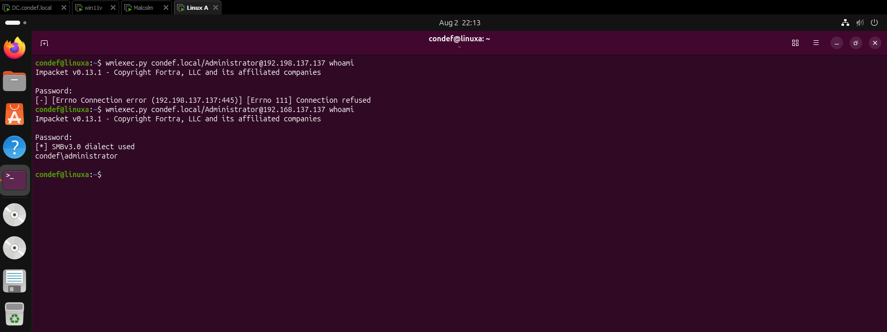

That opens a connection to win11v (`.137`) and runs `whoami` on it. The output comes straight back: `condef\administrator`. Quick note to myself in the screenshot, my first attempt fat-fingered the IP as `192.198.137.137` and got connection refused before I fixed it to `192.168.137.137`. Small thing, but it is a good reminder that a connection-refused is not always a defense doing its job, sometimes it is just me.

## Telemetry

The interesting question is what that single command left behind on the target. WMIExec does not run the command directly. It hands it to the WMI provider service, `WmiPrvSE.exe`, which is what spawns the process. So the first place I looked was Sysmon process creation events (Event ID 1) where the parent is `WmiPrvSE.exe`:

```
index=sysmon EventCode = 1
| where ParentImage = "C:\\Windows\\System32\\wbem\\WmiPrvSE.exe"
| stats values(Image) as Image,values(CommandLine) as CommandLine,values(ParentCommandLine) as ParentCommandLine by ParentImage
```

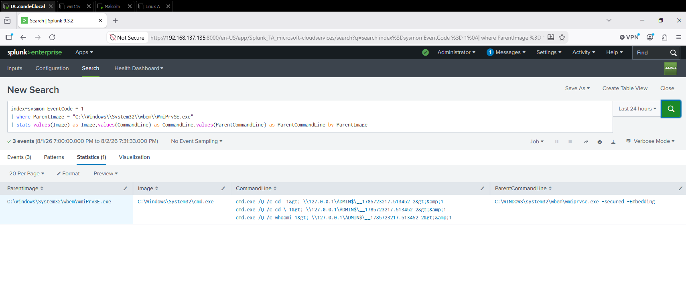

There it is. `WmiPrvSE.exe` spawned `cmd.exe`, and the command line shows the output-handling pattern from this run:

```
cmd.exe /Q /c whoami 1> \\127.0.0.1\ADMIN$\__1785723217.513452 2>&1
```

That is WMIExec's output-mode fingerprint. It runs my command with `cmd /Q /c`, then redirects the output (`1>`) to a file under the `ADMIN$` share with a name like `__1785723217.513452`. That is a temporary filename WMIExec builds from a timestamp when it starts, so it can read the output back. WMIExec also has a no-output mode that skips this redirect, so the filename is specific to how I ran it rather than something every WMI execution produces. The parent command line is `wmiprvse.exe -secured -Embedding`, which is WMI being driven by an external caller.

## Detection

**Hypothesis:** a command shell spawned by `WmiPrvSE.exe` and redirecting its output to a timestamp-named file under `ADMIN$` is WMIExec's output-mode behavior, not the routine WMI management that legitimately runs through that provider.

My lab is tiny, so `WmiPrvSE.exe` had nothing else hanging off it and the query above was already clean. A real network is not going to be that quiet, because WMI is used for plenty of legitimate management. So I tightened the query to key on that output-filename pattern specifically instead of just any child of the provider:

```
index=sysmon EventCode=1
| where ParentImage="C:\\Windows\\System32\\wbem\\WmiPrvSE.exe"
| regex CommandLine="__\d{10}\.\d+"
| stats values(Image) as Image, values(CommandLine) as CommandLine, values(ParentCommandLine) as ParentCommandLine by ParentImage
```

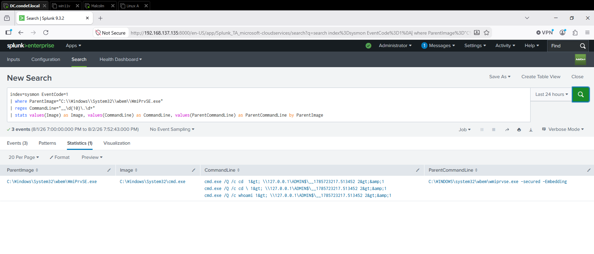

**Logic walkthrough:**
- `ParentImage=...WmiPrvSE.exe` isolates processes born from the WMI provider, which is the broker WMIExec runs its command through.
- `regex CommandLine="__\d{10}\.\d+"` matches the `__<epoch>.<fraction>` output filename. The `\d{10}` is the ten-digit Unix seconds and `\d+` covers the fractional part, which is variable length, so I did not want to lock it to a fixed count and miss events on a later run.
- The `stats` groups it up so I can read the spawned image, the full command line, and the parent command line in one row.

**Result:** the refined query returns the same execution events, now pinned to the output-redirect signature rather than to "anything WMI ever spawned." I would promote this as a high-confidence signature for WMIExec's output mode, with the `WmiPrvSE.exe` ancestry as the durable half underneath it and the timestamp filename as the tool fingerprint on top.

## Network corroboration

I wanted to see what this looks like below the host layer, so I went to Arkime on Malcolm and searched the session between my attacker and the target for notices:

```
ip == 192.168.137.137 && ip == 192.168.137.139 && event.dataset == notice
```

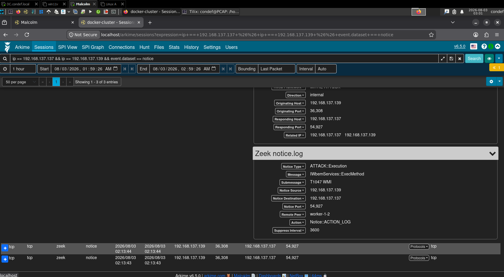

Malcolm's Zeek-based stack flagged it. The notice reads `IWbemServices::ExecMethod`, which is the exact WMI method call WMIExec makes to run a command, and it tags the activity `T1047 WMI` under the MITRE framework, with the notice source as my attacker (`.139`) and the destination as the victim (`.137`). One thing worth being precise about: those ATT&CK-formatted notices come from the extra Zeek packages Malcolm ships, not a stock Zeek install. The point still stands, a host sensor and a network sensor independently pointed at the same WMI execution. And notice the session is on a dynamic RPC port, not 445, which lines up with WMIExec driving WMI over DCOM/RPC rather than SMB.

That was a neat lesson on its own. Because I could see the ExecMethod call named in the notice, I went and looked at how WMIExec invokes `IWbemServices` in its source, and it lined up. So now I have a repeatable move: read how a tool does the thing at the protocol level, and use that to build a detection for it rather than guessing.

## Gaps

The host-side detection depends on Sysmon being deployed and watching process creation on the target. No Sysmon, no `WmiPrvSE` parent-child visibility, and I would be leaning entirely on the network notice. Sysmon does not show me the `ADMIN$` output file as a separate write artifact here, only the command line that references it, so on a host without Sysmon I would want Detailed File Share auditing (more on that in Part 2) to see the share access directly.

---

# Part 2: PsExec

## What the tool is and how I ran it

PsExec runs a program on a remote machine. I pulled it down onto my Windows attacker box (win11a) straight from Sysinternals:

```
Invoke-WebRequest https://live.sysinternals.com/PsExec.exe -UseBasicParsing -OutFile PSExec.exe
```

Then I used it to open an interactive command prompt from win11a onto win11v:

```
.\PSExec.exe -accepteula \\WIN11V.condef.local -u CONDEF.local\Administrator -i cmd
```

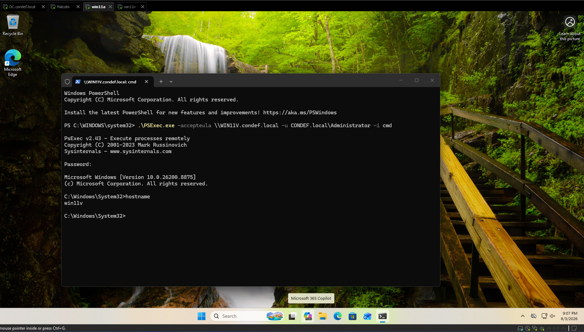

The `-i` flag runs the process so it interacts with the target's desktop session, which is why I get a live command prompt. The tab title (`\\WIN11V.condef.local: cmd`) plus running `hostname` and getting `win11v` back both confirm I am now executing on the target, not on my own box. That is the whole point of the tool proven in two lines.

## A visibility prerequisite I had to fix first

Before I go further, one setting matters a lot for this technique. A big chunk of the PsExec footprint is file activity on the target's `ADMIN$` share, and Windows does not audit that by default. The subcategory that logs it, Detailed File Share (Event ID 5145), is off out of the box. I had already learned this the hard way on an earlier lab, so this time I turned it on the victim before running anything:

```
auditpol /set /subcategory:"Detailed File Share" /success:enable /failure:enable
```

Without that, the 5145 events later in this writeup simply would not exist, and I would have a blind spot exactly where the most durable signal lives. Worth checking with `auditpol /get /subcategory:"Detailed File Share"` before you trust an empty result.

## Telemetry and detection, layer by layer

PsExec leaves tracks in a lot of places, which is good, because it means if an attacker breaks one signal I still have others. I walked through them from the most obvious name-based signals to the evidence that survived the rename.

### Layer 1: the logon (4624)

By default PsExec creates a service named `PSEXESVC` on the target, and running it produces logon events. I looked at 4624 where the local process behind the logon is `PSEXESVC.exe`, mapped the logon type to something readable, and renamed the fields so the important ones are easy to read, using `Computer` as the real target rather than the workstation field:

```
index=winlogs EventCode=4624 ProcessName="C:\\Windows\\PSEXESVC.exe"
| eval LogonTypeDescription=case(
    LogonType=2, "Interactive",
    LogonType=3, "Network",
    LogonType=5, "Service",
    LogonType=9, "NewCredentials",
    LogonType=10, "RemoteInteractive",
    true(), "Other"
)
| rename Computer AS TargetHost
         TargetDomainName AS Domain
         TargetUserName AS Account
         WorkstationName AS Workstation
         IpAddress AS SourceIP
         ProcessName AS RequestingProcess
| table _time TargetHost Account LogonType LogonTypeDescription RequestingProcess Workstation SourceIP
| sort 0 _time
```

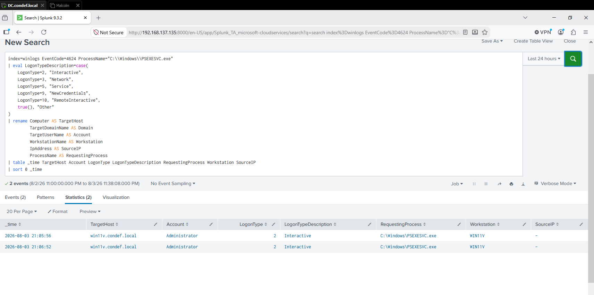

Two Type 2 (Interactive) logons for `Administrator` on `win11v.condef.local`, both with `PSEXESVC.exe` as the requesting process. It is worth being clear about what this does and does not tell me. `SourceIP` came back empty and the `Workstation` field is WIN11V, the target itself, so these events do not point back to my attacker box. What they show is the PsExec service creating local interactive logon sessions on the target to run the command, which lines up with the `-i` shell I asked for. They are not evidence of the remote origin, though. The inbound authentication that carried the connection would be a separate network logon carrying the source address, and I did not go pull that event here. As a detection, very little runs with `PSEXESVC.exe` as its requesting process, so this is a strong lead, keeping in mind admins use PsExec too.

### Layer 2: what the service spawned (Sysmon EID 1)

If there is a service, I want to know what it ran. I pivoted to process creation where the parent command line is the PsExec service:

```
index=sysmon EventCode = 1 ParentCommandLine = "C:\\Windows\\PSEXESVC.exe"
| stats values(Image) as Image, values(CommandLine) as CommandLine by ParentImage,Computer
```

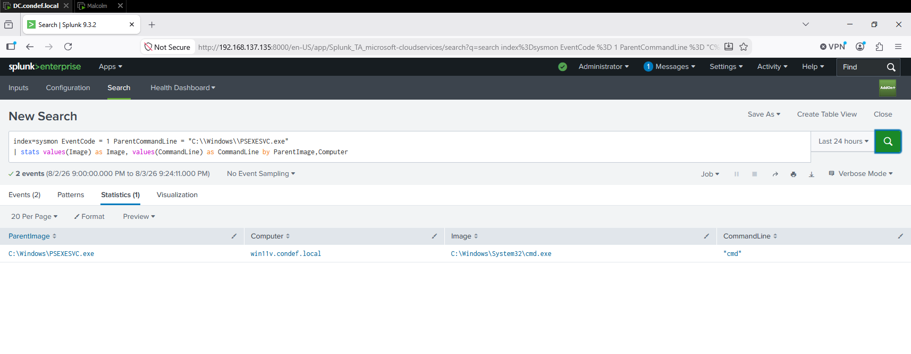

There is the payload: on `win11v.condef.local`, `PSEXESVC.exe` spawned `cmd.exe`. It is the same shape as the WMIExec finding, a service (or the WMI provider) launching an interactive shell. Neither parent is forbidden from doing that, `PSEXESVC.exe` exists precisely to launch the remote process, so what makes it suspicious is the remote-execution context around it, not the parent-child pair on its own.

### Layer 3: the service install (7045)

Installing a service writes a 7045 event to the Windows System log. I am not forwarding the System log into Splunk, so I checked this one directly in Event Viewer on win11v, filtering the System log for Event ID 7045:

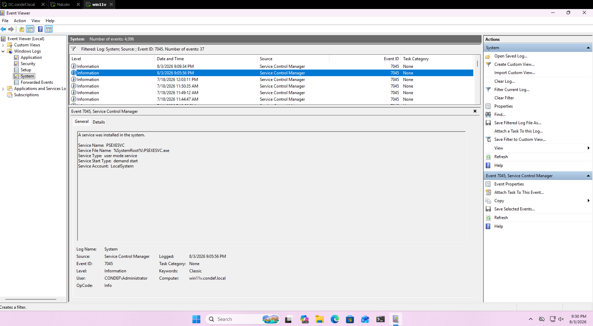

The event spells it out: a service named `PSEXESVC` was installed, file name `%SystemRoot%\PSEXESVC.exe`, start type demand start, running as `LocalSystem`. That is the service being registered on the victim right before it runs.

### Layer 4: the registry footprint (Sysmon EID 13)

Even without the System log in my SIEM, service creation leaves registry tracks that Sysmon does capture. I searched Sysmon registry-set events for anything touching PsExec or the service:

```
index=sysmon EventCode = 13 (Image=*PSExec* OR TargetObject=*PSEXESVC*)
| stats values(TargetObject) as TargetObject,values(Details) as Details by Image,Computer
```

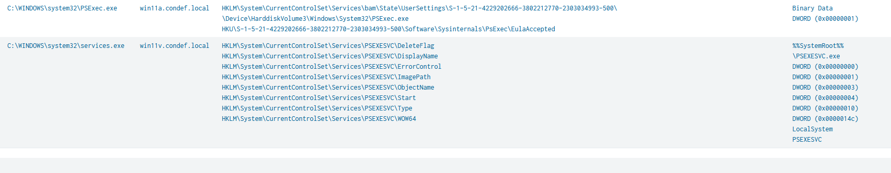

This one is my favorite because it shows both sides of the attack at once:

- On **win11v** (the victim), `services.exe` wrote the full set of registry values that define the new service under `HKLM\System\CurrentControlSet\Services\PSEXESVC\`: `ImagePath`, `Start`, `Type`, `ObjectName`, and so on.
- On **win11a** (the attacker), PsExec wrote a registry key accepting the EULA (`HKU\...\Software\Sysinternals\PsExec\EulaAccepted`), plus a Background Activity Moderator entry for having run the binary.

One value in that victim-side list stands out: `DeleteFlag`, sitting alongside the creation values. That combination fits how PsExec uses the service control manager: stand a service up, run the payload through it, then remove it. I want to be careful about what my own query proves, though. This `stats values()` view rolls every registry write into lists, so it does not show that `DeleteFlag` landed in the same instant as the creation values, only that `services.exe` wrote both for this service. To pin the timing tightly I would need the raw timestamped EID 13 events, which I did not pull here. So I am treating `DeleteFlag` as supporting behavioral context, and I come back to it below.

## The rename twist, and why it does not save the attacker

Everything above keys on the name `PSEXESVC`. So the obvious attacker move is to change the name, and PsExec even supports it with the `-r` flag, which lets you pick your own service name. I copied the binary to a different name and ran it with a renamed service:

```
copy .\PSExec.exe NotPSEXEc.exe
.\NotPSEXEc.exe -accepteula -r NotPSEXECSVC \\WIN11V.condef.local -u CONDEF.local\Administrator -i cmd
```

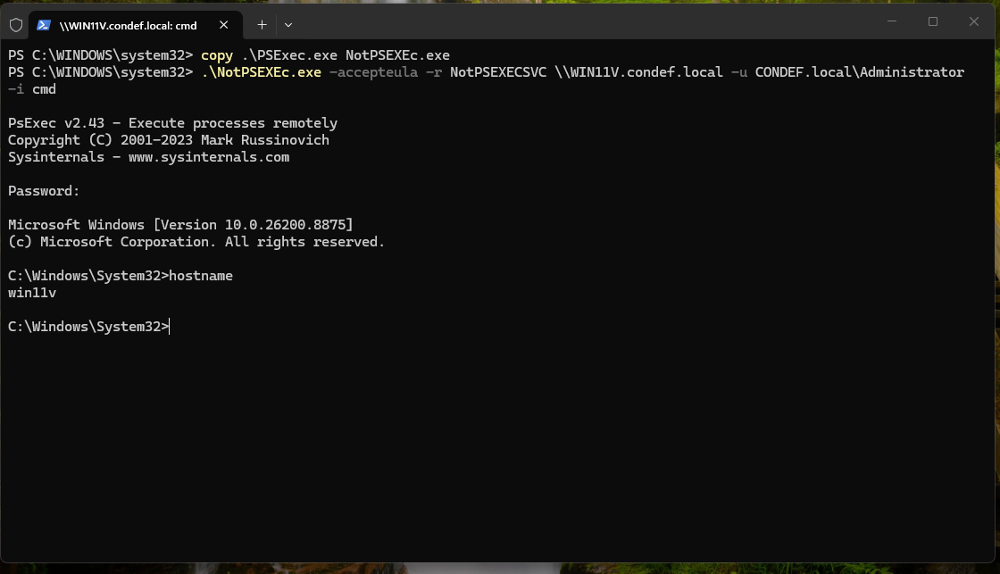

Same result, shell on win11v, but now the service is called `NotPSEXECSVC` and the binary is `NotPSEXEc.exe`. And sure enough, when I re-ran my Layer 1 query that filtered on `ProcessName="C:\Windows\PSEXESVC.exe"`, it came back empty. The name-based detection was defeated by a one-word change.

That empty result is the interesting part, because it forced me toward signals that do not care what the service is called.

### The durable file-share signal (5145)

I knew from the WMIExec work that these tools lean on the `ADMIN$` share, so I looked at the Detailed File Share events I had turned on earlier, filtering out `SYSVOL` noise:

```
index=winlogs EventCode=5145 ShareName != "*SYSVOL*"
| stats values(ShareName) as ShareName,values(RelativeTargetName) as RelativeTargetName,values(ShareLocalPath) as ShareLocalPath by IpAddress
```

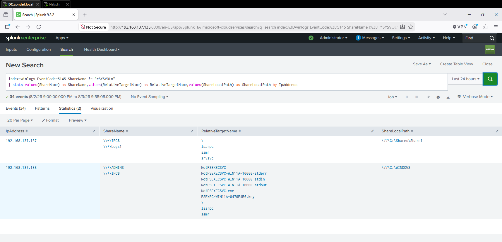

Now I can see it from the source IP `192.168.137.138`, my attacker, and the access splits across two shares. This row needs reading with care, because the `stats ... by IpAddress` rolls the share names and the filenames into separate lists, so `ADMIN$` and `IPC$` show up together and the query does not tie each filename back to its share. Pulling them apart, the `NotPSEXECSVC.exe` binary and the `PSEXEC-WIN11A-8470E4B6.key` file are the `ADMIN$` items, and the `NotPSEXECSVC-WIN11A-10000-stderr/stdin/stdout` names are PsExec's named pipes over `IPC$`. One more thing the query does not show: 5145 records access to the share object with the requested rights, and I am not displaying the access mask, so this establishes the access and the filenames, not that each one was written. The network side confirms the write in a moment.

Two things stand out anyway. First, renaming the service did not hide the executable at the share layer. Second, and this is the good one, the key file is still named `PSEXEC-WIN11A-8470E4B6.key`, with the attacking host baked into it, even though I renamed everything else.

That key file is how the PsExec client and service authenticate to each other, and here is the catch for the attacker: I renamed the exe and the service, but the key file kept the `PSEXEC-` prefix. In the version I ran (v2.43), renaming the binary and the service did not change that naming pattern, which makes it a much more durable thing to hunt for than the service name. Worth being precise about what it proves, though: it is a very strong indicator that Sysinternals PsExec was used, not that the use was malicious. Intent still comes from the account, source host, target, timing, and what got run.

I tested the idea by narrowing the same query to just the key file:

```
index=winlogs EventCode=5145 ShareName != "*SYSVOL*" RelativeTargetName="PSEXEC*key"
| stats values(ShareName) as ShareName,values(RelativeTargetName) as RelativeTargetName,values(ShareLocalPath) as ShareLocalPath by IpAddress
```

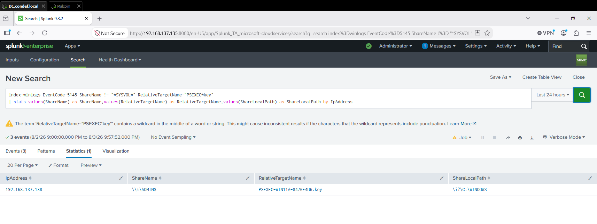

One row, one attacker IP, one `PSEXEC-WIN11A-8470E4B6.key` on `ADMIN$`. This isolates the run even after the binary and service were renamed, which the name-based query missed entirely. Splunk throws a warning about the wildcard sitting in the middle of the string, worth knowing, but it returned exactly what I wanted.

### What survived the rename

So the signal that held up through the rename, and the one I would build on, is the `PSEXEC-*.key` share access. The service name changed; that filename did not.

There is a second, softer thread worth naming. The create-then-delete service behavior I noticed in the registry, the `DeleteFlag` next to the creation values, is a promising name-independent idea, because an attacker would have to change how the tool behaves, not just relabel it, to dodge it. But I did not build that detection here. Doing it right means grouping registry writes by an unknown service name, showing the creation values and the delete inside a tight time window, and testing that logic against the renamed run, and I have not done that yet. Right now it is a hypothesis backed by two observations, the registry `DeleteFlag` and, in a moment, `DeleteService` on the network. The validated durable signal in this writeup is the key file.

## Network corroboration

Back to Malcolm to see the renamed run on the wire:

```
ip == 192.168.137.138 && ip == 192.168.137.137 && event.dataset == notice
```

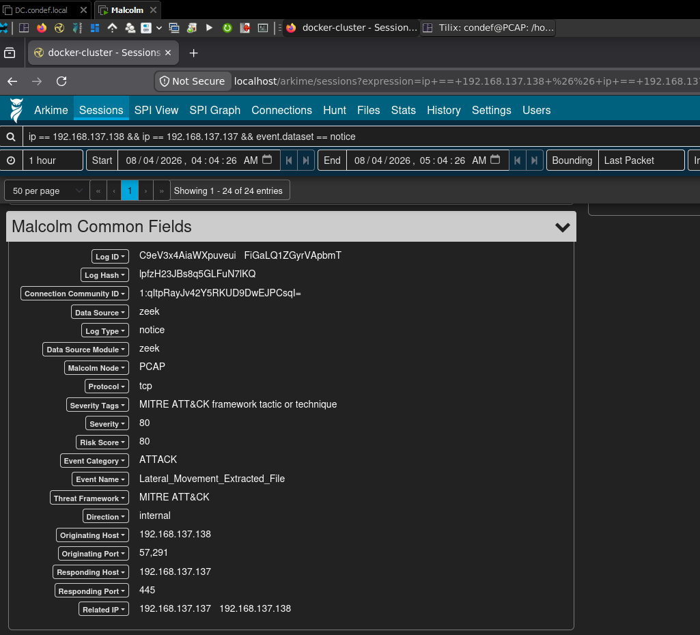

Malcolm's Zeek-based stack flags this as `ATTACK` with the event name `Lateral_Movement_Extracted_File`, attacker `.138` to victim `.137` over port 445. Opening the notice detail shows what file it extracted:

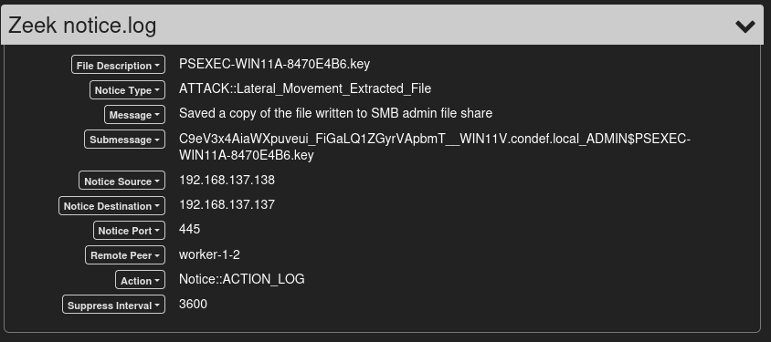

It is the exact same `PSEXEC-WIN11A-8470E4B6.key` I found in the Splunk 5145 events, with the message that a copy of the file written to the SMB admin share was saved. This is the piece that closes the loop the 5145 query could not: the share access and filename came from Splunk, and the network notice adds the stronger statement that a file was written and pulled off the wire. Host and network pointing at the identical artifact is about as solid as corroboration gets.

Then I switched the search to `dce_rpc` and looked at the Connections view, which draws the RPC calls as a graph:

```
ip == 192.168.137.138 && ip == 192.168.137.137 && event.dataset == dce_rpc
```

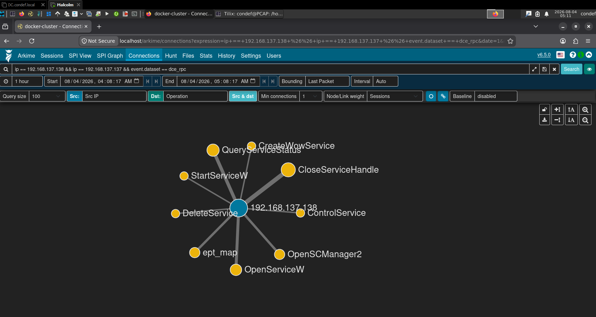

This is the service control manager conversation drawn out: `OpenSCManager2`, `CreateWowService`, `OpenServiceW`, `StartServiceW`, `ControlService`, `QueryServiceStatus`, `DeleteService`, `CloseServiceHandle`. The Connections view aggregates the traffic I selected rather than laying out one session in strict order, so I would not claim it proves a single end-to-end sequence. What it does show is that the selected traffic contains both service creation and deletion operations, which corroborates the short-lived-service behavior I saw on the host, this time at the network layer.

## Gaps

The whole file-share layer only exists because I turned on Detailed File Share auditing first. On a host where that subcategory is off, the 5145 evidence, including the durable key-file signal, is simply not written, and I would be back to name-based host signals plus the network view. The 7045 service-install evidence lives in the System log, which I am not centralizing, so today I only see it by walking up to the box in Event Viewer. Getting the System log into the SIEM is on my list so that service installs are searchable alongside everything else.

---

## Detection reasoning: malicious versus benign

The part that earns its keep is knowing what legitimate activity looks similar, because every one of these signals can fire on something benign somewhere.

- **WmiPrvSE spawning a shell.** WMI is real management infrastructure. Configuration management, monitoring agents, and scripted administration all run through the WMI provider, so `WmiPrvSE.exe` having children is normal, and it is not categorically forbidden from launching a command interpreter. What tips this run over is the timestamp-named `ADMIN$` output redirect layered on top of that provider ancestry.
- **PSEXESVC logon and service.** The name-based signals (4624 and Sysmon EID 1 keyed on `PSEXESVC`) barely fire on anything normal, since almost nothing legitimately runs with that process name. Two catches, though: real admins do use PsExec, so seeing it means go check rather than assume the worst, and the name is a one-word change away from being gone. I would read it as a strong lead worth chasing down, not a done deal.
- **Service installs (7045).** Software and updates install services constantly, so 7045 by itself is noisy. The combination is what matters: demand-start, `LocalSystem`, a binary in `C:\Windows` reached over an admin share moments earlier, and the service gone again shortly after.
- **The key file (5145).** Almost nothing other than Sysinternals PsExec produces a `PSEXEC-*.key` on `ADMIN$`, and it survived the rename in my test, so it is the cleanest and most durable signal of the bunch. What it identifies is PsExec usage, though, not whether that use was authorized. A legitimate admin running PsExec leaves the same artifact, so intent comes from the account, source host, target, timing, and surrounding commands. If I were turning one of these into an alert, this is still where I would start.
- **Service cleanup (`DeleteFlag` and `DeleteService`).** The registry and the network both showed evidence of a short-lived service, created and then removed. PsExec's service is a genuine service, and some legitimate installers spin up short-lived services too, so this is not a clean separator on its own. I am using it as corroborating behavior here.

## Key takeaways

- **Mechanism beats name.** WMIExec runs its command through `WmiPrvSE.exe`, and PsExec stands up a service on a host it is not sitting at, moves its binary across `ADMIN$` over SMB, and drives it through the service control manager. Those are structural. The service name, the binary name, even the tool are things an attacker changes freely, and I watched that happen when `-r` broke my name-based query in one word. Building detections around what the tool has to do, instead of what it happens to be called, is the part I want to hold onto.
- **Renaming defeats the obvious signal and nothing else.** The rename killed my `PSEXESVC` logon query, and the same run still showed up plainly on the `ADMIN$` file-share layer through the `PSEXEC-*.key` file, plus the network notice and the SVCCTL calls. One brittle detection going quiet did not mean the attack got away, as long as I had steadier ones sitting underneath it.
- **A tool fingerprint is not the same as maliciousness.** The WMIExec output filename and the PsExec key file are very specific artifacts, but they identify the tool, not intent. Account, source host, target, command, and authorization are what turn "PsExec ran" into "PsExec ran and it should not have."
- **Turn on the auditing before you need it.** Detailed File Share (5145) is off by default, and it is where the most durable PsExec signal lives. An empty result from a host with that subcategory disabled looks exactly like "nothing happened," which is the most dangerous kind of blind spot.
- **Host and network reinforce each other.** The same `PSEXEC-*.key` showed up in both the Splunk 5145 events and a network notice, and the short-lived-service behavior showed up in both the registry and the RPC view. That agreement gave me confidence no single sensor could. Reading how a tool works at the protocol level, the WMI `ExecMethod` call, the SVCCTL sequence, turned out to be a repeatable way to figure out what to hunt for.

---

## References
- MITRE ATT&CK T1047, Windows Management Instrumentation: https://attack.mitre.org/techniques/T1047/
- MITRE ATT&CK T1021.002, SMB/Windows Admin Shares: https://attack.mitre.org/techniques/T1021/002/
- MITRE ATT&CK T1569.002, Service Execution: https://attack.mitre.org/techniques/T1569/002/
- MITRE ATT&CK T1570, Lateral Tool Transfer: https://attack.mitre.org/techniques/T1570/
- Impacket (Fortra), WMIExec source: https://github.com/fortra/impacket/blob/master/examples/wmiexec.py
- CrowdStrike, detecting and preventing Impacket's WMIExec: https://www.crowdstrike.com/blog/how-to-detect-and-prevent-impackets-wmiexec/
- Microsoft Sysinternals, PsExec: https://learn.microsoft.com/en-us/sysinternals/downloads/psexec
- Microsoft Sysinternals, Sysmon: https://learn.microsoft.com/en-us/sysinternals/downloads/sysmon
- Microsoft, Event 4624 (An account was successfully logged on) field reference: https://learn.microsoft.com/en-us/previous-versions/windows/it-pro/windows-10/security/threat-protection/auditing/event-4624
- Microsoft, Event 5145 (network share object was checked for access) field reference: https://learn.microsoft.com/en-us/previous-versions/windows/it-pro/windows-10/security/threat-protection/auditing/event-5145
- Malcolm components and included Zeek packages: https://idaholab.github.io/Malcolm/docs/components.html
- 4sysops, how to use PsExec: https://4sysops.com/archives/how-to-use-psexec/
- bczyz1, PsExec internals: https://bczyz1.github.io/2021/01/30/psexec.html
- IPC research, RPC: https://ipc-research.readthedocs.io/en/latest/subpages/RPC.html
